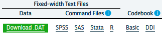
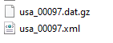

# Survey data analysis

## Demographic Survey data

The majority of demographic research relies on two or three main sources of information. First among these are population enumerations or censuses, followed by vital registration data on births and deaths and last but not least, data from surveys. Censuses and other population enumerations are typically undertaken by federal statistical agencies and demographers use this data once it's disseminated from these agencies. Similarly, vital registration data are usually collected by governmental agencies, who oversee the collection and data quality for the data. Survey data on the other hand can come from a wide variety of sources.

It's not uncommon for us to go and collect our own survey data specific to a research project we have, typically on a specialized population that we are interested in learning about, but surveys can also be quite general in their scope and collect information on a wide variety of subjects. Owing to the mix of small and large-scale survey data collection efforts, survey data are often available on many different topics, locales and time periods. Of course we as demographers are typically interested in population-level analysis or generalization from our work, so the survey data we try to use are collected in rigorous manners, with much attention and forethought paid to ensure the data we collect can actually be representative of the *target population* we are trying to describe.

In this chapter, I will introduce the nature of survey sampling as is often used in demographic data sources, and describe what to look for when first using a survey data source for you research. These topics are geared towards researchers and students who have not worked with survey data much in the past and will go over some very pragmatic things to keep in mind. Following this discussion, I will use a specific example from the US Census Bureau's American Community Survey and illustrate how to apply these principals to this specific source. The final goal of this chapter is to show how to use R to analyze survey data and produce useful summaries from our surveys, both tabular and graphically.

## Basics of survey sampling

To begin this section, I want to go over some of the simple terms from sampling that are very important to those of us who rely on survey data for our work. For many of the concepts from this chapter, I strongly recommend @Lohr2019 for the theoretical portions and @lumley2010 for discussion of how R is used for complex survey data.

The **target population** is the population that our survey has been designed to measure. For large national surveys, these are typically the population of the country of interest. For example, the Demographic and Health Survey (DHS) has it's primary target population as women of childbearing ages in women of reproductive age and their young children living in households. Our **observational units** are the level at which we are collecting data, for surveys this is typically a person or a household, and our survey documentation will tell us what its unit of observation is. **Sampling Units** refer to the units that can serve for us to collect data from, for example we may not have a list of every school age child, but we may have a list of schools, so we may use schools as our sampling units and sample children within them. The **sampling frame** is the set of sampling units containing distinct sets of population members, this is usually the most recent population census, ideally the entire population, or following our school example from above, the entire listing of schools.

These terms are ubiquitous in sampling, but other terminology also exists in many surveys and these terms relate to the nature of how the survey was actually carried out. Many times the surveys we end up using are not themselves **simple random samples**, but are instead some blend of stratified or cluster sample. For example, the DHS uses a stratified, cluster sample to collect its information. **Strata** refer to relatively homogeneous areas within the place we are trying to collect data. In the DHS, these are typically rural or urban areas of a country, as identified by the census. Within each strata, the DHS will choose **clusters** from which to sample from, this is a **two-stage sampling method**, where first the sampling frame is stratified, then clusters are selected. Clusters in the DHS are usually neighborhoods in urban areas and smaller towns or villages in rural areas.

Figure 1 shows a cartoon of how this process works, with multiple potential cluster that can be sampled (boxes), and within the cluster are our observational units, some of which are sampled, and some of which are unsampled.


## Simple versus complex survey designs

How the data we're using is sampled has a major implication for how we analyze it. The majority of statistical tools assume that data come from simple random samples, because most methods assume independence of observations, regardless of which distribution or test statistic you are using. Violations of this assumption are a big problem when we go to analyze our data, because the non-independence of survey data are automatically in violation of a key assumption of any test. The stratified and clustered nature of many survey samples may also present problems for methods such as linear regression analysis which assume errors in the model are **homoskedastic**, or constant. When data are collected in a stratified or clustered method, the data may have less variation than a simple random sample, because individuals who live closely to one another often share other characteristics in common as well. Our statistical models don't do well with this type of reduction in variation and we often have to resort to manipulations of our model parameters or standard errors of our statistics in order to make them coincide with how the data were collected.

Not to fear! Data collected using public funds are typically required to be made available to the public with information on how to use them. Most surveys come with some kind of code book or user manual which describes how the data were collected and how you should go about using them. In these cases, it pays to read the manual because it will tell you the names of the stratification and clustering variables in the survey data. This will allow you to use the design of the survey in your analysis so that your statistical routines are corrected for the non-randomness and homogeneity in the survey data.

**He's not heavy, he's my brother**

Another important aspect of survey data are the use of weighting variables. Whenever we design a survey, we have our target population, or universe of respondents in mind. In the DHS, again, this is traditionally[^surveydata-1] women of childbearing age and their children [@international_demographic_2012]. When we collect a sample from this population, or sample may be, and typically is, imperfect. It is imperfect for many reasons, owing to the difficulty of sampling some members of the population, or their unwillingness to participate in our study. Part of designing an effective survey is knowing your universe or population, and its characteristics. This will let you know the probability of a particular person being in the sample. Of course, the more complicated the survey, the more complicated it is to know what this probability is. For example, if we were to sample people in the United States, using a stratified design based on rural and urban residence, we would need to know how many people lived in rural and urban areas within the country, as this would effect the probability of sampling a person in each type of area. This **inclusion probability** tells us how likely a given person is of being sampled. The inverse of the inclusion probability is called the **sampling weight**:

[^surveydata-1]: The modern DHS collects information on couples, men and children, so the universe has been expanded away from just women of childbearing age and their children.

$w_i = \frac{1} {\pi_i}$

where $\pi_i$ is the inclusion probability.

Sampling weights are what we use to make our analyses of a survey representative of the larger population. They serve many purposes including unequal inclusion probabilities, differences in sample characteristics compared to the larger population, and differences in response rates across sample subgroups. All of these situations make the sample deviate from the population by affecting who the actual respondents included in the survey are. Differences in our sample when compared to the larger population can affect most all of our statistical analysis since again, most methods assume random sampling. The weights that are included in public data are the result of a rigorous process conducted by those who designed and implemented the survey itself, and most surveys in their user manuals or code books describe the process of how the weights are created. For example, the US Center for Disease Control and Prevention's Behavioral Risk Factor Surveillance System (BRFSS) provides a very thorough description of how their final person weights are calculated [@cdc2020]. These weights include three primary factors, the *stratum weight*, which is a combination of the number of records in a sample strata and the density of phone lines in a given strata, combined with the number of phones in a sampled household and the number of adults in the household to produce the final design weight. These weights are then **raked** to eight different marginal totals, based on age, race/ethnicity, education, marital status, home ownership, gender by race/ethnicity, age by race/ethnicity and phone ownership[@cdc2020]. After this process, weights are interpretable as the number of people a given respondent in the survey represents in the population. So, if a respondent's weight in the survey data is 100, they actually represent 100 people in the target population.

Other types of weights also exist, and are commonly seen in federal data sources. A common kind of weight that includes information on both the probability of inclusion **AND** the stratified design of the survey are **replicate weights**. Replicate weights are multiple weights for each respondent, and there are as many weights as there are different levels of the stratification variable. Later in this chapter, we will discuss how replicate weights are used, as compared to single design weights in an example.

## Characteristics of YOUR survey

Survey data that come from reputable sources, such as most federal agencies or repositories such as the Inter-university Consortium for Political and Social Research (ICPSR) at the University of Michigan in the United States, are accompanied by descriptions of the data source including when and where it was collected, what it's target population is, and information on the design of the survey. This will include information on sample design, such as stratum or cluster variables, and design or replicate weights to be used when you conduct your analysis. I cannot stress enough that learning how your particular survey data source is designed, and how the designers recommend you use provided survey variables for your analysis, is imperative to ensure your analysis is correctly specified.

## Example from the American Community Survey

Let's look at an example of these ideas in a real data source. Throughout the book I will use several complex survey design data sources to illustrate various topics, in this chapter I will use data from the US Census Bureau's American Community Survey (ACS) public use microdata sample (PUMS). We can actually use the `tidycensus` package [@walker21] to download ACS PUMS directly from the Census Bureau.

This example shows how to extract the 2018 single-year PUMS for the state of Texas, and only keep variables related to person-records. The ACS has information on both people and households, but for now we'll only look at the person records. Help on these functions can be found by typing `?pums_variables` and `?get_pums` in `R`

```{r ch2_11, eval=FALSE,results='hide', message=FALSE, warning=FALSE, include=TRUE}
library(tidycensus)
library(tidyverse)

pums_vars_18<- pums_variables %>%
  filter(year== 2018, survey == "acs1") %>%
  distinct(var_code, var_label, data_type, level) %>%
  filter(level == "person")

TX_pums <- get_pums(
  variables = c("PUMA", "SEX", "AGEP", "CIT", "JWTR","JWRIP", "HISP"),
  state = "AL",
  survey = "acs1",
  year = 2018)

```

```{r, eval=FALSE, results='asis'}
knitr::kable(
  head(TX_pums),
  format = 'html'
  )

```

These data are also easily available from the Integrated Public Use Microdata Series (IPUMS) project housed at the University of Minnesota [@Ruggles2021]. The IPUMS version of the data adds additional information to the data and homogenizes the data across multiple years to make using it easier. The following example will use the `ipumsr` package to read in an extract from IPUMS-USA.

After you create an IPUMS extract, right click on the DDI link and save that file to your computer. Then repeat this for the .DAT file. If you need help creating an IPUMS extract, their staff have created a tutorial for doing so (<https://usa.ipums.org/usa/tutorials.shtml>).

This will save the xml file that contains all the information on the data (what is contained in the data file) to your computer. When using IPUMS, it will have a name like `usa_xxxxx.xml` where the x's represent the extract number.

You will also need to download the data file, by right clicking the **Download.DAT** link in the above image. This will save a .gz file to your computer, again with a name like: `usa_xxxxx.dat.gz`. Make sure this file and the xml file from above are in the same folder.



The fundamentals of using `ipumsr` is to specify the name of your `.xml` file from your extract, and as long as your `.tar.gz` file from your extract is in the same location, R will read the data. The files on my computer:



```{r ch2_2x,eval=TRUE,results='hide', message=FALSE, warning=FALSE, include=TRUE}

library(ipumsr)
library(tidyverse)
ddi <- read_ipums_ddi(ddi_file = "~/OneDrive - University of Texas at San Antonio/projects/book_data//usa_00097.xml")
ipums <- read_ipums_micro(ddi = ddi)

```

Will read in the data, in this case, it is a subset of the 2008 to 2012 single year ACS. This extract is not all of the variables from the ACS, as that would be a very large file and for my purposes here, I don't need that. My goal for the rest of the chapter is to illustrate how to use the IPUMS as an example of a complex survey design data set and the steps necessary to do so.

## Basics of analyzing survey data

A fundamental part of analyzing complex survey data are knowing the variables within the data that contain the survey design information. The US Census Bureau has documented the design of the survey in a publication [@uscensusbureau2014] The IPUMS version of the ACS has two variables `STRATA` and `CLUSTER` that describe the two stage process by which the data are collected. Here are a the first few lines of these from the data:

```{r ,eval=TRUE,results='hide', message=FALSE, warning=FALSE, include=TRUE}
options(scipen = 999)
library(knitr)
  
kable(head(ipums[, c("SERIAL", "STRATA", "CLUSTER")],
           n=10),
      digits = 14 )

```

For the ACS, the strata variable is named, ironically `STRATA` and the cluster variable `CLUSTER`. The IPUMS creates the `STRATA` variable based on the sampling strata in the ACS, and the `CLUSTER` variable based on households within a stratum. Often in surveys, the clusters may not be households, they could be smaller population aggregates, such as neighborhoods and villages, as in the DHS.

The data also come with housing unit weights and person unit weights, so your analysis can be either representative of housing units or people.

```{r }
kable(head(ipums[, c("SERIAL", "STRATA", "CLUSTER", "HHWT", "PERWT")],
           n=10),
      digits = 14 )

```

```{r, include=FALSE}
sumwt<-sum(ipums$PERWT[ipums$STATEFIP==48])
nres<-dim(ipums)[1]
```

As can be seen in the first few cases, the `HHWT` variable is the same for everyone in a given household, but each person has a unique person weight showing that they each represent different numbers of people in the population. Further investigation of the housing and person weights allow us to see what these values actually look like.

```{r}
summary(ipums$PERWT)
```
Here we see the minimum person weight is 1 and the maximum is `r max(ipums$PERWT)`, which tells us that at least on person in the data represents `r max(ipums$PERWT)` people in the population that year. A histogram of the weights can also show us the distribution of weights in the sample. 

```{r, message=FALSE}
library(ggplot2)

ipums%>%
  ggplot(aes(x = PERWT)) +
    geom_histogram() + 
  labs(title = "Histogram of ACS Person Weights, 2019")

```


We can see how the weights inflate each person or household to the population by summing the weights. Below, I sum the person weights for the state of Texas, the sum is `r prettyNum(sumwt,big.mark=",",scientific=FALSE)` million people, which is the same as the official estimate of the population in 2019 (<https://www.census.gov/quickfacts/TX>), we also see, by using the `n()` function, that there were `r prettyNum(nres,big.mark=",",scientific=FALSE)` persons in the sample in 2019 living in Texas.


```{r}
library(dplyr)
ipums%>%
  filter(STATEFIP == 48)%>%
  summarize(tot_pop = sum( PERWT ) , n_respond = n())

```
```{r, include=FALSE}
sumhh<-sum(ipums$HHWT[ipums$PERNUM==1])
nhh<-length(unique(ipums$CLUSTER))

```

For housing units, we have to select a single person from the household in order for the same process to work, otherwise we would misrepresent the number of households in the state. We see there are `r prettyNum(sumhh,big.mark=",",scientific=FALSE)` million housing units, and `r prettyNum(nhh,big.mark=",",scientific=FALSE)` unique households in the data.


```{r }
ipums%>%
  filter(STATEFIP == 48,
         PERNUM == 1)%>%
  summarize(tothh = sum( HHWT ) , n_housing = n())

```

This total is nearly identical to that from the [Census's ACS estimate](https://data.census.gov/cedsci/table?t=Housing&g=0400000US48&y=2019&tid=ACSDP1Y2019.DP04).

This exercise shows that by using the provided weights in the survey, we can estimate the population size the sample was supposed to capture effectively. The `survey` package and the newer tidyverse package `srvyr` are designed to fully implement survey design and weighting and perform a wide variety of statistical summaries.

The way these packages work, is that you provide the name of your data frame, and the survey design variables that are in your data and the package code performs the requested analysis, correcting for survey design and weighting to the appropriate population. The code below illustrates how to enter the survey design for the IPUMS-USA ACS. Some surveys will not have both a cluster and stratification variable, so again, it's important to consult your survey documentation to find these for your data.

The function `as_survey_design()` in this case takes three arguments, since we are piping the 2019 ACS into it, we don't have to specify the name of the data. `ids` is the argument for the cluster variable, if your survey doesn't have one, just leave it out. `strata` is where you specify the name of the survey stratification variable, and `weights` is where you specify the name of the appropriate weighting variable. In this case, I'm replicating the estimate of the housing units in Texas from above, so I'll use the `HHWT` variable. The easiest way to get a total population estimate is to use the `survey_total()` function, which is equivalent to summing the weights as shown above, although in the case of the survey analysis commands in the `survey` and `srvyr` packages, the total will also be estimated with a standard error of the estimate. 

```{r ,eval=TRUE,results='hide', message=FALSE, warning=FALSE, include=TRUE}
library(srvyr)
library(survey)

ipums%>%
  filter(STATEFIP == 48, PERNUM == 1)%>%
  as_survey_design(cluster= CLUSTER,
                   strata = STRATA,
                   weights = HHWT)%>%
  summarize(tothh = survey_total())

```


<style>
div.blue { background-color:#e6f0ff; border-radius: 5px; padding: 20px;}
</style>
<div class = "blue">

**A short aside about survey design options**
The core definition of the ACS survey design is shown in the code above, and I highly recommend that you inspect the help file for the survey design functions `?as_survey_design` or `?svydesign`. An important option that often has to be specified is the `nest=TRUE` option. This if often necessary if PSU identifiers are not unique across strata. For example, the fictional data shown below has the PSU's values the same across strata.}


```{r fake_svy}

fake_survey<- data.frame(
  strata = c(1,1,1,1,1,1,
             2,2,2,2,2,2),
  psu = c(1,1,1,2,2,3,
          1,1,2,2,3,3),
  weight = rpois(n = 12, lambda = 20))

knitr::kable(fake_survey)

```

If we attempt to make a survey design from this, R would show an error.

```{r, error=TRUE}
fake_design<- fake_survey%>%
  as_survey_design(ids = psu,
                    strata=strata,
                    weights = weight)

```

But if we include the `nest = TRUE` option, R doesn't give us the error:

```{r}


fake_design<- fake_survey%>%
  as_survey_design(ids = psu,
                  strata=strata,
                  weights = weight, 
                  nest = TRUE)
fake_design
```
The ACS from IPUMS has unique CLUSTERs across strata, so we don't have to specify that argument when we declare our survey design. 
</div>


Back to our housing estimates. 

```{r, include=FALSE}
se1<-ipums%>%
  filter(STATEFIP==48, PERNUM==1)%>%
  as_survey_design(cluster= CLUSTER,
                   strata = STRATA,
                   weights = HHWT)%>%
  summarize(tothh = survey_total())%>%
  select(tothh_se)
```

In this case, our `tothh` estimate is identical to summing the weights, but new we also have an estimate of the precision of the estimate, so we could produce a more informed statistical estimate that in 2019, there were `r prettyNum(sumhh,big.mark=",",scientific=FALSE)` $\pm$ `r prettyNum(se1,big.mark=",",scientific=FALSE)` occupied housing units in the state.

If your data come with replicate weights instead of strata and cluster variables, this can be specified using the `as_survey_rep()` command instead `as_survey_design()`. In this case, we have to specify all of the columns which correspond to the replicate weights in the data. There are likely many ways to do this, but below, I use a method that matches the column names using a regular expression, where we are looking for the string `REPWT`, followed by any number of numeric digits, that is what the `[0-9]+` portion tells R to do. Also, the ACS uses a balanced replicate weight construction, which also requires the case weight as well [@Ruggles2021], so we specify the replicate weight type as `BRR`. Again, this is specific to the ACS, and you need to consult your own code book for your survey for your design information.

In this case, we get the same estimate for the total number of housing units, but a smaller variance in the estimate, which is often seen when using replicate weights.

```{r}
ipums%>%
  filter(STATEFIP == 48, PERNUM == 1)%>%
  as_survey_rep(weight = HHWT,
            repweights =matches("REPWT[0-9]+"),
            type = "JK1",
            scale = 4/80,
            rscales = rep(1, 80),
            mse = TRUE)%>%
  summarize(tothh = survey_total())
```

```{r}
rw<-ipums%>%
      filter(STATEFIP==48, PERNUM==1)%>%
      select(REPWT1:REPWT50)

t1<-survey::svrepdesign(data=ipums[ipums$STATEFIP==48&ipums$PERNUM==1,],
                        repweights = rw,
                        weights = ipums$HHWT[ipums$STATEFIP==48&ipums$PERNUM==1],
                        type="JK1",scale = .05, rscales = rep(1, ncol(rw)), mse= TRUE)

t1$variables$ones<-1
library(survey)

svytotal(~ones, design=t1)
```
We can also define the survey design outside of a dplyr pipe if we want using the `survey` package.

```{r}
acs_design <- svydesign(ids = ~ CLUSTER, 
                        strata= ~ STRATA, 
                        weights = ~ PERWT, 
                        data=ipums)

acs_design
```


Of course we typically want to do more analysis than just estimate a population size, and typically we are interested in using survey data for comparisons and regression modeling. To carry out any sort of statistical testing on survey data, we must not only weight the data appropriately but we must also calculate all measures of variability correctly as well. Since surveys are stratified, the traditional formula for variances is not correct because under stratified sampling, all estimates are not only a function of the total sample, but also the within-strata sample averages and sample sizes. We can estimate the variances in our estimates using the design variables and sample weights in the survey analysis procedures, but there are options.

## Replicates and jack knifes and expansions, oh my!

When conducting your analysis, you may not have any choices of whether you should use replicate weights or design weights, because your survey may only have one of these. There are two main strategies to estimate variances in survey data, the *Taylor Series Approximation* also referred to as *linearization* and the use of *replicate weights*. The Taylor Series, or linearization method is an approximation to the true variance, but is likely the most commonly used technique when analyzing survey data using regression methods. @Lohr2019 describes the calculation of variances from simple and clustered random samples in her book, and by her admission, once one has a clustered random sample the variance calculations for simple calculations becomes much more complex. 

The problem is that we often want much more complicated calculations in our work and the variance formulas for anything other than simple ratios are not analytically known. The Taylor series approximation to the variance for complex and nonlinear terms such as ratios or estimates of regression parameters. The `survey` package in R will do this if you specify a survey design that includes strata or clusters, while if you specify replicate weights then it will use an appropriate technique depending on how the data were collected. 

Typical replicate methods include balanced replicates, where there are exactly two clusters within each stratum, jackknife methods, which effectively remove one cluster from the strata and perform all calculations without that cluster in the analysis, then average across all replicates, and bootstrap methods which randomly sample clusters within strata with replacement a large number of times to get an estimate of the quantities of interest. 


## Descriptive analysis of survey data

The `survey` library allows many forms of descriptive and regression analysis. 

## Weighted frequencies and rates

Basic frequency tables are very useful tools for examining bivariate associations in survey data. In the survey analysis packages in R, the basic tools for doing this are the `svytable()` function in `survey`, or via the `survey_total()` function in `srvyr`. First I will recode two variables in the ACS, the employment status to indicate if a respondent is currently employed, and the `MET2013` variable, which is the metropolitan area where the respondent was living. This will give us the ACS estimate for the employed and unemployed population in each Texas MSA. I first have to filter the data to be people of working age, who are in the labor force and living in a MSA. 

```{r}

ipums %>%
  filter(EMPSTAT %in% 1:2,
         AGE >= 16 & AGE <= 65, 
         MET2013 != 0) %>%
  mutate(employed = as.factor(case_when(.$EMPSTAT == 1 ~ "Employed",
                              .$EMPSTAT == 2 ~ "Unemployed" )),
         met_name = haven::as_factor(MET2013)) %>%
  as_survey_design(cluster = CLUSTER,
                   strata = STRATA,
                   weights = PERWT) %>%
  group_by(met_name, employed)%>%
  summarize(emp_rate = survey_total()) %>%
  head()
```

This is OK, but if we want the totals in columns versus rows, we need to reshape the data. To go from the current "long" form of the variables to a wide form, we can use `pivot_wider` in `dplyr`. 

```{r}
ipums %>%
  filter(EMPSTAT %in% 1:2,
         AGE >= 16 & AGE <= 65, 
         MET2013 != 0) %>%
  mutate(employed = as.factor(case_when(.$EMPSTAT == 1 ~ "Employed",
                              .$EMPSTAT == 2 ~ "Unemployed" )),
         met_name = haven::as_factor(MET2013)) %>%
  as_survey_design(cluster = CLUSTER,
                   strata = STRATA,
                   weights = PERWT) %>%
  group_by(met_name, employed)%>%
  summarize(emp_rate = survey_total()) %>%  
  pivot_wider(id = met_name,
              names_from = employed,
              values_from = c(emp_rate, emp_rate_se) ) %>%
  head()
  

```

Of course, if we want rates, this would imply us having to divide these columns to calculate the rate, but we can also get R to do this for us using `survey_mean()`. Since the `employed` variable is dichotomous, if we take the mean of its various levels, we get a proportion, in this case the employment and unemployment rates, respectively. 


```{r}
ipums %>%
  filter(EMPSTAT %in% 1:2,
         AGE >= 16 & AGE <= 65, 
         MET2013 != 0) %>%
  mutate(employed = as.factor(case_when(.$EMPSTAT == 1 ~ "Employed",
                              .$EMPSTAT == 2 ~ "Unemployed" )),
         met_name = haven::as_factor(MET2013)) %>%
  as_survey_design(cluster = CLUSTER,
                   strata = STRATA,
                   weights = PERWT) %>%
  group_by(met_name, employed)%>%
  summarize(emp_rate = survey_mean()) %>%  
  pivot_wider(id = met_name,
              names_from = employed,
              values_from = c(emp_rate, emp_rate_se) ) %>%
  head()
 
```

```{r, include=FALSE}
tx_rates<- ipums %>%
  filter(EMPSTAT %in% 1:2,
         AGE >= 16 & AGE <= 65, 
         MET2013 != 0) %>%
  mutate(employed = as.factor(case_when(.$EMPSTAT == 1 ~ "Employed",
                              .$EMPSTAT == 2 ~ "Unemployed" )),
         met_name = haven::as_factor(MET2013)) %>%
  as_survey_design(cluster = CLUSTER,
                   strata = STRATA,
                   weights = PERWT) %>%
  group_by(met_name, employed)%>%
  summarize(emp_rate = survey_mean()) %>%  
  pivot_wider(id = met_name,
              names_from = employed,
              values_from = c(emp_rate, emp_rate_se) ) %>%
  head()
 
```

Which gets us the employment rate and the unemployment rate for each metropolitan area, with their associated standard errors. This is a general process that would work well for any grouping variable. If we create an object from this calculation, in this case I'll call it `tx_rates`, then we can also easily feed it into `ggplot` to visualize the rates with their associated 95% confidence intervals. The `geom_errorbar` addition to a `ggplot` object can add errors to estimates, which are great because we convey the uncertainty in the rates. 

```{r}
tx_rates%>%
  ggplot()+
  geom_bar(aes(x=met_name, y = emp_rate_Unemployed), stat = "identity")+
  geom_errorbar(aes(x=met_name,
                    ymin=emp_rate_Unemployed-1.96*emp_rate_se_Unemployed,
                    ymax= emp_rate_Unemployed+1.96*emp_rate_se_Unemployed),
                width=.25)+
  scale_y_continuous(labels = scales::percent)+
  labs(x = "MSA", 
       y = "Unemployment Rate",
       title = "Unmployment rate in Texas MSAs")+
  theme(axis.text.x = element_text(angle = 45, hjust = 1))
```
We see that among the first 6 MSAs in the state (that are in the ACS microdata), Corpus Christi has the highest unemployment rate a `r print(100*tx_rates$emp_rate_Unemployed[tx_rates$met_name =="Corpus Christi, TX"], digits = 3)`%, and College Station-Bryan has the lowest unemployment rate at `r print(100*tx_rates$emp_rate_Unemployed[tx_rates$met_name =="College Station-Bryan, TX"], digits = 3)`%. 

We can also use these functions for continuous variables, say with incomes. In the code below, I pipe all the elements of the analysis together to illustrate the workflow that we can do to calculate the median income in each MSA and plot it along with its error. 

```{r}
ipums %>%
  filter(EMPSTAT %in% 1:2,
         AGE >= 16 & AGE <= 65, 
         MET2013 != 0) %>%
  mutate(income = ifelse(INCWAGE <= 0, NA, INCWAGE),
         met_name = haven::as_factor(MET2013)) %>%
  as_survey_design(cluster = CLUSTER,
                   strata = STRATA,
                   weights = PERWT) %>%
  group_by(met_name)%>%
  summarize(median_wage = survey_median(income, na.rm=T)) %>%  
  head() %>%
  ggplot()+
  geom_bar(aes(x=met_name, y = median_wage), stat = "identity")+
  geom_errorbar(aes(x=met_name,
                    ymin=median_wage-1.96*median_wage_se,
                    ymax= median_wage+1.96*median_wage_se),
                width=.25)+
  scale_y_continuous(labels = scales::dollar)+
  labs(x = "MSA", 
       y = "Median Wage",
       title = "Median wage in Texas MSAs")+
  theme(axis.text.x = element_text(angle = 45, hjust = 1))

```
Which shows that Austin-Round Rock has the highest median wage and Brownsville-Harlingen has the lowest median wage. 

## Creating tables from survey data analysis

Tabular output from our survey data analysis is possible through several different means. When using dplyr, our intermediate output of the analysis is always a data frame, and so any R method for printing data frames would work for simple tabular display. For instance, if we just use `knitr::kable()` on our workflow from above instead of piping into a plot we would get something like this:

```{r, output = 'asis'}
ipums %>%
  filter(EMPSTAT %in% 1:2,
         AGE >= 16 & AGE <= 65, 
         MET2013 != 0) %>%
  mutate(income = ifelse(INCWAGE <= 0, NA, INCWAGE),
         met_name = haven::as_factor(MET2013)) %>%
  as_survey_design(cluster = CLUSTER,
                   strata = STRATA,
                   weights = PERWT) %>%
  group_by(met_name)%>%
  summarize(median_wage = survey_median(income, na.rm=T)) %>%  
  head() %>%
  knitr::kable(format = "latex",
               digits = 0,
               caption = "Median Wages in Texas MSAs",
               align = 'c',
               col.names =c("MSA Name", "Median Wage", "Median Wage SE"))

```
Which is OK, but there are other ways to make tables for reports. The `gt` package [@Iannone2021] is built using tidyverse principles, and build tables in much the same way that `ggplot` builds plots, and fits easily into a dplyr workflow. Here, I use `gt` to produce a similar table to that from `knitr::kable` from above.

```{r}
library(gt, quietly = T)

ipums %>%
  filter(EMPSTAT %in% 1:2,
         AGE >= 16 & AGE <= 65, 
         MET2013 != 0) %>%
  mutate(income = ifelse(INCWAGE <= 0, NA, INCWAGE),
         met_name = haven::as_factor(MET2013)) %>%
  as_survey_design(cluster = CLUSTER,
                   strata = STRATA,
                   weights = PERWT) %>%
  group_by(met_name)%>%
  summarize(median_wage = survey_median(income, na.rm=T)) %>%  
  head()%>%
  gt() %>%
    tab_header(title = "Median Wages in Texas MSAs")%>%
    cols_label(met_name = "MSA Name",
                 median_wage = "Median Wage",
                 median_wage_se = "Median Wage SE")%>%
    fmt_number(columns = c( median_wage,  median_wage_se), 
                 decimals = 0, use_seps = TRUE)


```

In general, the `gt` tables are much easier to make look nice, compared to basic tables, because they're much more customizable. The `gtsummary` package extends the table functionality by combining the summary functions like `dplyr` with the table structures of `gt`. Additionally, it will recognize survey design objects so that information can also be integrated into your workflow. The `gtsummary` presents a more descriptive statistical summary of the variables included, and actually uses `dplyr` tools under the hood of the package. 

In the code below, I first filter and mutate the IPUMS data to contain working age people who are employed, and who live in the six Texas cities featured in the examples above. I also create a new income variable that excludes all zero incomes, and drop levels of the `MET2013` variable that aren't in the list I specified. This pipes into the survey design function from the `survey` package, which pipes into the `tbl_svysummary` function which summarizes income for each MSA. This function has a lot of options to specify its output, and I recommend you consult the examples at the author's website[^surveydata-2]. 

[^surveydata-2]: http://www.danieldsjoberg.com/gtsummary/

```{r}
library(gtsummary)

ipums %>%
 filter(EMPSTAT == 1,
         AGE >= 16 & AGE <= 65, 
         MET2013 != 0, 
         MET2013 %in% c(11100, 12420, 13140, 15180, 17780, 18580)) %>% 
  mutate(income = ifelse(INCWAGE <= 0, NA, INCWAGE),
         met_name = haven::as_factor(MET2013))%>%
  select(met_name,  income, CLUSTER, STRATA, PERWT)%>%
  droplevels()%>%
  survey::svydesign(id = ~ CLUSTER,
                   strata = ~ STRATA,
                   weights = ~ PERWT,
                data = .) %>%
   tbl_svysummary(by = "met_name",
                  missing = "no",
                  include = c(met_name, income), 
                  label = list(income = "Median Wage"))%>%
  as_hux_table()

```


<p class="comment">

### How this differs from simple random sampling
So the big question I often get from students is "Do I really need to weight my analysis?" and of course, I say, "Of course!". Weights don't just inflate your data to the population, they serve a very important role in making sure your sample data aren't biased in their scope. Bias can enter into survey data in many forms, but nonresponse bias can dramatically affect population based estimates if key segments of our target population respond at low rates. Surveys will often deal with this by rigorous data collection strategies, but often the survey designers have to account for the added probability of nonresponse by modification of their basic weights. @Lohr2019 describes how this is done using a variety of methods including raking and post stratification, which typically separate the sample into subdivisions based on one or more demographic characteristic and produce weights based on how the sample deviates from the population composition. These methods are robust and are commonly used in large national surveys including the Behavioral Risk Factor Surveillance system (BRFSS). 

Other reasons for weighting and why it matters are oversampling. Many surveys will do this in their data collection because an important element of their target population may be small in overall size, so they will sample more respondents from that population subgroup than their proportion in the larger population would predict. For example, if a survey wanted to get detailed data on recent refugees to a country, and this group is small, say .1 percent of the overall population, they may design their study to have 10% of their survey respondents be refugees. This oversampling can be accounted for in the survey weights so the additional respondents are down-weighted to represent their fraction of the target population, while still allowing the researchers to get a large sample from this group. Surveys such as the Early Childhood Longitudinal Surveys and the National Longitudinal Study of Adolescent to Adult Health (AddHealth) routinely over-sample specific groups. For example the AddHealth over-samples black adolescents with college educated parents, Cuban, Puerto Rican, Chinese, and physically disabled adolescents. 

### How do weights affect our estimates?

In the code example below, I illustrate how not including sample weights affects the estimates generated. This in effect is how traditional statistical analysis assuming random sampling would do things. So in order to compare the weighted estimates to the unweighted estimates, all we need to do is use a non-survey design oriented method to produce our estimate, and compare it to the survey design oriented method. Note that many surveys are designed to be *self-weighting*, so weights are not provided nor necessary, again, read the documentation for your specific survey for what it recommends. 

```{r}
srs<-ipums %>%
  filter(EMPSTAT %in% 1:2,
         AGE >= 16 & AGE <= 65, 
         MET2013 != 0) %>%
  mutate(employed = as.factor(case_when(.$EMPSTAT == 1 ~ "Employed",
                              .$EMPSTAT == 2 ~ "Unemployed" )),
         met_name = haven::as_factor(MET2013)) %>%
  group_by(met_name)%>%
  summarize(emp_rate = mean(I(employed)=="Employed"),
            emp_rate_se = sd(I(employed)=="Employed")/sqrt(n()))%>%
   # pivot_wider(id = met_name,
   #            names_from = employed,
   #            values_from = c(emp_rate, emp_rate_se) ) %>%
  head()
srs$estimate<-"Unweighted"

```

```{r}
surv.est<-ipums %>%
  filter(EMPSTAT %in% 1:2,
         AGE >= 16 & AGE <= 65, 
         MET2013 != 0) %>%
  mutate(employed = as.factor(case_when(.$EMPSTAT == 1 ~ "Employed",
                              .$EMPSTAT == 2 ~ "Unemployed" )),
         met_name = haven::as_factor(MET2013)) %>%
  as_survey_design(cluster = CLUSTER,
                   strata = STRATA,
                   weights = PERWT) %>%
  group_by(met_name)%>%
  summarize(emp_rate = survey_mean(I(employed)=="Employed")) %>%  
  #rename(emp_rate_surv = emp_rate, emp_rate_se_surv = emp_rate_se)%>%
  head()

surv.est$estimate<-"Weighted"
 
```


```{r}
merged <- rbind(srs, surv.est)
p1<-merged%>%
  ggplot(aes(y = emp_rate, x = met_name , color = estimate))+
  geom_point(stat="identity",
             cex=2)+
  geom_line(aes(group = met_name),
            col = "grey")+
  scale_y_continuous(labels = scales::percent)+
  scale_color_discrete( name = "Estimate Type")%>%
  labs(x = "MSA", 
       y = "Employment Rate Estimate",
       title = "Employment rate in Texas MSAs",
       subtitle = "Rate estimates")+
  theme(axis.text.x = element_text(angle = 45, hjust = 1))

p2<-merged%>%
  ggplot(aes(y = emp_rate_se, x = met_name , color = estimate))+
  geom_point(stat="identity",
             cex=2)+
  geom_line(aes(group = met_name),
            col = "grey")+
  scale_color_discrete()%>%
  labs(x = "MSA", 
       y = "Standard Error",
       title = "",
       subtitle = "Standard error of estimates")+
  theme(axis.text.x = element_text(angle = 45, hjust = 1))

library(patchwork)

(p1 + p2)
```
We see that the difference in the weighted and unweighted estimates do vary by MSA, as do the standard errors of the estimates, with the survey-design calculated standard errors nearly always being higher than those assuming simple random sampling. If our data came from a survey with more extreme oversampling we would likely see larger differences in these estimates, and it is generally advisable to include both weights and survey design elements in all analysis of complex survey data. 

</p>

## Basic statistical testing on survey data. 

To perform basic bivariate statistical tests for frequency tables, the `srvyr::svychisq` and `survey::svy_chisq` are the primary tools you need. These will test for basic independence among rows and columns of a frequency table. Below is an example on how you would test for independence of labor force participation and gender in the IPUMS ACS data. 

```{r}
ipums %>%
  filter(EMPSTAT != 0,
         AGE >= 16 & AGE <= 65) %>%
  mutate(lab_force_part = ifelse (test = EMPSTAT %in% c(1,2),
                                  yes = 1,
                                  no = 0), 
         gender = ifelse(test = SEX ==1,
                         yes = "Male",
                         no = "Female")) %>%
  as_survey_design(cluster = CLUSTER,
                   strata = STRATA,
                   weights = PERWT) %>%
  svychisq(~lab_force_part+gender,
                    design = .)
  
```

The output above is for the survey adjusted chi square test [@rao_chi-squared_1984], which is actually calculated as an F-test in this case. We see a large F-test value, and a very small p value, which indicates that men and women have different labor force participation rates. Using our workflow from above, we can calculate the actual rates as well.

```{r}

ipums %>%
  filter(EMPSTAT != 0,
         AGE >= 16 & AGE <= 65) %>%
  mutate(lab_force_part = ifelse (test = EMPSTAT %in% c(1,2),
                                  yes = 1,
                                  no = 0), 
         gender = ifelse(test = SEX ==1,
                         yes = "Male",
                         no = "Female")) %>%
  as_survey_design(cluster = CLUSTER,
                   strata = STRATA,
                   weights = PERWT) %>%
  group_by(gender)%>%
  summarize(lf_part_rate = survey_mean(lab_force_part, na.rm=T)) %>%  
  head()%>%
  gt() %>%
    tab_header(title = "Labor Force Participation Rates in Texas")%>%
    cols_label(gender = "Gender",
                 lf_part_rate = "Labor Force Participation Rate",
                lf_part_rate_se = "SE")%>%
    fmt_number(columns = c( lf_part_rate,  lf_part_rate_se), 
                 decimals = 3, use_seps = TRUE)

```

So we see that males have a much higher labor force participation rate, compared to females, and this puts the differences that we observed from the chi square test into better context. 

### Regression and survey design

The design of our surveys affect the most basic estimates we do, and likewise, the design affects the more complicated analysis as well. Regression models are the work horse of social science research and we will spend a significant amount of the chapters that follow on thorough inspection of them. In the context of this chapter, I felt like I need to show both how to include survey design in a regression model and illustrate that weighting and survey design matters in terms of the output from out models. This section is *NOT* a total coverage of these models, and is at best a short example. This example will go in a different direction and use data from the Demographic and Health Survey instead of the ACS. 

The Demographic and Health Survey (DHS) data have been collected since the mid 1980's in over 90 countries around the world, and the DHS provides a public model data set that represents data on real households, without a specific national context. These data are provided to let people learn how to use the data before applying for access. The model data can be downloaded freely from the DHS[^surveydata-3] as a SAS or STATA format, or from my Github site[^surveydata-4] for this book. Below, I will read in the data from Github and recode child growth stunting relative to the WHO standard as an outcome[^surveydata-5] , and child age, rural residence and gender as predictors. 

The DHS household file is arrayed with a column for every child, so we must reshape the data from wide to long format using `pivot_longer` for the variables for child height relative to the WHO standard (`hc70`), child gender `hc27`, and child age `hc1`. The other variables are common to the household, so we do not have to reshape them (per the `cols=` line below). We then recode the outcome and the predictors for our regression example.

```{r}
dhs_model_hh <- readRDS(
  url("https://github.com/coreysparks/data/blob/master/dhs_model_hh.rds?raw=true")
  )

dhs_model_hh_sub <- dhs_model_hh%>%
  select(hc27_01:hc27_20, 
         hc70_01:hc70_20, 
         hc1_01:hc1_20,
         hv021, hv025, hv270, hv005, hv021, hv022)%>%
  pivot_longer(cols = c(-hv021, -hv025, -hv270, -hv005, -hv021, -hv022), 
               names_to  = c(".value", "child"),
               names_sep = "_") %>%
  na.omit()%>%
  mutate(stunting = car::Recode(hc70, recodes = "-900:-200 = 1; 9996:9999 = NA; else = 0"),
         gender = ifelse(test = hc27 == 1, yes = "male", no = "female"),
         hh_wealth = as.factor(hv270),
         age = hc1,
         age2 = hc1^2,
         rural = ifelse(test = hv025 ==2, yes = "rural", no = "urban"),
         wt = hv005/1000000,
         psu = hv021,
         strata = hv022)


dhs_model_des<- dhs_model_hh_sub%>%
  as_survey_design(cluster = psu,
                   strata = strata,
                   weights = wt,
                   nest = TRUE)
summary(dhs_model_des)
```
Just for completeness, I create a bar chart showing the percent stunted by the two main variables, gender and rural residence. 

```{r}
dhs_model_des%>%
  summarise( svyby(formula = ~ stunting,
                              by = ~ gender + rural,
                              design = .,
                              FUN = svymean,
                              na.rm=T))%>%
  ggplot()+
  geom_bar(aes(x = gender, y  = stunting, fill = rural),
           stat="identity",
           position="dodge")+
  labs(x = "Child Gender", 
       y = "Percent Stunted", 
       title = "Percent Stunted by Gender and Rural Residence",
       subtitle = "DHS Model Data")+
  scale_y_continuous(labels = scales::percent)

```

Now I estimate two logistic regression models for the stunting outcome. The first assumes random sampling and the second includes the full survey design information.

```{r, include=FALSE}
options(scipen = 1, digits = 3)
```

For the unweighted regular logistic regression, we use the `glm()` function with `family = binomial (link = "logit")`. 

```{r}
library(broom)
m1<-glm(stunting ~ age + age2 + rural + gender,
              data = dhs_model_hh_sub,
              family = binomial(link = "logit"))
m1%>%
  tidy()
  
```

For the survey design model, you specify the design versus the data set name, otherwise the same code works just fine. 

```{r}
m2 <- dhs_model_des%>%
  svyglm(stunting ~ age + age2 +rural + gender,
         design = .,
         family = binomial)

m2%>%
  tidy()

```

There are lots of ways to make a table from a regression model, but `stargazer` [@stargazer] is a simple way to present multiple models side by side. 

```{r, results='asis', message=FALSE}
stargazer::stargazer(m1, m2,
                     keep.stat = "n",
                     model.names = F,
                     column.labels = c("Unweighted model", "Weighted Model"),
                     type = "latex",
                     header = FALSE, 
                     style = "demography",
                     title = "Output from Unweighted and Weighted Regression Models")
```

In this case, we see that the coefficient estimates are very similar between the two models, but the coefficient standard errors are all smaller in the unweighted model. This is commonly what you see in this situation, because the survey deign model is actually using *clustered standard errors* instead of asymptotic standard errors [@cameron_practitioners_2015, @ibragimov_inference_2016]. While this example does not show an extreme difference, it is commonplace for t-statistics generated from clustered standard errors to have higher p-values than those using asymptotic standard errors. As a result, if the t-statistic is lower, and the p-value higher, you can easily get differences in your hypothesis tests for regression parameters. This is always something to be aware of as you analyze survey data.


[^surveydata-3] https://dhsprogram.com/data/model-datasets.cfm
[^surveydata-4] https://github.com/coreysparks/dem-stats-book
[^surveydata-4] Per the [guide to DHS statistics ](https://dhsprogram.com/data/Guide-to-DHS-Statistics/index.cfm)

## More examples from the CDC BRFSS
Below I illustrate the use of survey characteristics when conducting
descriptive analysis of a survey data set and a linear regression model
estimated from that data. For this example I am using 2016 CDC
Behavioral Risk Factor Surveillance System (BRFSS) SMART metro area
survey data. [Link](https://www.cdc.gov/brfss/smart/smart_2016.html)

```{r}
#load brfss
library(car)
library(stargazer)
library(survey)
library(questionr)
library(dplyr)

```

```{r}
load(url("https://github.com/coreysparks/data/blob/master/brfss_2017.Rdata?raw=true"))

```

### Fix variable names

```{r}
#The names in the data are very ugly, so I make them less ugly
nams<-names(brfss_17)
head(nams, n=10)

#we see some names are lower case, some are upper and some have a little _ in the first position. This is a nightmare.
newnames<-tolower(gsub(pattern = "_",replacement =  "",x =  nams))
names(brfss_17)<-newnames
```

### Recoding of variables

Be sure to always check your codebooks!

```{r}
#Poor or fair self rated health
brfss_17$badhealth<-Recode(brfss_17$genhlth, recodes="4:5=1; 1:3=0; else=NA")

#sex
brfss_17$male<-as.factor(ifelse(brfss_17$sex==1, "Male", "Female"))

#race/ethnicity
brfss_17$black<-Recode(brfss_17$racegr3, recodes="2=1; 9=NA; else=0")
brfss_17$white<-Recode(brfss_17$racegr3, recodes="1=1; 9=NA; else=0")
brfss_17$other<-Recode(brfss_17$racegr3, recodes="3:4=1; 9=NA; else=0")
brfss_17$hispanic<-Recode(brfss_17$racegr3, recodes="5=1; 9=NA; else=0")
brfss_17$race_eth<-Recode(brfss_17$racegr3, recodes="1='nhwhite'; 2='nh black'; 3='nh other';4='nh multirace'; 5='hispanic'; else=NA", as.factor = T)

#insurance
brfss_17$ins<-Recode(brfss_17$hlthpln1, recodes ="7:9=NA; 1=1;2=0")

#income grouping
brfss_17$inc<-ifelse(brfss_17$incomg==9, NA, brfss_17$incomg)

#education level
brfss_17$educ<-Recode(brfss_17$educa, recodes="1:2='0Prim'; 3='1somehs'; 4='2hsgrad'; 5='3somecol'; 6='4colgrad';9=NA", as.factor=T)
brfss_17$educ<-relevel(brfss_17$educ, ref='2hsgrad')

#employment
brfss_17$employ<-Recode(brfss_17$employ1, recodes="1:2='Employed'; 2:6='nilf'; 7='retired'; 8='unable'; else=NA", as.factor=T)
brfss_17$employ<-relevel(brfss_17$employ, ref='Employed')

#marital status
brfss_17$marst<-Recode(brfss_17$marital, recodes="1='married'; 2='divorced'; 3='widowed'; 4='separated'; 5='nm';6='cohab'; else=NA", as.factor=T)
brfss_17$marst<-relevel(brfss_17$marst, ref='married')

#Age cut into intervals
brfss_17$agec<-cut(brfss_17$age80, breaks=c(0,24,39,59,79,99))

#BMI, in the brfss_17a the bmi variable has 2 implied decimal places, so we must divide by 100 to get real bmi's

brfss_17$bmi<-brfss_17$bmi5/100
brfss_17$obese<-ifelse(brfss_17$bmi>=30, 1, 0)
```

### Filter cases

```{r}

brfss_17<-brfss_17%>%
  filter(sex!=9, is.na(educ)==F)

```

### Analysis

First, we will do some descriptive analysis, such as means and cross
tabulations.

```{r}
#First we will do some tables
#Raw frequencies
table(brfss_17$badhealth, brfss_17$educ)

#column percentages
100*prop.table(table(brfss_17$badhealth, brfss_17$educ), margin=2)

#basic chi square test of independence
chisq.test(table(brfss_17$badhealth, brfss_17$educ))
```

So basically all of these numbers are incorrect, since they all assume
random sampling. Now, we must tell R what the survey design is and what
the weight variable is, then we can re-do these so they are correct.

### Create a survey design object

Now we identify the survey design. *ids* = PSU identifers,
*strata*=strata identifiers, *weights*=sampling weights, *data*= the
data frame where these variables are located. Lastly, I only include
respondents with NON-MISSING case weights.

I first try to get only cities in the state of Texas by looking for "TX"
in the MSA's name field in the data.

```{r}
brfss_17$tx<-NA
brfss_17$tx[grep(pattern = "TX", brfss_17$mmsaname)]<-1

```

Now I make the survey design object. You may be required to specify two
options here:

1.  `survey.lonely.psu` This means that some of the strata only have 1
    PSU within them. This does not allow for within strata variance to
    be calculated. So we often have to tell the computer to do something
    here. Two valid options are "adjust", to center the stratum at the
    population mean rather than the stratum mean, and "average" to
    replace the variance contribution of the stratum by the average
    variance contribution across strata. (from ?surveyoptions)

2.  Nesting of PSU within strata. By default, PSUs have numeric
    identifiers that can overlap between strata. By specifying `nest=T`,
    we tell R to re-lable the PSUs so they are unique across strata. If
    your survey requires this, it will throw a warning message.

```{r}
brfss_17<-brfss_17%>%
  filter(tx==1, is.na(mmsawt)==F, is.na(badhealth)==F)

#
options(survey.lonely.psu = "adjust")

des<-svydesign(ids=~1, strata=~ststr, weights=~mmsawt, data = brfss_17 )

```

Simple weighted analysis Now , we re-do the analysis from above
using only weights:

```{r}
#counts
cat<-wtd.table(brfss_17$badhealth, brfss_17$educ, weights = brfss_17$mmsawt)

#proportions
prop.table(wtd.table(brfss_17$badhealth, brfss_17$educ, weights = brfss_17$mmsawt), margin=2)

#compare that with the original, unweighted proportions
prop.table(table(brfss_17$badhealth, brfss_17$educ), margin=2)

```

There **are** differences, notably that the prevalence of poor SRH is
*higher in the sample than the population*. This is important!

Let's say we also want the standard errors of these percentages. This
can be found for a proportion by: $s.e. (p)={\sqrt {p(1-p)} \over {n}}$

So we need to get n and p, that's easy:

```{r,results='asis'}
n<-table(is.na(brfss_17$badhealth)==F)
n

p<-prop.table(wtd.table(brfss_17$badhealth, brfss_17$educ, weights = brfss_17$mmsawt), margin=2)
t(p)

p<-prop.table(wtd.table(brfss_17$badhealth, brfss_17$male, weights = brfss_17$mmsawt), margin=2)
t(p)

se<-(p*(1-p))/n[2]

p<-

knitr::kable(data.frame(proportion=p, se=sqrt(se))[, c(1,2,3,6)],  caption = "Frequencies assuming random sampling")

```

Which shows us the errors in the estimates based on the weighted
proportions. That's nice, but since we basically inflated the n to be
the population of the US, these standard errors are too small. This is
another example of using survey statistical methods, to get the right
standard error for a statistic.

### Proper survey design analysis

```{r, results='asis'}
#Now consider the full sample design + weights
cat<-svyby(formula = ~badhealth, by=~male+agec+ins, design = des, FUN=svymean)

svychisq(~badhealth+male, design = des)

knitr::kable(cat,
      caption = "Survey Estimates of Poor SRH by Sex",
      align = 'c')

```

Which gives the same %'s as the weighted table above, but we also want
the correct standard errors for our bad health prevalence.

The `svyby()` function will calculate statistics by groups, in this case
we want the % in bad health by each level of education. The %'s can be
gotten using the `svymean()` function, which finds means of variables
using survey design:

```{r, results='asis'}

sv.table<-svyby(formula = ~badhealth, by = ~educ, design = des, FUN = svymean, na.rm=T)


knitr::kable(sv.table,
      caption = "Survey Estimates of Poor SRH by Education",
      align = 'c')

#Make a survey design that is random sampling - no survey information
nodes<-svydesign(ids = ~1,  weights = ~1, data = brfss_17)

sv.table<-svyby(formula = ~factor(badhealth), by = ~educ, design = nodes, FUN = svymean, na.rm=T)


prop.table(table(brfss_17$sex, brfss_17$badhealth))

knitr::kable(sv.table,
      caption = "Estimates of Poor SRH by Education - No survey design",
      align = 'c',  
      format = "html")

```

And we see the same point estimates of our prevalences as in the simple
weighted table, but the standard errors have now been adjusted for
survey design as well, so they are also correct. You also see they are
much larger than the ones we computed above, which assumed random
sampling.

### Another way

There's this great R package, `tableone` that does this stuff very
nicely and incorporates survey design too. Here's an example of using it
to generate your bi-variate tests like above:

```{r}
library(tableone)
#not using survey design
t1<-CreateTableOne(vars = c("educ", "marst", "male", "badhealth"),strata="race_eth", data = brfss_17)


#t1<-print(t1, format="p")
print(t1,format="p" )
#, strata = "badhealth", test = T,
#using survey design
st1<-svyCreateTableOne(vars = c("educ", "marst", "male", "badhealth"), strata = "race_eth", test = T, data = des)
#st1<-print(st1, format="p")
print(st1, format="p")
```

## Regression example

Next we apply this logic to a regression case. First we fit the OLS
model for our BMI outcome using education and age as predictors:

```{r}
fit1<-lm(bmi~educ+agec, data=brfss_17)
```

Next we incorporate case weights

```{r}
fit2<-lm(bmi~educ+agec, data=brfss_17, weights = mmsawt)

```

Now we will incorporate design effects as well:

```{r}
fit3<-svyglm(bmi~educ+agec,des, family=gaussian)

```

Now I make a table to show the results of the three models:

```{r, results='asis'}
stargazer(fit1, fit2, fit3, style="demography",
          column.labels = c("OLS", "Weights Only", "Survey Design"),
          title = "Regression models for BMI using survey data - BRFSS 2016", 
          covariate.labels=c("PrimarySchool", "SomeHS", "SomeColl", "CollGrad", "Age 24-39","Age 39-59" ,"Age 59-79", "Age 80+"), 
          keep.stat="n", model.names=F, align=T, ci=T)
```

Notice, the results for the education levels are much *less* significant
than the were with either of the other two analysis. This is because
those models had standard errors for the parameters that were too small.
You see all the standard errors are larger and the T statistics are
smaller.

Which shows the same $\beta$'s between the survey design model and the
weighted model but the standard errors are larger in the survey model,
so the test statistics are more conservative (smaller t statistics).

While in this simple model, our overall interpretation of the effects do
not change (positive effects of education, negative effects of age), it
is entirely possible that they could once we include our survey design
effects.

It may be informative to plot the results of the models to see how
different the coefficients are from one another:

```{r}

library(ggplot2)
library(dplyr)
coefs<-data.frame(coefs=c(coef(fit1)[-1], coef(fit3)[-1]),
                  mod=c(rep("Non Survey Model", 8),rep("Survey Model", 8)),
                  effect=rep(names(coef(fit1)[-1]), 2))

coefs%>%
  ggplot()+
  geom_point(aes( x=effect, y=coefs, group=effect,color=effect, shape=mod),
             position=position_jitterdodge(jitter.width = 1),
             size=2)+
  ylab("Regression Coefficient")+
  xlab("Beta")+
  geom_abline(intercept = 0, slope=0)+
  theme(axis.text.x = element_text(angle = 45, hjust = 1))+
  ggtitle(label = "Comparison of Survey and Non-Survey Regression effects")


```

Which shows us that the betas are similar but have some differences
between the two models.

## Creating Survey estimates for places

One of the coolest ways to use the BRFSS is to calculate estimates for
places, and by demographic characteristics withing places. Again, we use
`svyby()` to do this, but now we calculate obesity rates by sex within
cities.

```{r, results='asis'}
citytab<-svyby(~obese, ~mmsaname, design=des,FUN = svymean, na.rm=T )
knitr::kable(citytab, type="html", digits=3,caption = "Obesity Estimats for TX MSAs")

```

### Using srvyr

There's a new package called `srvyr` that incorporates the survey
analysis stuff into the `dplyr` universe:

```{r, eval=F}
library(srvyr)
brfsurv<-brfss_17%>%
  as_survey_design(1,strata=ststr,weights=mmsawt )


brfsurv%>%
  group_by(mmsaname)%>%
    summarise(obprev = survey_mean(obese, na.rm=T))

```

## Replicate Weights

If your dataset comes with *replicate weights*, you have to specify the
survey design slightly differently. Here is an example using the IPUMS
CPS data. For this data, you can get information
[here](https://cps.ipums.org/cps/repwt.shtml), but you must consult your
specific data source for the appropriate information for your data.

```{r, message=F, warning=F}
load(url("https://github.com/coreysparks/data/blob/master/cpsmar10tx.Rdata?raw=true"))
names(cpsmar10tx)

```

So we see the replicate weights are in columns 8 through 167 in the data

```{r}
#simple binary outcome
cpsmar10tx$poverty<-ifelse(cpsmar10tx$offpov==1,1,0)

# Replicate weight design - I got these details from the data source, you should too
des2<-svrepdesign( data = cpsmar10tx,repweights = cpsmar10tx[, c(8:167)]  ,
                   weights = ~wtsupp ,
                   type="JK1",
                   scale=.025)
des2

```

```{r}
#Without design
prop.table(table(cpsmar10tx$poverty))

#with design
prop.table(svytable(~poverty, design = des2))

```

```{r}
#Again, using the mean
mean(cpsmar10tx$poverty)
#Using the design. This would be an official estimate of poverty in TX in 2010:
svymean(~poverty, design=des2)
```
