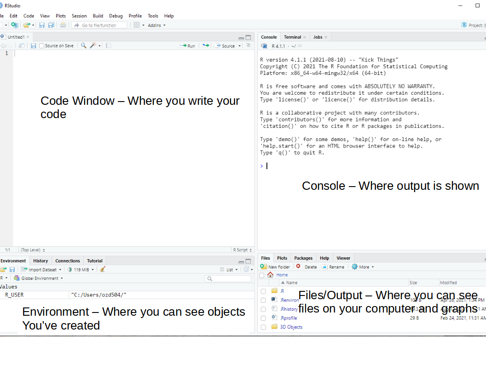
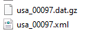

--- 
title: "Course Introduction"
author: "Corey Sparks, PhD"
date: "`r Sys.Date()`"
site: bookdown::bookdown_site
documentclass: book
bibliography: [book.bib, packages.bib]
# url: your book url like https://bookdown.org/yihui/bookdown
# cover-image: path to the social sharing image like images/cover.jpg
description: |
  This is a set of course notes for Demography 5283/7283.
link-citations: yes
github-repo: rstudio/bookdown-demo
---

# Introduction to R and Demography

## Why R?

I've used R for twenty years. I was also trained in SPSS and SAS along
the way, by various mentors. Some tried to get me to learn more general
purpose languages like Delphi (of all things) or Perl, or Basic, and
I've been chastised for not knowing the depths of Python, but R presents
a nimble and rigorous platform to *do* demography. My top three reasons
for teaching and using R are:

1.  It's free - This is important, because, why should we pass along
    more costs to people, especially our students? This also make R code
    accessible to people, worldwide.

2.  It's the hotbed of methodological development. The R ecosystem has
    thousands of packages that represent the bleeding edge of data
    analysis, visualization and data science. This makes R attractive
    because it can pivot quickly to adopt new methods, which often lag
    in their development in other environments.

3.  It has a supportive community of users. While there are some debates
    over how friendly some R users are to new users, overall, after
    spending 20 years in the R community, I've personally assisted
    hundreds of users, and been personally helped by many others. The
    open source nature of R lends itself to sharing of ideas and
    collaboration between users.

### My assumptions in this book

In statistics we always make assumptions, often these are wrong, but we
adapt to our mistakes daily. My assumptions about who is reading this
book are:

1.  You are interested in learning more about R.

2.  You are likely a student or professional interested in demography or
    population research.

3.  You have likely been exposed to other statistical platforms and are
    curious about R, in conjunction with 1 and 2 above.

4.  You may be an avid R user from another strange and exotic
    discipline, but are interested in how demographers do research.

5.  You want to see *how* to do things instead of being bombarded with
    theoretical and often unnecessary gate-keeping mathematical
    treatments of statistical models.

I think if any of these assumptions are true, you're in the right place.
That being said, this book *is not* a review of all of statistics, nor
is it an encyclopedic coverage of the R language and ecosystem. I image
the latter being on the same scale of hopelessness as the search for the
Holy Grail or the fountain of youth. People have died for such fool
hearty quests, I'm not falling on my sword here folks.

## Who is this book for?

This book has come from several courses that I teach in our Applied Demography program at the University of Texas at San Antonio.  **MORE NEEDED**


```{r include=FALSE}
# automatically create a bib database for R packages
knitr::write_bib(c(
  .packages(), 'bookdown', 'knitr', 'rmarkdown'
), 'packages.bib')
```

<!--chapter:end:index.Rmd-->

# Hello bookdown 

All chapters start with a first-level heading followed by your chapter title, like the line above. There should be only one first-level heading (`#`) per .Rmd file.

## A section

All chapter sections start with a second-level (`##`) or higher heading followed by your section title, like the sections above and below here. You can have as many as you want within a chapter.

### An unnumbered section {-}

Chapters and sections are numbered by default. To un-number a heading, add a `{.unnumbered}` or the shorter `{-}` at the end of the heading, like in this section.

<!--chapter:end:01-intro.Rmd-->

---
output: html_document
bibliography: book.bib
editor_options: 
  markdown: 
    wrap: 72
---
# Introduction to R

This chapter is devoted to introducing R to new users. R was first implemented in the early 1990’s by Robert Gentleman and Ross Ihaka, both faculty members at the University of Auckland. It is an open source software system that specializes in statistical analysis and graphics. R is its own programming language and the R ecosystem includes over 18,000 user-contributed additions to the software, known as packages.


## Welcome to R.

If you're coming to R from SAS, there is no data step. There are no
procs. The [SAS and R
book](https://www.amazon.com/gp/product/1466584491/ref=as_li_tl?ie=UTF8&camp=1789&creative=390957&creativeASIN=1466584491&linkCode=as2&tag=sasandrblog-20)
@kleinman is very useful for going between the two programs.

If you're coming from SPSS and you've been using the button clicking
method, be prepared for a steep learning curve. If you've been writing
syntax in SPSS, you're at least used to having to code. There's a good
book for SAS and SPSS users by Bob Meunchen at the Univ. of Tennessee
[here](https://www.amazon.com/SAS-SPSS-Users-Statistics-Computing/dp/1461406846),
which may be of some help.

Stata users have fewer official publications at their fingertips to ease
the transition to R, but I have always thought that the two were very
similar. If you search the internet for information related to R and
Stata, you will find a myriad of (somewhat dated) blog posts on which
one is better for "data science", how to "get started" with either and
so forth. What is really needed is a text similar to @kleinman which
acts as a crosswalk between the two programs.

## R and Rstudio

The Rgui is the base version of R, but is not very good to program in.
Rstudio is much better, as it gives you a true integrated development
environment (IDE), where you can write code in one window, see results
in others, see locations of files, and see objects you've created. To
get started, you should download the R installer for your operating
system. Windows and Mac have installer files, and Linux users will
install R using their preferred package manager.

Download R from [CRAN](https://cran.r-project.org/). If you're on
Windows, I would also highly recommend you install
[Rtools](https://cran.r-project.org/), because it gives you c++ and
Fortran compilers, which many packages need to be installed.

Rstudio can be downloaded for free
[here](https://rstudio.com/products/rstudio/download/).

I would recommend installing the base R program from CRAN first then
(for Windows users) install Rtools, then install Rstudio, in that order.

## Introduction to Rstudio

Again, each operating system has its own binary for Rstudio, so pick the one that matches your operating system. Rstudio typically has 4 sub-windows open at any given time. 

Rstudio is an open source Integrated Development Environment (IDE) for R. It is a much better interface for using R because it allows you to write code in multiple languages, navigate your computer’s files, and see your output in a very nice single place. The Rstudio IDE has several components that we will explore.



### Code window/Source editor pane
 - This is where you write your R code. You can write R code in a few different file types (more on this later), but the basic one is an R script, with file extension .R
 
 - The code window allows you to write and execute your code one line at a time, or to run an entire script at once. I use this to develop new code and when I want to test if things work (a VERY common exercise when writing any code).
 
 - To run a single line of code, put your cursor on the line and hit Ctrl-Enter (on Mac CMD-Enter also does this)

 - To run multiple lines of code, highlight the lines you want to run and do the same thing

### Console Pane

- This is where most of your non-graphical output will be shown. Any numeric output will appear here, as well as any warnings or error messages. In R a warning doesn’t necessarily mean something went wrong, its just R’s polite way of telling you to pay attention.

- An Error means something did go wrong. This is often because you left off a ) or a, sometimes because you misspelled something. I routinely spell `length` as `lenght` which causes R to print an error message. If you see an error, don’t worry, R will print some kind of message telling you what went wrong. 

 - R's output is in plain text, although we can produce much prettier output using other output methods, and we’ll talk more about that later. 

- You can type commands or code into the console as well, and you’ll immediately get the result, versus if you write it in the Source/Code window, you have to run it to see the result. I will often work in the console when I want to get “fast” answers, meaning little checks that I will often do to see the value of something. 

### Environment or Workspace browser pane
 - The R environment is where any object you create is stored. In R, anything you read in or create with your code is called an object, and R is said to be an object oriented programming language. 

 - Depending on the type of object something is, you may be able to click on the object in the environment and see more about it. 

 - For instance if the object is a data frame, R will open it in a viewer where you can explore it like a spreadsheet, and sort and filter it as well.
 
 - Other objects may not do anything when you click on them.
 
 - There is also a useful History tab here that shows you recently executed lines of code from the console or the code pane. 


### Files/Output/Help pane

 - The files and output area is where you can interact with files on your local computer, such as data files or code files, or images that R can open. 

 - This area also has a plots window that will display plots you create in R either via typing directly into the console or by running a line(s) of code from the source/code pane. 
 
 - There is also a very valuable part of this pane that lets you access the help system in R. If you are either looking for something, or you just want to explore the functions, you can get access to all of this here. 
 
### R file types

*.R files* R uses a basic text file with the .R extension. This type of
file is useful if you're going to write a function or do some analysis
and don't want to have formatted output or text. You can use these files
for everything, but they are limited in their ability to produce reports
and formatted output, so I recommend people work with R Markdown files
instead.

*.Rmd files* Rstudio uses a form of the markdown formatting language,
called R Markdown, for creating formatted documents that include code,
tables, figures and statistical output. **This book is written in R
Markdown!**

R Markdown is nice for lots of reasons, such as the ability to insert
latex equations into documents.

$$
{y_i \sim Normal (x'\beta, \sigma_2)}
$$ 

or to include output tables directly into a document:

```{r, echo = FALSE, results='hide', message = FALSE }
library(readr, quietly = TRUE)
prb <- read_csv(file = "https://raw.githubusercontent.com/coreysparks/r_courses/master/2018_WPDS_Data_Table_FINAL.csv")
names(prb) <- tolower(names(prb))
```

```{r}
library(broom)
library(pander)
fit <- lm(imr~tfr+pcturban+pctlt15_2018+pctwomcontra_all, 
          data = prb)
pander(broom::tidy(fit))

```

This allows you to make tables in Rmarkdown without having to do
non-repeatable tasks in Word or some other program. You can basically do
your entire analysis, or a sideshow for a presentation, or an entire
paper, including bibliography, in Rstudio.

### R projects

Rstudio allows you to create a R project, which basically sets up a
specific location to store R code for a given project you may be doing.
For instance, this book is a single R project, which helps me organize
all the chapters, bibliographies, figures, etc.

R projects also allow you to use version control, including Git and SVN,
to collaborate and share code and data with others.

### R data files

R allows you to read and write its own *native* data formats, as well as
read and write text formatted files and data files from other
statistical software packages. Two native R data formats are `.rds` and
`.rdata` formats. `.rds` files allow you to save a single R object to an
external files, while `.rdata` files allow you to save one or more
objects to a file.

Here is a short example of doing this, where I create 2 vectors, `x` and
`y` and save them.

```{r}
x <- c(1, 2,3)

y <- c(4, 5, 6)

saveRDS(x, 
        file="~/x.rds")

save(list=c("x","y"),
     file="xy.rdata")

```

I can also load these into R again:

```{r}
readRDS(file = "~/x.rds")
load("xy.rdata")
```

Standard methods for importing text data such as comma separated value
or tab delimited files can be read into R using `read.csv()` or
`read.table()` and similar writing functions are available.

To read in a dataset from another statistical package, I recommend using
the `haven` package. It allows you to read and write SAS (both sas7bdat
and xpt files), Stata, SPSS (both .por and .sav files).

For example, here I write out a dataframe containing `x` and `y` from
above to a SAS version 7 file:

```{r}
xy <- data.frame(x = x, y = y)
xy

library(haven)

write_sas(data = xy,
          path = "~/xy.sas7bdat")
```

I will describe dataframes more later in the chapter.

R also has packages for reading/writing such data formats as JSON, ESRI
Shapefiles, Excel spreadsheets, Google Spreadsheets, DBF files, in
addition to tools for connecting to SQL databases, and for interfacing
with other statistics packages, such as Mplus, OpenBUGS, WinBUGS and
various Geographic Information Systems.

## Getting help in R

I wish I had a nickel for every time I ran into a problem trying to do
something in R, that would be a lot of nickles. Here are some good tips
for finding help in R:

1)  If you know the name of a function you want to use, but just need
    help using it, try `?`

`?lm`

2)  If you need to find a function to do something, try `??`

`??"linear model"`

3)  You can also search the history of other R users questions by
    tapping into the
    [RSiteSearch](http://finzi.psych.upenn.edu/search.html) website,
    which is an archive of user questions to the R list serve. This can
    be used by tying `RSiteSearch()`

`RSiteSearch("heteroskedasticity")`

4)  Speaking of which, there are multiple [R user email list
    serves](https://www.r-project.org/mail.html) that you can ask
    questions to, or subscribe to daily digests from. These typically
    want an example of what you're trying to do, referred to as a
    *reproducible example*. I wish I also had nickles for each question
    I've asked and answered on these forums.

5)  A good source for all things programming is the statistics branch of
    [Stack Exchange](https://stats.stackexchange.com), which has lots of
    contributed questions and answers, although many answers are either
    very snarky or wrong or for an old version of a library, so *caveat
    emptor*.

6)  Your local R guru or R user group. You would be surprised at how
    many people are R users, there may be one just down the hall, or in
    the cubicle next door. I relish the opportunity to talk to other R
    users, mostly because, even though I've used R for more than 20
    years, I still learn so much by talking to others about how they
    use R.

Lastly, I want to be clear that there are often **more than one way to
do everything** in R. Simple things like reading and writing a CSV data
file can be accomplished by any of a handful of different functions
found in different packages. If someone tells you that there is only one
way to do something, they are usually wrong in such a statement,
regarding R at least.

## R packages

R uses packages to store functions that do different types of analysis,
so we will need to install lots of different packages to do different
things. There are over 20,000 different packages currently for R. These
are hosted on one of a number of *repositories*, such as the
Comprehensive R Archive Network, or CRAN, which is the official
repository for R packages. Other locations where authors store packages
include [R-Forge](%22https://r-forge.r-project.org/%22) and
[BioconductoR](%22https://www.bioconductor.org/%22). Many authors host
packages in [Github](%22https://github.com%22) repositories, especially
for development purposes.

Packages are often organized into *Task Views*, which CRAN uses to
organize packages into thematic areas. You can find a list of these Task
Views [here](%22https://cran.r-project.org/web/views/%22). There is not
a task view for Demography, but there are ones for the [Social
Sciences](%22https://cran.r-project.org/web/views/SocialSciences.html%22),
[Econometrics](%22https://cran.r-project.org/web/views/Econometrics.html%22),
and [Spatial
Data](%22https://cran.r-project.org/web/views/Spatial.html%22) to name a
few. Task views allow users to download a lot of thematically linked
packages in a single command, through the package `ctv`, or Cran Task
Views. You can install this package by typing:

`install.packages("ctv")`

into Rstudio. Then you have to load the package by using the `library()`
command:

`library(ctv)`

which gives you access to the functions in that package. You don't need
to install the package again, unless you update your R software, but
each time you start a new session (i.e. open Rstudio), you will have to
load the library again. If you want to install all of the packages in
the Social Science task view, you would type:

`install.views("SocialSciences")`

into R and it will install all of the packages under that task view, as
of the writing of this sentence, include over 80 packages.

I strongly recommend you install several packages prior to us beginning
to use R, so you will not be distracted by this later. I've written a
short script on my Github repository and you can use it by running:

```{r, eval = FALSE}
source("https://raw.githubusercontent.com/coreysparks/Rcode/master/install_first_short.R")
```

This will install a few dozen R packages that are commonly used for
social science analysis and some other packages I find of use.

You only have to install a package once, but each time you start a R
session, you must load the package to use its functions. You should also
routinely update your installed packages using
`update.packages(ask = FALSE)`. This will update any packages that have
new versions on CRAN. These often will contain bug fixes and new
features. On CRAN, each package will have a README file that tells what
has changed in the various versions. Here is one for one of my favorite
packages
[`tidycensus`](https://cran.r-project.org/web/packages/tidycensus/readme/README.html).

### Functions within packages

Each package will have one or more functions within it, each doing a
specific task. The default way to access all functions within a given
package is to use the command `library(packagename)` to access the
functions. Once loaded, all the functions will be accessible to you.
Sometimes, different packages have functions with the same name, for
example the base R library has the function `lag()`, which lag's a time
series, the `dplyr` library also has a function `lag()`, which does a
similar task, but with different function arguments. If you have the
`dplyr` library loaded, R will default to use its `lag()` function. If
you want to access a specific function within a specific library,
sometimes it is safest to use the `library::function()` syntax. So if I
want to use base R's `lag()` function, I could do

`stats::lag()`

to access that function specifically. How do you know when this happens?
When you load a library, you will often see messages from R that
functions have conflicts. For example, if I load `dplyr`, I see:


As you use R more, you will learn which packages have conflicts, and
often the developers of the packages will do this and rename the
commonly conflicting functions. For example, the function to recode
variables in the `car` package, `car::recode()` was renamed to
`car::Recode()` to avoid conflicts with the `dplyr::recode()` function,
as both are often used in the same analysis.

#### More notes on functions

Functions in R are bits of code that do something, what they do depends
on the code within them. For instance, the `median()` function's
underlying code can be seen by:

```{r}
getAnywhere(median.default())

```

This seems like a lot, I know, but it allows you to see all of the code
under the hood of any function. Obviously, the more complicated the
function, the more complicated the code. For instance, I can write my
own simple function to find the mean of a sample:

```{r}
mymean <- function(x,
                   na.rm = FALSE){
  sx <- sum(x, 
            na.rm = FALSE)
  nx <- length(x)
  mu <- sx/nx
  mu
}

mymean(x = c(1,2,3))

```

This function only includes the basic machinery to calculate the
arithmetic mean of a vector $x$. The function has 2 **arguments**, `x`
and `na.rm`. All R functions have one or more arguments that users must
enter for the function to operate. Some arguments are required, while
some are optional, also some arguments, such as the `na.rm = FALSE`,
have default values. As mentioned earlier, to see all the information
for a function's arguments, use the help operator, `?`. For example
`?mean` will show you the help documents for the `mean()` function


When using a new function, it's always advised to check out the help
file to see all the arguments the function can take, because this is
where you can choose alternative specifications for models and methods.
These help files also contain the original citations for methods, so you
can immediately check the source of the algorithms. The help files also
contain a working example of how to use the function on data contained
in R.

## Your R user environment

When you begin an R session (generally by opening Rstudio) you will
begin in your home directory. This is traditionally, on Windows, at
`'C:/Users/yourusername/Documents'` on Mac at `'/Users/yourusername'`,
and on Linux at `'/users/yourusername'`. There are files you can add to
your home directory to specify starting options for R.

You can find information on setting up `.Rprofile` and `.Renviron` files
on [CRAN's
website](https://cran.r-project.org/web/packages/startup/vignettes/startup-intro.html).
This allows you to setup packages that load every time R starts, to save
API keys and other various options. These are completely optional and
many R users never touch these.

If you're not sure where you are you can type `getwd()`, for get working
directory, and R will tell you:

```{r,eval = FALSE}
getwd()
```

If you don't like where you start, you can change it, by using
`setwd()`, to set your working directory to a new location.

```{r, eval = FALSE}
setwd("~")
getwd()
```

R projects will typically set the home folder for the project at the
directory location of the project, so files associate with the project
will always be in the same place. You can set this at the beginning of
your R code file to ensure the code will look for data in a specific
location.

## Some Simple R examples

Below we will go through a simple R session where we introduce some
concepts that are important for R. I'm running these in an Rstudio
session, in the

### R is a calculator

```{r}
#addition and subtraction
3+7
3-7
```

```{r}
#multiplication and division
3*7

3/7
```

```{r}
#powers
3^2
3^3
```

```{r}
#common math functions
log(3/7)
exp(3/7)
sin(3/7)

```

R allows users to write custom functions as well. In general, if you
find yourself writing the same code over and over again, you should
probably just write a function and save it to your local user
environment.

For example a very simple function is given below, it takes a variable
$x$ as an argument, and then exponentiates the value of the variable.

```{r}
#custom functions
myfun <- function(x){
  exp(x)
}

myfun(.5)
myfun(-.1)
```

You may want to save this function for future use, so you don't have to
write it over again. In general, this is why people write R packages, to
store custom functions, but you can also save the function to an R
script. One such way to do this is to use the `dump()` command.

```{r}
dump("myfun", 
     file="myfun1.R")
```

One way to load this function when you want to use it is to use the
`source()` command, which loads any code in a given R script.

```{r}
source("myfun1.R")
```

Which will load this function into your local environment and you can
use it. If you are interested in writing your own packages, I would
highly recommend reading @Wickham.

## Variables and objects

In R we assign values to objects (object-oriented programming). These
can generally have any name, but some names are reserved for R. For
instance you probably wouldn't want to call something 'mean' because
there's a 'mean()' function already in R. For instance:

```{r}
x <- 3
y <- 7
x+y
```

```{r}
x*y
```

```{r}
log(x*y)

```

The `[1]` in the answer refers to the first element of a *vector*, which
brings us to...

### Vectors

R thinks many objects are like a matrix, or a vector, meaning a row or
column that contains either numbers or characters. One of R's big
selling points is that much of it is completely vectorized. Meaning, I
can apply an operation along all elements of a vector without having to
write a *loop*.

For example, if I want to multiply a vector of numbers by a constant, in
SAS, I could do:

`for (i in 1 to 5)` `x[i] <- y[i]*5` `end;`

but in R, I can just do:

```{r}
x <- c(3, 4, 5, 6, 7)
#c() makes a vector
y <- 7

x*y

```

R is also very good about using vectors, let's say I wanted to find the
third element of x:

```{r}
x[3]
```

or if I want to test if this element is 10

```{r}
x[3] == 10
x[3] != 10
```

or is it larger than another number:

```{r}

x[3] > 3
```

or is any element of the whole vector greater than 3

```{r}
x > 3

```

If you want to see what's in an object, use `str()`, for `str`ucture

```{r}
str(x)
```

and we see that x is numeric, and has the values that we made.

We can also see different characteristics of x

```{r}
#how long is x?
length(x)

#is x numeric?
is.numeric(x)

#is x full of characters?
is.character(x)

#is any element of x missing?
is.na(x)

```

```{r}
#now i'll modify x
x <- c(x, NA) #combine x and a missing value ==NA
x

#Now ask if any x's are missing
is.na(x)
```

#### Replacing elements of vectors

Above, we had a missing value in X, let's say we want to replace it with
another value. He we will use basic conditional logic, which exists in
any programming language. The `ifelse()` function will evaluate a `test`
statement, and depending on if that statement is true, it will assign a
value, if the statement is false, R will assign another value. Here, we
replace the missing value with $\sqrt{7.2}$, and leave the other values
as they are.

```{r}
x <- ifelse(test = is.na(x) == TRUE,
            yes =  sqrt(7.2),
            no =  x)
x
```

## Variable types

R stores data differently depending on the type of information
contained. Common variables types in R are numeric, character, integer
and factor.

Numeric variables are just that, numbers. They can be whole numbers or
decimal values. The best way to see if a variable is numeric is to use
`is.numeric(x)`, and R will return TRUE if the variable is numeric and
FALSE if it is not.

```{r}
is.numeric(x)
```

Likewise, you can use `is.character()`, `is.integer()`, and `is.factor`
to identify if a variable is of a given type. The `class()` function
will also do this more generally:

```{r}

class(x)
```

Character and factor variables often store the same kind of information,
and R (until recently) would always convert character variables to
factors when data were read into R. This is the option
`getOption("stringsAsFactors")`, which used to default to True, but has
recently changed. What's the difference you ask? Character variables
store information on strings, or text. This is one way to code
categorical variables that are strings. Factors, on the other hand can
store strings OR numbers as categorical variables, and can be ordered or
unordered. Factors also allow for specific categories of the variable to
be considered as reference categories, as are often used in many
statistical procedures. Factor variables have "levels" which are the
different values of the categorical variable, this implied a more
complicated structure than simple character variables, which lack these
qualities.

You can manipulate variables of one type into another, with some notable
things to watch out for.

Here are some examples:

```{r}
#create at numeric vector

z <-  c(1,2,3,4)
class(z)

```

We can convert this to a character vector using `as.character()`

```{r}
zc <-  as.character(z)
zc

```

Likewise, we can convert it to a factor type:

```{r}
zf <- as.factor(z)
zf
class(zf)
is.ordered(zf)
```

and as an ordered factor:

```{r}
zfo <- factor(zf, 
              ordered = TRUE)
zfo
```

Another very useful variable type is the *logical* type. In R a logical
variable is either a `TRUE` or `FALSE` value. I personally use this a
lot in my work in both preliminary data analysis and data checking. We
saw this used above, when we did `is.na(x) == TRUE` to check if the `x`
variable was missing. We can see how this translates into a logical
variable here:

```{r}
x <- c(3, 4, 5, 6, 7, NA)

z<-is.na(x) #check if x is missing

z

class(z)
```

In practice, I use this with the `I()` function (more on this below) to
do quick binary codes of a value:

```{r}
x <- c(3, 4, 5, 6, 7)

table( I(x >= 5) )
```

## Dataframes

Traditionally, R organizes variables into data frames, these are like a
spreadsheet. The columns can have names, and the *dataframe* itself can
have data of different types.

Here we make a short data frame with three columns, two numeric and one
factor:

```{r}
mydat <- data.frame(
  x = c(1,2,3,4,5, 6, 7, 8),
  y = c(10, 20, 35, 57, 37, 21, 23, 25),
  group = factor(c("A", "A" ,"A", "B", "B", "C","C","C"))
)

#See the size of the dataframe
dim(mydat)


#Open the dataframe in a viewer and just print it
print(mydat)
```

### Accessing variables in dataframes

R has a few different ways to get a variable from a data set. One way is
the `$` notation, used like `dataset$variable`, and another is to
provide the column index or name of the variable. These three methods
are illustrated below. The first tells R to get the variable named
`group` from the data. The second tells R to get the column named
`group` from the data, and the third tells R to get the third column
from the data.

```{r}
mydat$group
mydat['group'] 
mydat[,3]
```

The `names()` function is very useful for seeing all the column names of
a dataset, without having to print any of the data.

```{r}
names(mydat)
```

R has several useful function for previewing the contents of a dataframe
or variable. The `head()` function shows the first 6 observations of a
dataframe or variable, and `tail()` shows the last 6 observations. You
can also show a custom number of observations by using the `n=` argument
in either function. These are illustrated below:

```{r}
head(mydat)
head(mydat, n = 2)
```

```{r}
head(mydat$group)
```

```{r}
tail(mydat)
tail(mydat, n = 2)
tail(mydat$group)
```

### Nicer looking tables

R can also produce nicely formatted HTML and LaTeX tables. There are
several packages that do this, but the `knitr` package has some basic
table creation functions that do a good job for simple tables.

```{r, results='asis', eval=FALSE}
library(knitr)

kable(mydat,
      caption = "My basic table",
      align = 'c',  
      format = "html")
```
```{r, results='asis'}
library(knitr)
kable(mydat,
      caption = "My basic table",
      align = 'c',  
      format="latex"  )

```


Much more advanced tables can be created using the `gt` package @GT,
which allows for highly customized tables.

```{r}
library(gt, 
        quietly = TRUE)
library(dplyr,
        quietly = TRUE)
mydat%>%
  gt()%>%
  tab_header(title= "My simple gt table",
             subtitle = "With a subtitle")
```

## Real data example

Now let's open a 'real' data file. This is the [2018 World population
data
sheet](https://www.prb.org/2018-world-population-data-sheet-with-focus-on-changing-age-structures/)
from the [Population Reference Bureau](http://www.prb.org). It contains
summary information on many demographic and population level
characteristics of nations around the world in 2018.

I've had this entered into a **Comma Separated Values** file by some
poor previous research assistant of mine and it lives happily on Github
now for all the world to see. CSV files are a good way to store data
coming out of a spreadsheet, because R can read them without any other
packages. R can also read Excel files, but it requires external packages
to do so, such as `readxl`.

I can read it from Github directly by using a function in the `readr`
library, or with the base R function `read.csv()`, both accomplish the
same task.

```{r, echo= TRUE, results='hide', message = FALSE, tidy= TRUE}
prb <- read.csv(
  file = "https://raw.githubusercontent.com/coreysparks/r_courses/master/2018_WPDS_Data_Table_FINAL.csv", 
  stringsAsFactors = TRUE)
```

That's handy. If the file lived on our computer in your working
directory, I could read it in like so:

```{r, eval = FALSE}

prb <- read_csv("path/to/file/2018_WPDS_Data_Table_FINAL.csv")

```

Same result.

The `haven` library @haven can read files from other statistical
packages easily, so if you have data in Stata, SAS or SPSS, you can read
it into R using those functions, for example, the `read_dta()` function
reads Stata files, `read_sav()` to read SPSS data files.

```{r, eval = FALSE}
library(haven)
prb_stata <- read_dta("path/to/file/prb2018.dta")

prb_spss <- read_sav("path/to/file/prb_2018.sav")


```

## Basic Descriptive analysis of data

One of the key elements of analyzing data is the initial descriptive
analysis of it. In subsequent chapters, I will go into more depth about
this process, but for now, I want to illustrate some simple but
effective commands for summarizing data.

### Dataframe summaries

The `summary()` function is very useful both in terms of producing
numerical summaries of individual variables, but also for shows
summaries of entire dataframes. Its output differs based on the type of
variable you give it, for character variables it does not return any
summary. For factor variables, it returns a frequency table, and for
numeric variables, it returns the five number summary plus the mean.

```{r}
summary(prb$region)

summary(as.factor(prb$continent))

summary(prb$tfr)
```

I find this function to be very useful when I'm initially exploring a
data set, so I can easily see the min/max values of a variable. There
are many alternatives to this base function, including
`psych::describe()`, `Hmisc::describe()`, and `skimr::skim()`, all of
which produce summaries of dataframes or variables

```{r R.options=list(max.print=10), warning = FALSE, max.print=200}
desc1  <-  psych::describe(prb[, 1:8],
                           fast = FALSE)
print(desc1,
      short = TRUE)
```

```{r}

desc2 <-  Hmisc::describe(prb[, 1:8],
                          tabular= FALSE)
head(desc2)

```
```{r,eval=FALSE, include=FALSE}
kable(format="latex")
```

```{r,eval=FALSE,results='asis'}
desc3 <- skimr::skim(prb[, 1:8])
desc3
```

The `skimr::skim()` function is very good at doing summaries of both
numeric and categorical data, while the other functions are perhaps best
suited to numeric data.

The `summary()` function, as well as the other three functions in other
packages can be used on a single variable within a dataframe as well, or
on a simple vector:

```{r}
summary(prb$tfr)
```

```{r}
summary(zf)
```


From this summary, we see that the mean is
`r mean(prb$tfr, na.rm= TRUE)`, there is one country missing the Total
fertility rate variable. The minimum is 1 and the maximum is 7.2
children per woman.

### Frequency tables

A basic exploration of data, especially if your data have categorical or
nominal variables, includes the extensive use of frequency tables. If
you're simply looking at the number of observations in each level of a
categorical variable, or using frequency tables to aggregate data, they
are some of the most useful basic statistical summaries around. The
basic function for constructing simple tables is `table()` in base R.
More sophisticated table construction is allowed in `xtabs()`

Let's have a look at some descriptive information about the data:

```{r}
#Frequency Table of # of Countries by Continent
table(prb$continent)
```

Frequency of TFR over 3 by continent:

```{r}
table(I(prb$tfr > 3),
      prb$continent)
```

Two things to notice in the above code, first we have to use the `$`
operator to extract each variable from the `prb` dataframe. Second, the
`I()` operator is used. This is honestly one of my favorite things in
base R. `I()` is the indicator function, it evaluates to `TRUE` or
`FALSE` depending on the argument inside of it. This also allows for
fast construction of binary variables on the fly in any function. Here's
another example:

```{r}
x <- c(1, 3, 4, 5, 7, 19)
I(x > 5)


table(I(x > 5))
```

So we see how this works, I checks if `x` is greater than 5, if it is,
`I()` returns `TRUE`. When we feed this to `table()`, we can count up
the `TRUE` and `FALSE` responses.

Later in the book, we will see how to employ the `xtabs()` function to
quickly aggregate data from individual level to aggregate level.

### More basic statistical summaries

Now, we will cover some basic descriptive statistical analysis including
basic measures of central tendency and variability.

### Measures of central tendency

We can use graphical methods to describe what data 'look like' in a
visual sense, but graphical methods are rarely useful for comparative
purposes. In order to make comparisons, you need to rely on a numerical
summary of data vs. a graphical one.

Numerical measures tell us a lot about the form of a distribution
without resorting to graphical methods. The first kind of summary
statistics we will see are those related to the measure of *central
tendency*. Measures of central tendency tell us about the central part
of the distribution

### Mean and median

Here is an example from the PRB data.

```{r}
mean(prb$tfr)
```

Whoops! What happened? This means that R can't calculate the mean
because there's a missing value, which we saw before. We can tell R to
automatically remove missing values by:

```{r}
mean(prb$tfr,
     na.rm = TRUE)
```

Which works without an error. Many R functions will fail, or do listwise
deletion of observations when `NA`s are present, so it's best to look at
the documentation for the function you're wanting to use to see what
it's default na action is. The `mean()` function defaults to
`na.rm = FALSE`, which indicates that it does not remove missing values
by default.

We can also calculate the median TFR

```{r}
median(prb$tfr,
       na.rm = TRUE)
```

### Measures of variation

One typical set of descriptive statistics that is very frequently used
is the so-called **five number summary** and it consists of : the
Minimum, lower quartile, median, upper quartile and maximum values. This
is often useful if the data are not symmetric or skewed. This is what
you get when you use the `fivenum()` function, or we can include the
mean if we use the `summary()` function.

```{r}
fivenum(prb$tfr) 
```

```{r}
summary(prb$tfr)
```

#### Variance

To calculate the variance and standard deviation of a variable:

```{r}
var(prb$tfr, 
   na.rm = TRUE) #variance
sd(prb$tfr,
   na.rm = TRUE) #standard deviation

sqrt(var(prb$tfr)) #same as using sd()
```

The above sections have shown some basic ways to summarize data in R,
along with many handy functions that are pervasive in my own general
work flow. Is this everything R will do, No. Are these the only way to
do things in R? Never. I'm constantly marveled at how many new functions
I see my students using in their own work and this reminds me how much
of the R ecosystem I have yet to explore, even after twenty-plus years
of using it.

## The tidyverse

So far, most of the functions I have discussed have been from the base R
ecosystem, with some specific functions from other downloadable
packages. One of the biggest changes to R in recent years has been the
explosion in popularity of the **tidyverse** @tidyverse. The tidyverse
is a large collection of related packages that share a common philosophy
of how data and programming relate to one another and work together to
produce a more streamlined, literate way of programming with data.

To get the core parts of the tidyverse, install it using
`install.packages("tidyverse")` in your R session. This will install the
core components of the tidyverse that can then be used throughout the
rest of the book [^introtor-1].

Two of the workhorses in the tidyverse are the packages `dplyr` @dplyr
and `ggplot2` @ggplot2. The `dplyr` package is very thoroughly described
in the book *R for Data Science* @Wickham2017R, and the `ggplot2`
package also has a book-length description in the book *ggplot2: Elegant
Graphics for Data Analysis* @ggplot2, so I won't waste time and space
here with complete descriptions. Instead, I will show some pragmatic
examples of how these work in my own work flow, and also use these
packages together to produce some descriptive data visualizations.

[^introtor-1]: If you followed the script at the beginning of this
    chapter, the tidyverse will already be installed.

### Basic dplyr

The `dplyr` package has many functions that work together to produce
succinct, readable and highly functional code. I often say about base R
packages in comparison to things like SAS, that I can do something in R
in about 10 lines of code compared to 50 in SAS. Using dplyr, you can do
even more, faster.

The package consists of core "verbs" that are used to clean, reshape,
and summarize data. Using "pipes", the user can chain these verbs
together so that you only have to name the data being used once, which
makes for more efficient code, since you're not constantly having to
name the dataframe. The pipes also allow for all variables within a
dataframe to be accessed, without using the `$` or `[]` notation
described earlier in this chapter.

Perhaps a short tour of using dplyr would be good at this point, and we
will see it used throughout the book. In the following code, I will use
the `prb` data from earlier, and I will do a series of tasks. First, I
will create a new variable using the `mutate()` function, then group the
data into groups (similar to SAS's 'by' processing) , then do some
statistical summaries of other variables using the `summarise()`
function.

Here we go:

```{r}
library(dplyr)

prb %>%
  mutate(high_tfr = ifelse(test = tfr > 3,
                           yes =  "high",
                           no =  "low") )%>%
  group_by(high_tfr) %>%
  summarise(mean_e0 = mean(e0male, na.rm = TRUE))

```

The `prb%>%` line says, take the prb data and feed it into the next verb
using the pipe. The next line
`mutate(high_tfr = ifelse(test = tfr > 3,yes =  "high", no =  "low") )%>%`
tells R to create a new variable called `high_tfr`, the value of the
variable will be created based on conditional logic. If the value of the
tfr is over 3, the value will be `"high"` and if the value of the tfr is
less than 3, the value of the variable will be `"low"`.

The `group_by(high_tfr)%>%` line tells R to form a "grouped data frame",
basically this is how `dplyr` segments data into discrete groups, based
off a variable, and then performs operations on those groups. This is
the same thing as stratification of data. 

The final command `summarise(mean_e0 = mean(e0male, na.rm = TRUE))` tells R to take the mean of the `e0male` variable, in this case it will be calculated for each of the `high_tfr` groups. 

Finally, we `ungroup()` the dataframe to remove the grouping, this is
customary whenever using the `group_by()` verb.

We can also summarize multiple variables at the same time using the `across()` command. In the code below, I find the mean (specified by `.fns = mean`) for each of the four variables `e0male`, `e0female`, `gnigdp` and `imr` for each of the `high_tfr` groups. 

```{r}
prb %>%
  mutate(high_tfr = ifelse(test = tfr > 3,
                           yes =  "high",
                           no =  "low") )%>%
  group_by(high_tfr) %>%
  summarise(n = n(),
            across(.cols = c(e0male, e0female, gnigdp, imr),
                   .fns = mean,
                   na.rm = TRUE))%>%
  ungroup()
  

```


The line `summarise(n=n() , across(.cols = c(e0male, e0female, gnigdp, imr), .fns = mean, na.rm = TRUE))`
tells R to first count the number of cases in each group `n = n()`, then
summarize multiple variables, in this case male and female life
expectancy at birth, GDP, and the infant mortality rate, by each of the
levels of the `high_tfr` variable. The summary I want to do is the mean
of each variable, being sure to remove missing values before calculating
the mean.

We see then the estimates of the four other indicators for countries
that have TFR over 3, versus countries with a TFR under 3.

This is a basic `dplyr` use, but it is far from what the package can do.
Throughout the rest of the book, this process will be used to do
calculations, aggregate data, present model results and produce
graphics. This example was trying to show a simple workflow in dplyr,
and introduce the pipe concept.

Next, we will explore some basic uses of `dplyr` in conjunction with the
`ggplot2` package.

## Basic ggplot

Let's say that we want to compare the distributions of income from the
above examples graphically. Since the `ggplot2` library is part of the
tidyverse, it integrates directly with dplyr and we can do plots within
pipes too.

In generally, `ggplot()` has a few core statements.

1)  `ggplot()` statement - This tells R the data and the basic aesthetic
    that will be plotted, think x and y axis of a graph. The aesthetic
    is defined using the `aes()` function. This is where you pass values
    to be plotted to the plot device.
2)  Define the geometries you want to use to plot your data, there are
    many types of plots you can do, some are more appropriate for
    certain types of data
3)  Plot annotations - Titles, labels etc. This allows you to customize
    the plot with more information to make it more easily
    understandable.

Now I will illustrate some basic ggplot examples, and I'm going to use
the PRB data that I have been using for other examples. In order to
better illustrate the code, I will walk through a *very* minimal
example, line by line.

`library(ggplot2)` Loads the ggplot package

`ggplot(data = prb, mapping = aes(x = tfr))+` Use the ggplot function,
on the prb dataframe. The variable we are plotting is the total
fertility rate, `tfr`. In this case, it is the only variable we are
using. I include a `+` at the end of the line to tell R that more
elements of the plot are going to be added.

`geom_histogram()+` Tells R that the `geom`etry we are using is a
histogram, again we have the `+` at the end of the line to indicate that
we will add something else to the plot, in this case a title.

`ggtitle(label = "Distribution of the Total Fertility Rate, 2018")`
Tells R the primary title for the plot, which describes what is being
plotted. I'm also going to add an additional annotation to the x-axis to
indicate that it is showing the distribution of the TFR:

`xlab(label = "TFR")`

Now, let's see all of this together:

```{r prbhist, message = FALSE}
library(ggplot2)

ggplot(data=prb,
       mapping=aes(x = tfr))+
  geom_histogram()+
  ggtitle(label = "Distribution of the Total Fertility Rate, 2018")+
  xlab(label = "TFR")

```

The above example named the data frame explicitly in the `ggplot()`
call, but we can also use `dplyr` to pipe data into the plot:

```{r}
prb%>%
  ggplot(mapping=aes(x = tfr))+
  geom_histogram()+
  ggtitle(label = "Distribution of the Total Fertility Rate, 2018")+
  xlab(label = "TFR")
  
```

We can likewise incorporate a `dplyr` workflow directly into our
plotting, using the example from before, we will create histograms for
the high and low fertility groups using the `facet_wrap()` function.

```{r}
prb%>%
  mutate(high_tfr = ifelse(test = tfr > 3,
                           yes = "high",
                           no = "low") )%>%
  group_by(high_tfr)%>%
  ggplot(mapping=aes(x = imr))+
  geom_histogram(aes( fill = high_tfr))+
  facet_wrap( ~ high_tfr)+
  ggtitle(label = "Distribution of the Infant Mortality Rate, 2018",
          subtitle = "Low and High Fertility Countries")+
  xlab(label = "Infant Mortality Rate")
 
 
```

You also notice that I used the `aes(fill = high_tfr)` to tell R to
color the histogram bars according to the variable `high_tfr`. The
`aes()` function allows you to modify colors, line types, and fills
based of values of a variable.

Another way to display the distribution of a variable is to use
`geom_density()` which calculates the kernel density of a variable.
Again, I use a variable, this time the continent a country is on, to
color the lines for the plot.

```{r}
prb%>%
ggplot(mapping = aes(tfr,
                     colour = continent,
                     stat = ..density..))+
  geom_density()+
  ggtitle(label = "Distribution of the Total Fertility Rate by Continent",
          subtitle = "2018 Estimates")+
  xlab(label = "TFR")

```

### Stem and leaf plots/Box and Whisker plots

Another visualization method is the stem and leaf plot, or box and
whisker plot. This is useful when you have a continuous variable you
want to display the distribution of across levels of a categorical
variable. This is basically a graphical display of Tukey's 5 number
summary of data.

```{r, fig.height=8, fig.width=10}
prb%>%
  ggplot( mapping = aes(x = continent, y = tfr))+
  geom_boxplot()+
  ggtitle(label = "Distribution of the Total Fertility Rate by Continent",
          subtitle = "2018 Estimates")
```

You can flip the axes, by adding `coord_flip()`

```{r, fig.height=8, fig.width=10}
prb%>%
ggplot( mapping = aes( x = continent,
                       y = tfr))+
  geom_boxplot()+
  ggtitle(label = "Distribution of the Total Fertility Rate by Continent",
          subtitle = "2018 Estimates")+
  coord_flip()

```

You can also color the boxes by a variable, Here, I will make a new
variable that is the combination of the continent variable with the
region variable, using the `paste()` function. It's useful for combining
values of two strings.

```{r, fig.height=8, fig.width=10}

prb%>%
  mutate(newname = paste(continent, region, sep = "-"))%>%
  ggplot(aes(x = newname,
             y = tfr,
             fill = continent))+
  geom_boxplot()+
  coord_flip()+
  ggtitle(label = "Distribution of the Total Fertility Rate by Continent",
          subtitle = "2018 Estimates")


```

### X-Y Scatter plots

These are useful for finding relationships among two or more continuous
variables. `ggplot()` can really make these pretty. The `geom_point()`
geometry adds points to the plot.

Here are a few riffs using the PRB data:

```{r}
prb%>%
ggplot(mapping= aes(x = tfr,
                    y = imr))+
  geom_point()+
  ggtitle(label = "Relationship between Total Fertility and Infant Mortality",
          subtitle = "2018 Estimates")+
  xlab(label = "TFR")+
  ylab(label = "IMR")
```

R also makes it easy to overlay linear and spline smoothers for the data
(more on splines later).

```{r, warning=FALSE, message=FALSE, results='hide'}
prb%>%
ggplot(mapping = aes(x = tfr,
                    y = imr))+
  geom_point()+
  geom_smooth(method = "lm",
              color = "black",
              se = F)+ #linear regression fit
  geom_smooth(color = "blue",
              method = "loess",
              se = FALSE)+
  ggtitle(label = "Relationship between Total Fertility and Infant Mortality",
          subtitle = "2018 Estimates")+
  xlab(label = "TFR")+
  ylab(label = "IMR")
```

Now we color the points by continent

```{r,warning=FALSE, message=FALSE}
prb%>%
ggplot(mapping = aes(x = tfr, 
                     y = imr,
                     color =continent))+
  geom_point()+
  geom_smooth(method = "lm",
              se = FALSE)+
  ggtitle(label = "Relationship between Total Fertility and Infant Mortality",
          subtitle = "2018 Estimates")+
  xlab(label = "TFR")+
  ylab(label = "IMR")
```

### Facet plots

Facet plots are nice, they allow you to create a plot separately based
on a grouping variable. This allows you to visualize if the relationship
is constant across those groups. Here, I repeat the plot above, but I
facet on the continent, and include the regression line for each
continent.

```{r,warning=FALSE, message=FALSE}
prb%>%
ggplot(mapping= aes(x = tfr,
                    y = imr,
                    color = continent))+
  geom_point()+
  geom_smooth(method = "lm",
              se = FALSE,
              color = "black")+
  facet_wrap( ~ continent)+
  ggtitle(label = "Relationship between Total Fertility and Infant Mortality",
          subtitle = "2018 Estimates")+
  xlab(label = "TFR")+
  ylab(label = "IMR")
```

Another example, this time of a bad linear plot! `ggplot` makes it easy
to examine if a relationship is linear or curvilinear, at least
visually.

```{r}
ggplot(data = prb,mapping = aes(x = tfr, y = pctlt15_2018))+
  geom_point()+
  geom_smooth( method = "lm",
               se = FALSE,
               color = "black")+
  geom_smooth( method = "loess",
               se = FALSE,
               color = "blue")+
  ggtitle(label = "Relationship between Total Fertility and Percent under age 15",
          subtitle = "2018 Estimates- Linear & Loess fit")+
  xlab(label = "Percent under age 15")+
  ylab(label = "IMR")
```

## Chapter summary

In this chapter, I have introduced R and Rstudio and some basic uses of
the software for accessing data and estimating some summary statistics.
The R ecosystem is large and complex, and the goal of this book is to
show you, the user, how to use R for analyzing data from demographic
data sources. In the chapters that follow, I will show how to use R
within two large universes of data, the macro and the micro. The *macro*
level sections will focus on using R on data that come primarily from
places - nations, regions, administrative areas. The *micro* level
sections will focus on analyzing complex survey data on individual
responses to demographic surveys. The final section will discuss
approaches that merge these two levels into a multi-level framework and
describe how such models are estimated and applied.

## References

```{r include = FALSE}
# automatically create a bib database for R packages
knitr::write_bib(c(
  .packages(), 'bookdown', 'knitr', 'rmarkdown'
), 'packages.bib')
```

<!--chapter:end:02-IntrotoR.Rmd-->

---
output: html_document
bibliography: book.bib
editor_options: 
  markdown: 
    wrap: 72
---

# Survey data analysis

## Demographic Survey data

The majority of demographic research relies on two or three main sources of information. First among these are population enumerations or censuses, followed by vital registration data on births and deaths and last but not least, data from surveys. Censuses and other population enumerations are typically undertaken by federal statistical agencies and demographers use this data once it's disseminated from these agencies. Similarly, vital registration data are usually collected by governmental agencies, who oversee the collection and data quality for the data. Survey data on the other hand can come from a wide variety of sources.

It's not uncommon for us to go and collect our own survey data specific to a research project we have, typically on a specialized population that we are interested in learning about, but surveys can also be quite general in their scope and collect information on a wide variety of subjects. Owing to the mix of small and large-scale survey data collection efforts, survey data are often available on many different topics, locales and time periods. Of course we as demographers are typically interested in population-level analysis or generalization from our work, so the survey data we try to use are collected in rigorous manners, with much attention and forethought paid to ensure the data we collect can actually be representative of the *target population* we are trying to describe.

In this chapter, I will introduce the nature of survey sampling as is often used in demographic data sources, and describe what to look for when first using a survey data source for you research. These topics are geared towards researchers and students who have not worked with survey data much in the past and will go over some very pragmatic things to keep in mind. Following this discussion, I will use a specific example from the US Census Bureau's American Community Survey and illustrate how to apply these principals to this specific source. The final goal of this chapter is to show how to use R to analyze survey data and produce useful summaries from our surveys, both tabular and graphically.

## Basics of survey sampling

To begin this section, I want to go over some of the simple terms from sampling that are very important to those of us who rely on survey data for our work. For many of the concepts from this chapter, I strongly recommend @Lohr2019 for the theoretical portions and @lumley2010 for discussion of how R is used for complex survey data.

The **target population** is the population that our survey has been designed to measure. For large national surveys, these are typically the population of the country of interest. For example, the Demographic and Health Survey (DHS) has it's primary target population as women of childbearing ages in women of reproductive age and their young children living in households. Our **observational units** are the level at which we are collecting data, for surveys this is typically a person or a household, and our survey documentation will tell us what its unit of observation is. **Sampling Units** refer to the units that can serve for us to collect data from, for example we may not have a list of every school age child, but we may have a list of schools, so we may use schools as our sampling units and sample children within them. The **sampling frame** is the set of sampling units containing distinct sets of population members, this is usually the most recent population census, ideally the entire population, or following our school example from above, the entire listing of schools.

These terms are ubiquitous in sampling, but other terminology also exists in many surveys and these terms relate to the nature of how the survey was actually carried out. Many times the surveys we end up using are not themselves **simple random samples**, but are instead some blend of stratified or cluster sample. For example, the DHS uses a stratified, cluster sample to collect its information. **Strata** refer to relatively homogeneous areas within the place we are trying to collect data. In the DHS, these are typically rural or urban areas of a country, as identified by the census. Within each strata, the DHS will choose **clusters** from which to sample from, this is a **two-stage sampling method**, where first the sampling frame is stratified, then clusters are selected. Clusters in the DHS are usually neighborhoods in urban areas and smaller towns or villages in rural areas.

Figure 1 shows a cartoon of how this process works, with multiple potential cluster that can be sampled (boxes), and within the cluster are our observational units, some of which are sampled, and some of which are unsampled.


## Simple versus complex survey designs

How the data we're using is sampled has a major implication for how we analyze it. The majority of statistical tools assume that data come from simple random samples, because most methods assume independence of observations, regardless of which distribution or test statistic you are using. Violations of this assumption are a big problem when we go to analyze our data, because the non-independence of survey data are automatically in violation of a key assumption of any test. The stratified and clustered nature of many survey samples may also present problems for methods such as linear regression analysis which assume errors in the model are **homoskedastic**, or constant. When data are collected in a stratified or clustered method, the data may have less variation than a simple random sample, because individuals who live closely to one another often share other characteristics in common as well. Our statistical models don't do well with this type of reduction in variation and we often have to resort to manipulations of our model parameters or standard errors of our statistics in order to make them coincide with how the data were collected.

Not to fear! Data collected using public funds are typically required to be made available to the public with information on how to use them. Most surveys come with some kind of code book or user manual which describes how the data were collected and how you should go about using them. In these cases, it pays to read the manual because it will tell you the names of the stratification and clustering variables in the survey data. This will allow you to use the design of the survey in your analysis so that your statistical routines are corrected for the non-randomness and homogeneity in the survey data.

**He's not heavy, he's my brother**

Another important aspect of survey data are the use of weighting variables. Whenever we design a survey, we have our target population, or universe of respondents in mind. In the DHS, again, this is traditionally[^surveydata-1] women of childbearing age and their children [@international_demographic_2012]. When we collect a sample from this population, or sample may be, and typically is, imperfect. It is imperfect for many reasons, owing to the difficulty of sampling some members of the population, or their unwillingness to participate in our study. Part of designing an effective survey is knowing your universe or population, and its characteristics. This will let you know the probability of a particular person being in the sample. Of course, the more complicated the survey, the more complicated it is to know what this probability is. For example, if we were to sample people in the United States, using a stratified design based on rural and urban residence, we would need to know how many people lived in rural and urban areas within the country, as this would effect the probability of sampling a person in each type of area. This **inclusion probability** tells us how likely a given person is of being sampled. The inverse of the inclusion probability is called the **sampling weight**:

[^surveydata-1]: The modern DHS collects information on couples, men and children, so the universe has been expanded away from just women of childbearing age and their children.

$w_i = \frac{1} {\pi_i}$

where $\pi_i$ is the inclusion probability.

Sampling weights are what we use to make our analyses of a survey representative of the larger population. They serve many purposes including unequal inclusion probabilities, differences in sample characteristics compared to the larger population, and differences in response rates across sample subgroups. All of these situations make the sample deviate from the population by affecting who the actual respondents included in the survey are. Differences in our sample when compared to the larger population can affect most all of our statistical analysis since again, most methods assume random sampling. The weights that are included in public data are the result of a rigorous process conducted by those who designed and implemented the survey itself, and most surveys in their user manuals or code books describe the process of how the weights are created. For example, the US Center for Disease Control and Prevention's Behavioral Risk Factor Surveillance System (BRFSS) provides a very thorough description of how their final person weights are calculated [@cdc2020]. These weights include three primary factors, the *stratum weight*, which is a combination of the number of records in a sample strata and the density of phone lines in a given strata, combined with the number of phones in a sampled household and the number of adults in the household to produce the final design weight. These weights are then **raked** to eight different marginal totals, based on age, race/ethnicity, education, marital status, home ownership, gender by race/ethnicity, age by race/ethnicity and phone ownership[@cdc2020]. After this process, weights are interpretable as the number of people a given respondent in the survey represents in the population. So, if a respondent's weight in the survey data is 100, they actually represent 100 people in the target population.

Other types of weights also exist, and are commonly seen in federal data sources. A common kind of weight that includes information on both the probability of inclusion **AND** the stratified design of the survey are **replicate weights**. Replicate weights are multiple weights for each respondent, and there are as many weights as there are different levels of the stratification variable. Later in this chapter, we will discuss how replicate weights are used, as compared to single design weights in an example.

## Characteristics of YOUR survey

Survey data that come from reputable sources, such as most federal agencies or repositories such as the Inter-university Consortium for Political and Social Research (ICPSR) at the University of Michigan in the United States, are accompanied by descriptions of the data source including when and where it was collected, what it's target population is, and information on the design of the survey. This will include information on sample design, such as stratum or cluster variables, and design or replicate weights to be used when you conduct your analysis. I cannot stress enough that learning how your particular survey data source is designed, and how the designers recommend you use provided survey variables for your analysis, is imperative to ensure your analysis is correctly specified.

## Example from the American Community Survey

Let's look at an example of these ideas in a real data source. Throughout the book I will use several complex survey design data sources to illustrate various topics, in this chapter I will use data from the US Census Bureau's American Community Survey (ACS) public use microdata sample (PUMS). We can actually use the `tidycensus` package [@walker21] to download ACS PUMS directly from the Census Bureau.

This example shows how to extract the 2018 single-year PUMS for the state of Texas, and only keep variables related to person-records. The ACS has information on both people and households, but for now we'll only look at the person records. Help on these functions can be found by typing `?pums_variables` and `?get_pums` in `R`

```{r ch2_11, eval=FALSE,results='hide', message=FALSE, warning=FALSE, include=TRUE}
library(tidycensus)
library(tidyverse)

pums_vars_18<- pums_variables %>%
  filter(year== 2018, survey == "acs1") %>%
  distinct(var_code, var_label, data_type, level) %>%
  filter(level == "person")

TX_pums <- get_pums(
  variables = c("PUMA", "SEX", "AGEP", "CIT", "JWTR","JWRIP", "HISP"),
  state = "AL",
  survey = "acs1",
  year = 2018)

```

```{r, eval=FALSE, results='asis'}
knitr::kable(
  head(TX_pums),
  format = 'html'
  )

```

These data are also easily available from the Integrated Public Use Microdata Series (IPUMS) project housed at the University of Minnesota [@Ruggles2021]. The IPUMS version of the data adds additional information to the data and homogenizes the data across multiple years to make using it easier. The following example will use the `ipumsr` package to read in an extract from IPUMS-USA.

After you create an IPUMS extract, right click on the DDI link and save that file to your computer. Then repeat this for the .DAT file. If you need help creating an IPUMS extract, their staff have created a tutorial for doing so (<https://usa.ipums.org/usa/tutorials.shtml>).

This will save the xml file that contains all the information on the data (what is contained in the data file) to your computer. When using IPUMS, it will have a name like `usa_xxxxx.xml` where the x's represent the extract number.

You will also need to download the data file, by right clicking the **Download.DAT** link in the above image. This will save a .gz file to your computer, again with a name like: `usa_xxxxx.dat.gz`. Make sure this file and the xml file from above are in the same folder.


The fundamentals of using `ipumsr` is to specify the name of your `.xml` file from your extract, and as long as your `.tar.gz` file from your extract is in the same location, R will read the data. The files on my computer:



```{r ch2_2x,eval=TRUE,results='hide', message=FALSE, warning=FALSE, include=TRUE}

library(ipumsr)
library(tidyverse)
ddi <- read_ipums_ddi(ddi_file = "~/OneDrive - University of Texas at San Antonio/projects/book_data//usa_00097.xml")
ipums <- read_ipums_micro(ddi = ddi)

```

Will read in the data, in this case, it is a subset of the 2008 to 2012 single year ACS. This extract is not all of the variables from the ACS, as that would be a very large file and for my purposes here, I don't need that. My goal for the rest of the chapter is to illustrate how to use the IPUMS as an example of a complex survey design data set and the steps necessary to do so.

## Basics of analyzing survey data

A fundamental part of analyzing complex survey data are knowing the variables within the data that contain the survey design information. The US Census Bureau has documented the design of the survey in a publication [@uscensusbureau2014] The IPUMS version of the ACS has two variables `STRATA` and `CLUSTER` that describe the two stage process by which the data are collected. Here are a the first few lines of these from the data:

```{r ,eval=TRUE,results='hide', message=FALSE, warning=FALSE, include=TRUE}
options(scipen = 999)
library(knitr)
  
kable(head(ipums[, c("SERIAL", "STRATA", "CLUSTER")],
           n=10),
      digits = 14 )

```

For the ACS, the strata variable is named, ironically `STRATA` and the cluster variable `CLUSTER`. The IPUMS creates the `STRATA` variable based on the sampling strata in the ACS, and the `CLUSTER` variable based on households within a stratum. Often in surveys, the clusters may not be households, they could be smaller population aggregates, such as neighborhoods and villages, as in the DHS.

The data also come with housing unit weights and person unit weights, so your analysis can be either representative of housing units or people.

```{r }
kable(head(ipums[, c("SERIAL", "STRATA", "CLUSTER", "HHWT", "PERWT")],
           n=10),
      digits = 14 )

```

```{r, include=FALSE}
sumwt<-sum(ipums$PERWT[ipums$STATEFIP==48])
nres<-dim(ipums)[1]
```

As can be seen in the first few cases, the `HHWT` variable is the same for everyone in a given household, but each person has a unique person weight showing that they each represent different numbers of people in the population. Further investigation of the housing and person weights allow us to see what these values actually look like.

```{r}
summary(ipums$PERWT)
```
Here we see the minimum person weight is 1 and the maximum is `r max(ipums$PERWT)`, which tells us that at least on person in the data represents `r max(ipums$PERWT)` people in the population that year. A histogram of the weights can also show us the distribution of weights in the sample. 

```{r, message=FALSE}
library(ggplot2)

ipums%>%
  ggplot(aes(x = PERWT)) +
    geom_histogram() + 
  labs(title = "Histogram of ACS Person Weights, 2019")

```


We can see how the weights inflate each person or household to the population by summing the weights. Below, I sum the person weights for the state of Texas, the sum is `r prettyNum(sumwt,big.mark=",",scientific=FALSE)` million people, which is the same as the official estimate of the population in 2019 (<https://www.census.gov/quickfacts/TX>), we also see, by using the `n()` function, that there were `r prettyNum(nres,big.mark=",",scientific=FALSE)` persons in the sample in 2019 living in Texas.


```{r}
library(dplyr)
ipums%>%
  filter(STATEFIP == 48)%>%
  summarize(tot_pop = sum( PERWT ) , n_respond = n())

```
```{r, include=FALSE}
sumhh<-sum(ipums$HHWT[ipums$PERNUM==1])
nhh<-length(unique(ipums$CLUSTER))

```

For housing units, we have to select a single person from the household in order for the same process to work, otherwise we would misrepresent the number of households in the state. We see there are `r prettyNum(sumhh,big.mark=",",scientific=FALSE)` million housing units, and `r prettyNum(nhh,big.mark=",",scientific=FALSE)` unique households in the data.


```{r }
ipums%>%
  filter(STATEFIP == 48,
         PERNUM == 1)%>%
  summarize(tothh = sum( HHWT ) , n_housing = n())

```

This total is nearly identical to that from the [Census's ACS estimate](https://data.census.gov/cedsci/table?t=Housing&g=0400000US48&y=2019&tid=ACSDP1Y2019.DP04).

This exercise shows that by using the provided weights in the survey, we can estimate the population size the sample was supposed to capture effectively. The `survey` package and the newer tidyverse package `srvyr` are designed to fully implement survey design and weighting and perform a wide variety of statistical summaries.

The way these packages work, is that you provide the name of your data frame, and the survey design variables that are in your data and the package code performs the requested analysis, correcting for survey design and weighting to the appropriate population. The code below illustrates how to enter the survey design for the IPUMS-USA ACS. Some surveys will not have both a cluster and stratification variable, so again, it's important to consult your survey documentation to find these for your data.

The function `as_survey_design()` in this case takes three arguments, since we are piping the 2019 ACS into it, we don't have to specify the name of the data. `ids` is the argument for the cluster variable, if your survey doesn't have one, just leave it out. `strata` is where you specify the name of the survey stratification variable, and `weights` is where you specify the name of the appropriate weighting variable. In this case, I'm replicating the estimate of the housing units in Texas from above, so I'll use the `HHWT` variable. The easiest way to get a total population estimate is to use the `survey_total()` function, which is equivalent to summing the weights as shown above, although in the case of the survey analysis commands in the `survey` and `srvyr` packages, the total will also be estimated with a standard error of the estimate. 

```{r ,eval=TRUE,results='hide', message=FALSE, warning=FALSE, include=TRUE}
library(srvyr)
library(survey)

ipums%>%
  filter(STATEFIP == 48, PERNUM == 1)%>%
  as_survey_design(cluster= CLUSTER,
                   strata = STRATA,
                   weights = HHWT)%>%
  summarize(tothh = survey_total())

```


<style>
div.blue { background-color:#e6f0ff; border-radius: 5px; padding: 20px;}
</style>
<div class = "blue">

**A short aside about survey design options**
The core definition of the ACS survey design is shown in the code above, and I highly recommend that you inspect the help file for the survey design functions `?as_survey_design` or `?svydesign`. An important option that often has to be specified is the `nest=TRUE` option. This if often necessary if PSU identifiers are not unique across strata. For example, the fictional data shown below has the PSU's values the same across strata.}


```{r fake_svy}

fake_survey<- data.frame(
  strata = c(1,1,1,1,1,1,
             2,2,2,2,2,2),
  psu = c(1,1,1,2,2,3,
          1,1,2,2,3,3),
  weight = rpois(n = 12, lambda = 20))

knitr::kable(fake_survey)

```

If we attempt to make a survey design from this, R would show an error.

```{r, error=TRUE}
fake_design<- fake_survey%>%
  as_survey_design(ids = psu,
                    strata=strata,
                    weights = weight)

```

But if we include the `nest = TRUE` option, R doesn't give us the error:

```{r}


fake_design<- fake_survey%>%
  as_survey_design(ids = psu,
                  strata=strata,
                  weights = weight, 
                  nest = TRUE)
fake_design
```
The ACS from IPUMS has unique CLUSTERs across strata, so we don't have to specify that argument when we declare our survey design. 
</div>


Back to our housing estimates. 

```{r, include=FALSE}
se1<-ipums%>%
  filter(STATEFIP==48, PERNUM==1)%>%
  as_survey_design(cluster= CLUSTER,
                   strata = STRATA,
                   weights = HHWT)%>%
  summarize(tothh = survey_total())%>%
  select(tothh_se)
```

In this case, our `tothh` estimate is identical to summing the weights, but new we also have an estimate of the precision of the estimate, so we could produce a more informed statistical estimate that in 2019, there were `r prettyNum(sumhh,big.mark=",",scientific=FALSE)` $\pm$ `r prettyNum(se1,big.mark=",",scientific=FALSE)` occupied housing units in the state.

If your data come with replicate weights instead of strata and cluster variables, this can be specified using the `as_survey_rep()` command instead `as_survey_design()`. In this case, we have to specify all of the columns which correspond to the replicate weights in the data. There are likely many ways to do this, but below, I use a method that matches the column names using a regular expression, where we are looking for the string `REPWT`, followed by any number of numeric digits, that is what the `[0-9]+` portion tells R to do. Also, the ACS uses a balanced replicate weight construction, which also requires the case weight as well [@Ruggles2021], so we specify the replicate weight type as `BRR`. Again, this is specific to the ACS, and you need to consult your own code book for your survey for your design information.

In this case, we get the same estimate for the total number of housing units, but a smaller variance in the estimate, which is often seen when using replicate weights.

```{r}
ipums%>%
  filter(STATEFIP == 48, PERNUM == 1)%>%
  as_survey_rep(weight = HHWT,
            repweights =matches("REPWT[0-9]+"),
            type = "JK1",
            scale = 4/80,
            rscales = rep(1, 80),
            mse = TRUE)%>%
  summarize(tothh = survey_total())
```

```{r}
rw<-ipums%>%
      filter(STATEFIP==48, PERNUM==1)%>%
      select(REPWT1:REPWT50)

t1<-survey::svrepdesign(data=ipums[ipums$STATEFIP==48&ipums$PERNUM==1,],
                        repweights = rw,
                        weights = ipums$HHWT[ipums$STATEFIP==48&ipums$PERNUM==1],
                        type="JK1",scale = .05, rscales = rep(1, ncol(rw)), mse= TRUE)

t1$variables$ones<-1
library(survey)

svytotal(~ones, design=t1)
```
We can also define the survey design outside of a dplyr pipe if we want using the `survey` package.

```{r}
acs_design <- svydesign(ids = ~ CLUSTER, 
                        strata= ~ STRATA, 
                        weights = ~ PERWT, 
                        data=ipums)

acs_design
```


Of course we typically want to do more analysis than just estimate a population size, and typically we are interested in using survey data for comparisons and regression modeling. To carry out any sort of statistical testing on survey data, we must not only weight the data appropriately but we must also calculate all measures of variability correctly as well. Since surveys are stratified, the traditional formula for variances is not correct because under stratified sampling, all estimates are not only a function of the total sample, but also the within-strata sample averages and sample sizes. We can estimate the variances in our estimates using the design variables and sample weights in the survey analysis procedures, but there are options.

## Replicates and jack knifes and expansions, oh my!

When conducting your analysis, you may not have any choices of whether you should use replicate weights or design weights, because your survey may only have one of these. There are two main strategies to estimate variances in survey data, the *Taylor Series Approximation* also referred to as *linearization* and the use of *replicate weights*. The Taylor Series, or linearization method is an approximation to the true variance, but is likely the most commonly used technique when analyzing survey data using regression methods. @Lohr2019 describes the calculation of variances from simple and clustered random samples in her book, and by her admission, once one has a clustered random sample the variance calculations for simple calculations becomes much more complex. 

The problem is that we often want much more complicated calculations in our work and the variance formulas for anything other than simple ratios are not analytically known. The Taylor series approximation to the variance for complex and nonlinear terms such as ratios or estimates of regression parameters. The `survey` package in R will do this if you specify a survey design that includes strata or clusters, while if you specify replicate weights then it will use an appropriate technique depending on how the data were collected. 

Typical replicate methods include balanced replicates, where there are exactly two clusters within each stratum, jackknife methods, which effectively remove one cluster from the strata and perform all calculations without that cluster in the analysis, then average across all replicates, and bootstrap methods which randomly sample clusters within strata with replacement a large number of times to get an estimate of the quantities of interest. 


## Descriptive analysis of survey data

The `survey` library allows many forms of descriptive and regression analysis. 

## Weighted frequencies and rates

Basic frequency tables are very useful tools for examining bivariate associations in survey data. In the survey analysis packages in R, the basic tools for doing this are the `svytable()` function in `survey`, or via the `survey_total()` function in `srvyr`. First I will recode two variables in the ACS, the employment status to indicate if a respondent is currently employed, and the `MET2013` variable, which is the metropolitan area where the respondent was living. This will give us the ACS estimate for the employed and unemployed population in each Texas MSA. I first have to filter the data to be people of working age, who are in the labor force and living in a MSA. 

```{r}

ipums %>%
  filter(EMPSTAT %in% 1:2,
         AGE >= 16 & AGE <= 65, 
         MET2013 != 0) %>%
  mutate(employed = as.factor(case_when(.$EMPSTAT == 1 ~ "Employed",
                              .$EMPSTAT == 2 ~ "Unemployed" )),
         met_name = haven::as_factor(MET2013)) %>%
  as_survey_design(cluster = CLUSTER,
                   strata = STRATA,
                   weights = PERWT) %>%
  group_by(met_name, employed)%>%
  summarize(emp_rate = survey_total()) %>%
  head()
```

This is OK, but if we want the totals in columns versus rows, we need to reshape the data. To go from the current "long" form of the variables to a wide form, we can use `pivot_wider` in `dplyr`. 

```{r}
ipums %>%
  filter(EMPSTAT %in% 1:2,
         AGE >= 16 & AGE <= 65, 
         MET2013 != 0) %>%
  mutate(employed = as.factor(case_when(.$EMPSTAT == 1 ~ "Employed",
                              .$EMPSTAT == 2 ~ "Unemployed" )),
         met_name = haven::as_factor(MET2013)) %>%
  as_survey_design(cluster = CLUSTER,
                   strata = STRATA,
                   weights = PERWT) %>%
  group_by(met_name, employed)%>%
  summarize(emp_rate = survey_total()) %>%  
  pivot_wider(id = met_name,
              names_from = employed,
              values_from = c(emp_rate, emp_rate_se) ) %>%
  head()
  

```

Of course, if we want rates, this would imply us having to divide these columns to calculate the rate, but we can also get R to do this for us using `survey_mean()`. Since the `employed` variable is dichotomous, if we take the mean of its various levels, we get a proportion, in this case the employment and unemployment rates, respectively. 


```{r}
ipums %>%
  filter(EMPSTAT %in% 1:2,
         AGE >= 16 & AGE <= 65, 
         MET2013 != 0) %>%
  mutate(employed = as.factor(case_when(.$EMPSTAT == 1 ~ "Employed",
                              .$EMPSTAT == 2 ~ "Unemployed" )),
         met_name = haven::as_factor(MET2013)) %>%
  as_survey_design(cluster = CLUSTER,
                   strata = STRATA,
                   weights = PERWT) %>%
  group_by(met_name, employed)%>%
  summarize(emp_rate = survey_mean()) %>%  
  pivot_wider(id = met_name,
              names_from = employed,
              values_from = c(emp_rate, emp_rate_se) ) %>%
  head()
 
```

```{r, include=FALSE}
tx_rates<- ipums %>%
  filter(EMPSTAT %in% 1:2,
         AGE >= 16 & AGE <= 65, 
         MET2013 != 0) %>%
  mutate(employed = as.factor(case_when(.$EMPSTAT == 1 ~ "Employed",
                              .$EMPSTAT == 2 ~ "Unemployed" )),
         met_name = haven::as_factor(MET2013)) %>%
  as_survey_design(cluster = CLUSTER,
                   strata = STRATA,
                   weights = PERWT) %>%
  group_by(met_name, employed)%>%
  summarize(emp_rate = survey_mean()) %>%  
  pivot_wider(id = met_name,
              names_from = employed,
              values_from = c(emp_rate, emp_rate_se) ) %>%
  head()
 
```

Which gets us the employment rate and the unemployment rate for each metropolitan area, with their associated standard errors. This is a general process that would work well for any grouping variable. If we create an object from this calculation, in this case I'll call it `tx_rates`, then we can also easily feed it into `ggplot` to visualize the rates with their associated 95% confidence intervals. The `geom_errorbar` addition to a `ggplot` object can add errors to estimates, which are great because we convey the uncertainty in the rates. 

```{r}
tx_rates%>%
  ggplot()+
  geom_bar(aes(x=met_name, y = emp_rate_Unemployed), stat = "identity")+
  geom_errorbar(aes(x=met_name,
                    ymin=emp_rate_Unemployed-1.96*emp_rate_se_Unemployed,
                    ymax= emp_rate_Unemployed+1.96*emp_rate_se_Unemployed),
                width=.25)+
  scale_y_continuous(labels = scales::percent)+
  labs(x = "MSA", 
       y = "Unemployment Rate",
       title = "Unmployment rate in Texas MSAs")+
  theme(axis.text.x = element_text(angle = 45, hjust = 1))
```
We see that among the first 6 MSAs in the state (that are in the ACS microdata), Corpus Christi has the highest unemployment rate a `r print(100*tx_rates$emp_rate_Unemployed[tx_rates$met_name =="Corpus Christi, TX"], digits = 3)`%, and College Station-Bryan has the lowest unemployment rate at `r print(100*tx_rates$emp_rate_Unemployed[tx_rates$met_name =="College Station-Bryan, TX"], digits = 3)`%. 

We can also use these functions for continuous variables, say with incomes. In the code below, I pipe all the elements of the analysis together to illustrate the workflow that we can do to calculate the median income in each MSA and plot it along with its error. 

```{r}
ipums %>%
  filter(EMPSTAT %in% 1:2,
         AGE >= 16 & AGE <= 65, 
         MET2013 != 0) %>%
  mutate(income = ifelse(INCWAGE <= 0, NA, INCWAGE),
         met_name = haven::as_factor(MET2013)) %>%
  as_survey_design(cluster = CLUSTER,
                   strata = STRATA,
                   weights = PERWT) %>%
  group_by(met_name)%>%
  summarize(median_wage = survey_median(income, na.rm=T)) %>%  
  head() %>%
  ggplot()+
  geom_bar(aes(x=met_name, y = median_wage), stat = "identity")+
  geom_errorbar(aes(x=met_name,
                    ymin=median_wage-1.96*median_wage_se,
                    ymax= median_wage+1.96*median_wage_se),
                width=.25)+
  scale_y_continuous(labels = scales::dollar)+
  labs(x = "MSA", 
       y = "Median Wage",
       title = "Median wage in Texas MSAs")+
  theme(axis.text.x = element_text(angle = 45, hjust = 1))

```
Which shows that Austin-Round Rock has the highest median wage and Brownsville-Harlingen has the lowest median wage. 

## Creating tables from survey data analysis

Tabular output from our survey data analysis is possible through several different means. When using dplyr, our intermediate output of the analysis is always a data frame, and so any R method for printing data frames would work for simple tabular display. For instance, if we just use `knitr::kable()` on our workflow from above instead of piping into a plot we would get something like this:

```{r, output = 'asis'}
ipums %>%
  filter(EMPSTAT %in% 1:2,
         AGE >= 16 & AGE <= 65, 
         MET2013 != 0) %>%
  mutate(income = ifelse(INCWAGE <= 0, NA, INCWAGE),
         met_name = haven::as_factor(MET2013)) %>%
  as_survey_design(cluster = CLUSTER,
                   strata = STRATA,
                   weights = PERWT) %>%
  group_by(met_name)%>%
  summarize(median_wage = survey_median(income, na.rm=T)) %>%  
  head() %>%
  knitr::kable(format = "latex",
               digits = 0,
               caption = "Median Wages in Texas MSAs",
               align = 'c',
               col.names =c("MSA Name", "Median Wage", "Median Wage SE"))

```
Which is OK, but there are other ways to make tables for reports. The `gt` package [@Iannone2021] is built using tidyverse principles, and build tables in much the same way that `ggplot` builds plots, and fits easily into a dplyr workflow. Here, I use `gt` to produce a similar table to that from `knitr::kable` from above.

```{r}
library(gt, quietly = T)

ipums %>%
  filter(EMPSTAT %in% 1:2,
         AGE >= 16 & AGE <= 65, 
         MET2013 != 0) %>%
  mutate(income = ifelse(INCWAGE <= 0, NA, INCWAGE),
         met_name = haven::as_factor(MET2013)) %>%
  as_survey_design(cluster = CLUSTER,
                   strata = STRATA,
                   weights = PERWT) %>%
  group_by(met_name)%>%
  summarize(median_wage = survey_median(income, na.rm=T)) %>%  
  head()%>%
  gt() %>%
    tab_header(title = "Median Wages in Texas MSAs")%>%
    cols_label(met_name = "MSA Name",
                 median_wage = "Median Wage",
                 median_wage_se = "Median Wage SE")%>%
    fmt_number(columns = c( median_wage,  median_wage_se), 
                 decimals = 0, use_seps = TRUE)


```

In general, the `gt` tables are much easier to make look nice, compared to basic tables, because they're much more customizable. The `gtsummary` package extends the table functionality by combining the summary functions like `dplyr` with the table structures of `gt`. Additionally, it will recognize survey design objects so that information can also be integrated into your workflow. The `gtsummary` presents a more descriptive statistical summary of the variables included, and actually uses `dplyr` tools under the hood of the package. 

In the code below, I first filter and mutate the IPUMS data to contain working age people who are employed, and who live in the six Texas cities featured in the examples above. I also create a new income variable that excludes all zero incomes, and drop levels of the `MET2013` variable that aren't in the list I specified. This pipes into the survey design function from the `survey` package, which pipes into the `tbl_svysummary` function which summarizes income for each MSA. This function has a lot of options to specify its output, and I recommend you consult the examples at the author's website[^surveydata-2]. 

[^surveydata-2]: http://www.danieldsjoberg.com/gtsummary/

```{r}
library(gtsummary)

ipums %>%
 filter(EMPSTAT == 1,
         AGE >= 16 & AGE <= 65, 
         MET2013 != 0, 
         MET2013 %in% c(11100, 12420, 13140, 15180, 17780, 18580)) %>% 
  mutate(income = ifelse(INCWAGE <= 0, NA, INCWAGE),
         met_name = haven::as_factor(MET2013))%>%
  select(met_name,  income, CLUSTER, STRATA, PERWT)%>%
  droplevels()%>%
  survey::svydesign(id = ~ CLUSTER,
                   strata = ~ STRATA,
                   weights = ~ PERWT,
                data = .) %>%
   tbl_svysummary(by = "met_name",
                  missing = "no",
                  include = c(met_name, income), 
                  label = list(income = "Median Wage"))%>%
  as_hux_table()

```


<p class="comment">

### How this differs from simple random sampling
So the big question I often get from students is "Do I really need to weight my analysis?" and of course, I say, "Of course!". Weights don't just inflate your data to the population, they serve a very important role in making sure your sample data aren't biased in their scope. Bias can enter into survey data in many forms, but nonresponse bias can dramatically affect population based estimates if key segments of our target population respond at low rates. Surveys will often deal with this by rigorous data collection strategies, but often the survey designers have to account for the added probability of nonresponse by modification of their basic weights. @Lohr2019 describes how this is done using a variety of methods including raking and post stratification, which typically separate the sample into subdivisions based on one or more demographic characteristic and produce weights based on how the sample deviates from the population composition. These methods are robust and are commonly used in large national surveys including the Behavioral Risk Factor Surveillance system (BRFSS). 

Other reasons for weighting and why it matters are oversampling. Many surveys will do this in their data collection because an important element of their target population may be small in overall size, so they will sample more respondents from that population subgroup than their proportion in the larger population would predict. For example, if a survey wanted to get detailed data on recent refugees to a country, and this group is small, say .1 percent of the overall population, they may design their study to have 10% of their survey respondents be refugees. This oversampling can be accounted for in the survey weights so the additional respondents are down-weighted to represent their fraction of the target population, while still allowing the researchers to get a large sample from this group. Surveys such as the Early Childhood Longitudinal Surveys and the National Longitudinal Study of Adolescent to Adult Health (AddHealth) routinely over-sample specific groups. For example the AddHealth over-samples black adolescents with college educated parents, Cuban, Puerto Rican, Chinese, and physically disabled adolescents. 

### How do weights affect our estimates?

In the code example below, I illustrate how not including sample weights affects the estimates generated. This in effect is how traditional statistical analysis assuming random sampling would do things. So in order to compare the weighted estimates to the unweighted estimates, all we need to do is use a non-survey design oriented method to produce our estimate, and compare it to the survey design oriented method. Note that many surveys are designed to be *self-weighting*, so weights are not provided nor necessary, again, read the documentation for your specific survey for what it recommends. 

```{r}
srs<-ipums %>%
  filter(EMPSTAT %in% 1:2,
         AGE >= 16 & AGE <= 65, 
         MET2013 != 0) %>%
  mutate(employed = as.factor(case_when(.$EMPSTAT == 1 ~ "Employed",
                              .$EMPSTAT == 2 ~ "Unemployed" )),
         met_name = haven::as_factor(MET2013)) %>%
  group_by(met_name)%>%
  summarize(emp_rate = mean(I(employed)=="Employed"),
            emp_rate_se = sd(I(employed)=="Employed")/sqrt(n()))%>%
   # pivot_wider(id = met_name,
   #            names_from = employed,
   #            values_from = c(emp_rate, emp_rate_se) ) %>%
  head()
srs$estimate<-"Unweighted"

```

```{r}
surv.est<-ipums %>%
  filter(EMPSTAT %in% 1:2,
         AGE >= 16 & AGE <= 65, 
         MET2013 != 0) %>%
  mutate(employed = as.factor(case_when(.$EMPSTAT == 1 ~ "Employed",
                              .$EMPSTAT == 2 ~ "Unemployed" )),
         met_name = haven::as_factor(MET2013)) %>%
  as_survey_design(cluster = CLUSTER,
                   strata = STRATA,
                   weights = PERWT) %>%
  group_by(met_name)%>%
  summarize(emp_rate = survey_mean(I(employed)=="Employed")) %>%  
  #rename(emp_rate_surv = emp_rate, emp_rate_se_surv = emp_rate_se)%>%
  head()

surv.est$estimate<-"Weighted"
 
```


```{r}
merged <- rbind(srs, surv.est)
p1<-merged%>%
  ggplot(aes(y = emp_rate, x = met_name , color = estimate))+
  geom_point(stat="identity",
             cex=2)+
  geom_line(aes(group = met_name),
            col = "grey")+
  scale_y_continuous(labels = scales::percent)+
  scale_color_discrete( name = "Estimate Type")%>%
  labs(x = "MSA", 
       y = "Employment Rate Estimate",
       title = "Employment rate in Texas MSAs",
       subtitle = "Rate estimates")+
  theme(axis.text.x = element_text(angle = 45, hjust = 1))

p2<-merged%>%
  ggplot(aes(y = emp_rate_se, x = met_name , color = estimate))+
  geom_point(stat="identity",
             cex=2)+
  geom_line(aes(group = met_name),
            col = "grey")+
  scale_color_discrete()%>%
  labs(x = "MSA", 
       y = "Standard Error",
       title = "",
       subtitle = "Standard error of estimates")+
  theme(axis.text.x = element_text(angle = 45, hjust = 1))

library(patchwork)

(p1 + p2)
```
We see that the difference in the weighted and unweighted estimates do vary by MSA, as do the standard errors of the estimates, with the survey-design calculated standard errors nearly always being higher than those assuming simple random sampling. If our data came from a survey with more extreme oversampling we would likely see larger differences in these estimates, and it is generally advisable to include both weights and survey design elements in all analysis of complex survey data. 

</p>

## Basic statistical testing on survey data. 

To perform basic bivariate statistical tests for frequency tables, the `srvyr::svychisq` and `survey::svy_chisq` are the primary tools you need. These will test for basic independence among rows and columns of a frequency table. Below is an example on how you would test for independence of labor force participation and gender in the IPUMS ACS data. 

```{r}
ipums %>%
  filter(EMPSTAT != 0,
         AGE >= 16 & AGE <= 65) %>%
  mutate(lab_force_part = ifelse (test = EMPSTAT %in% c(1,2),
                                  yes = 1,
                                  no = 0), 
         gender = ifelse(test = SEX ==1,
                         yes = "Male",
                         no = "Female")) %>%
  as_survey_design(cluster = CLUSTER,
                   strata = STRATA,
                   weights = PERWT) %>%
  svychisq(~lab_force_part+gender,
                    design = .)
  
```

The output above is for the survey adjusted chi square test [@rao_chi-squared_1984], which is actually calculated as an F-test in this case. We see a large F-test value, and a very small p value, which indicates that men and women have different labor force participation rates. Using our workflow from above, we can calculate the actual rates as well.

```{r}

ipums %>%
  filter(EMPSTAT != 0,
         AGE >= 16 & AGE <= 65) %>%
  mutate(lab_force_part = ifelse (test = EMPSTAT %in% c(1,2),
                                  yes = 1,
                                  no = 0), 
         gender = ifelse(test = SEX ==1,
                         yes = "Male",
                         no = "Female")) %>%
  as_survey_design(cluster = CLUSTER,
                   strata = STRATA,
                   weights = PERWT) %>%
  group_by(gender)%>%
  summarize(lf_part_rate = survey_mean(lab_force_part, na.rm=T)) %>%  
  head()%>%
  gt() %>%
    tab_header(title = "Labor Force Participation Rates in Texas")%>%
    cols_label(gender = "Gender",
                 lf_part_rate = "Labor Force Participation Rate",
                lf_part_rate_se = "SE")%>%
    fmt_number(columns = c( lf_part_rate,  lf_part_rate_se), 
                 decimals = 3, use_seps = TRUE)

```

So we see that males have a much higher labor force participation rate, compared to females, and this puts the differences that we observed from the chi square test into better context. 

### Regression and survey design

The design of our surveys affect the most basic estimates we do, and likewise, the design affects the more complicated analysis as well. Regression models are the work horse of social science research and we will spend a significant amount of the chapters that follow on thorough inspection of them. In the context of this chapter, I felt like I need to show both how to include survey design in a regression model and illustrate that weighting and survey design matters in terms of the output from out models. This section is *NOT* a total coverage of these models, and is at best a short example. This example will go in a different direction and use data from the Demographic and Health Survey instead of the ACS. 

The Demographic and Health Survey (DHS) data have been collected since the mid 1980's in over 90 countries around the world, and the DHS provides a public model data set that represents data on real households, without a specific national context. These data are provided to let people learn how to use the data before applying for access. The model data can be downloaded freely from the DHS[^surveydata-3] as a SAS or STATA format, or from my Github site[^surveydata-4] for this book. Below, I will read in the data from Github and recode child growth stunting relative to the WHO standard as an outcome[^surveydata-5] , and child age, rural residence and gender as predictors. 

The DHS household file is arrayed with a column for every child, so we must reshape the data from wide to long format using `pivot_longer` for the variables for child height relative to the WHO standard (`hc70`), child gender `hc27`, and child age `hc1`. The other variables are common to the household, so we do not have to reshape them (per the `cols=` line below). We then recode the outcome and the predictors for our regression example.

```{r}
dhs_model_hh <- readRDS(
  url("https://github.com/coreysparks/data/blob/master/dhs_model_hh.rds?raw=true")
  )

dhs_model_hh_sub <- dhs_model_hh%>%
  select(hc27_01:hc27_20, 
         hc70_01:hc70_20, 
         hc1_01:hc1_20,
         hv021, hv025, hv270, hv005, hv021, hv022)%>%
  pivot_longer(cols = c(-hv021, -hv025, -hv270, -hv005, -hv021, -hv022), 
               names_to  = c(".value", "child"),
               names_sep = "_") %>%
  na.omit()%>%
  mutate(stunting = car::Recode(hc70, recodes = "-900:-200 = 1; 9996:9999 = NA; else = 0"),
         gender = ifelse(test = hc27 == 1, yes = "male", no = "female"),
         hh_wealth = as.factor(hv270),
         age = hc1,
         age2 = hc1^2,
         rural = ifelse(test = hv025 ==2, yes = "rural", no = "urban"),
         wt = hv005/1000000,
         psu = hv021,
         strata = hv022)


dhs_model_des<- dhs_model_hh_sub%>%
  as_survey_design(cluster = psu,
                   strata = strata,
                   weights = wt,
                   nest = TRUE)
summary(dhs_model_des)
```
Just for completeness, I create a bar chart showing the percent stunted by the two main variables, gender and rural residence. 

```{r}
dhs_model_des%>%
  summarise( svyby(formula = ~ stunting,
                              by = ~ gender + rural,
                              design = .,
                              FUN = svymean,
                              na.rm=T))%>%
  ggplot()+
  geom_bar(aes(x = gender, y  = stunting, fill = rural),
           stat="identity",
           position="dodge")+
  labs(x = "Child Gender", 
       y = "Percent Stunted", 
       title = "Percent Stunted by Gender and Rural Residence",
       subtitle = "DHS Model Data")+
  scale_y_continuous(labels = scales::percent)

```

Now I estimate two logistic regression models for the stunting outcome. The first assumes random sampling and the second includes the full survey design information.

```{r, include=FALSE}
options(scipen = 1, digits = 3)
```

For the unweighted regular logistic regression, we use the `glm()` function with `family = binomial (link = "logit")`. 

```{r}
library(broom)
m1<-glm(stunting ~ age + age2 + rural + gender,
              data = dhs_model_hh_sub,
              family = binomial(link = "logit"))
m1%>%
  tidy()
  
```

For the survey design model, you specify the design versus the data set name, otherwise the same code works just fine. 

```{r}
m2 <- dhs_model_des%>%
  svyglm(stunting ~ age + age2 +rural + gender,
         design = .,
         family = binomial)

m2%>%
  tidy()

```

There are lots of ways to make a table from a regression model, but `stargazer` [@stargazer] is a simple way to present multiple models side by side. 

```{r, results='asis', message=FALSE}
stargazer::stargazer(m1, m2,
                     keep.stat = "n",
                     model.names = F,
                     column.labels = c("Unweighted model", "Weighted Model"),
                     type = "latex",
                     header = FALSE, 
                     style = "demography",
                     title = "Output from Unweighted and Weighted Regression Models")
```

In this case, we see that the coefficient estimates are very similar between the two models, but the coefficient standard errors are all smaller in the unweighted model. This is commonly what you see in this situation, because the survey deign model is actually using *clustered standard errors* instead of asymptotic standard errors [@cameron_practitioners_2015, @ibragimov_inference_2016]. While this example does not show an extreme difference, it is commonplace for t-statistics generated from clustered standard errors to have higher p-values than those using asymptotic standard errors. As a result, if the t-statistic is lower, and the p-value higher, you can easily get differences in your hypothesis tests for regression parameters. This is always something to be aware of as you analyze survey data.


[^surveydata-3] https://dhsprogram.com/data/model-datasets.cfm
[^surveydata-4] https://github.com/coreysparks/dem-stats-book
[^surveydata-4] Per the [guide to DHS statistics ](https://dhsprogram.com/data/Guide-to-DHS-Statistics/index.cfm)

## More examples from the CDC BRFSS
Below I illustrate the use of survey characteristics when conducting
descriptive analysis of a survey data set and a linear regression model
estimated from that data. For this example I am using 2016 CDC
Behavioral Risk Factor Surveillance System (BRFSS) SMART metro area
survey data. [Link](https://www.cdc.gov/brfss/smart/smart_2016.html)

```{r}
#load brfss
library(car)
library(stargazer)
library(survey)
library(questionr)
library(dplyr)

```

```{r}
load(url("https://github.com/coreysparks/data/blob/master/brfss_2017.Rdata?raw=true"))

```

### Fix variable names

```{r}
#The names in the data are very ugly, so I make them less ugly
nams<-names(brfss_17)
head(nams, n=10)

#we see some names are lower case, some are upper and some have a little _ in the first position. This is a nightmare.
newnames<-tolower(gsub(pattern = "_",replacement =  "",x =  nams))
names(brfss_17)<-newnames
```

### Recoding of variables

Be sure to always check your codebooks!

```{r}
#Poor or fair self rated health
brfss_17$badhealth<-Recode(brfss_17$genhlth, recodes="4:5=1; 1:3=0; else=NA")

#sex
brfss_17$male<-as.factor(ifelse(brfss_17$sex==1, "Male", "Female"))

#race/ethnicity
brfss_17$black<-Recode(brfss_17$racegr3, recodes="2=1; 9=NA; else=0")
brfss_17$white<-Recode(brfss_17$racegr3, recodes="1=1; 9=NA; else=0")
brfss_17$other<-Recode(brfss_17$racegr3, recodes="3:4=1; 9=NA; else=0")
brfss_17$hispanic<-Recode(brfss_17$racegr3, recodes="5=1; 9=NA; else=0")
brfss_17$race_eth<-Recode(brfss_17$racegr3, recodes="1='nhwhite'; 2='nh black'; 3='nh other';4='nh multirace'; 5='hispanic'; else=NA", as.factor = T)

#insurance
brfss_17$ins<-Recode(brfss_17$hlthpln1, recodes ="7:9=NA; 1=1;2=0")

#income grouping
brfss_17$inc<-ifelse(brfss_17$incomg==9, NA, brfss_17$incomg)

#education level
brfss_17$educ<-Recode(brfss_17$educa, recodes="1:2='0Prim'; 3='1somehs'; 4='2hsgrad'; 5='3somecol'; 6='4colgrad';9=NA", as.factor=T)
brfss_17$educ<-relevel(brfss_17$educ, ref='2hsgrad')

#employment
brfss_17$employ<-Recode(brfss_17$employ1, recodes="1:2='Employed'; 2:6='nilf'; 7='retired'; 8='unable'; else=NA", as.factor=T)
brfss_17$employ<-relevel(brfss_17$employ, ref='Employed')

#marital status
brfss_17$marst<-Recode(brfss_17$marital, recodes="1='married'; 2='divorced'; 3='widowed'; 4='separated'; 5='nm';6='cohab'; else=NA", as.factor=T)
brfss_17$marst<-relevel(brfss_17$marst, ref='married')

#Age cut into intervals
brfss_17$agec<-cut(brfss_17$age80, breaks=c(0,24,39,59,79,99))

#BMI, in the brfss_17a the bmi variable has 2 implied decimal places, so we must divide by 100 to get real bmi's

brfss_17$bmi<-brfss_17$bmi5/100
brfss_17$obese<-ifelse(brfss_17$bmi>=30, 1, 0)
```

### Filter cases

```{r}

brfss_17<-brfss_17%>%
  filter(sex!=9, is.na(educ)==F)

```

### Analysis

First, we will do some descriptive analysis, such as means and cross
tabulations.

```{r}
#First we will do some tables
#Raw frequencies
table(brfss_17$badhealth, brfss_17$educ)

#column percentages
100*prop.table(table(brfss_17$badhealth, brfss_17$educ), margin=2)

#basic chi square test of independence
chisq.test(table(brfss_17$badhealth, brfss_17$educ))
```

So basically all of these numbers are incorrect, since they all assume
random sampling. Now, we must tell R what the survey design is and what
the weight variable is, then we can re-do these so they are correct.

### Create a survey design object

Now we identify the survey design. *ids* = PSU identifers,
*strata*=strata identifiers, *weights*=sampling weights, *data*= the
data frame where these variables are located. Lastly, I only include
respondents with NON-MISSING case weights.

I first try to get only cities in the state of Texas by looking for "TX"
in the MSA's name field in the data.

```{r}
brfss_17$tx<-NA
brfss_17$tx[grep(pattern = "TX", brfss_17$mmsaname)]<-1

```

Now I make the survey design object. You may be required to specify two
options here:

1.  `survey.lonely.psu` This means that some of the strata only have 1
    PSU within them. This does not allow for within strata variance to
    be calculated. So we often have to tell the computer to do something
    here. Two valid options are "adjust", to center the stratum at the
    population mean rather than the stratum mean, and "average" to
    replace the variance contribution of the stratum by the average
    variance contribution across strata. (from ?surveyoptions)

2.  Nesting of PSU within strata. By default, PSUs have numeric
    identifiers that can overlap between strata. By specifying `nest=T`,
    we tell R to re-lable the PSUs so they are unique across strata. If
    your survey requires this, it will throw a warning message.

```{r}
brfss_17<-brfss_17%>%
  filter(tx==1, is.na(mmsawt)==F, is.na(badhealth)==F)

#
options(survey.lonely.psu = "adjust")

des<-svydesign(ids=~1, strata=~ststr, weights=~mmsawt, data = brfss_17 )

```

Simple weighted analysis Now , we re-do the analysis from above
using only weights:

```{r}
#counts
cat<-wtd.table(brfss_17$badhealth, brfss_17$educ, weights = brfss_17$mmsawt)

#proportions
prop.table(wtd.table(brfss_17$badhealth, brfss_17$educ, weights = brfss_17$mmsawt), margin=2)

#compare that with the original, unweighted proportions
prop.table(table(brfss_17$badhealth, brfss_17$educ), margin=2)

```

There **are** differences, notably that the prevalence of poor SRH is
*higher in the sample than the population*. This is important!

Let's say we also want the standard errors of these percentages. This
can be found for a proportion by: $s.e. (p)={\sqrt {p(1-p)} \over {n}}$

So we need to get n and p, that's easy:

```{r,results='asis'}
n<-table(is.na(brfss_17$badhealth)==F)
n

p<-prop.table(wtd.table(brfss_17$badhealth, brfss_17$educ, weights = brfss_17$mmsawt), margin=2)
t(p)

p<-prop.table(wtd.table(brfss_17$badhealth, brfss_17$male, weights = brfss_17$mmsawt), margin=2)
t(p)

se<-(p*(1-p))/n[2]

p<-

knitr::kable(data.frame(proportion=p, se=sqrt(se))[, c(1,2,3,6)], format = "html", caption = "Frequencies assuming random sampling")

```

Which shows us the errors in the estimates based on the weighted
proportions. That's nice, but since we basically inflated the n to be
the population of the US, these standard errors are too small. This is
another example of using survey statistical methods, to get the right
standard error for a statistic.

### Proper survey design analysis

```{r, results='asis'}
#Now consider the full sample design + weights
cat<-svyby(formula = ~badhealth, by=~male+agec+ins, design = des, FUN=svymean)

svychisq(~badhealth+male, design = des)

knitr::kable(cat,
      caption = "Survey Estimates of Poor SRH by Sex",
      align = 'c',  
      format = "html")

```

Which gives the same %'s as the weighted table above, but we also want
the correct standard errors for our bad health prevalence.

The `svyby()` function will calculate statistics by groups, in this case
we want the % in bad health by each level of education. The %'s can be
gotten using the `svymean()` function, which finds means of variables
using survey design:

```{r, results='asis'}

sv.table<-svyby(formula = ~badhealth, by = ~educ, design = des, FUN = svymean, na.rm=T)


knitr::kable(sv.table,
      caption = "Survey Estimates of Poor SRH by Education",
      align = 'c',  
      format = "html")

#Make a survey design that is random sampling - no survey information
nodes<-svydesign(ids = ~1,  weights = ~1, data = brfss_17)

sv.table<-svyby(formula = ~factor(badhealth), by = ~educ, design = nodes, FUN = svymean, na.rm=T)


prop.table(table(brfss_17$sex, brfss_17$badhealth))

knitr::kable(sv.table,
      caption = "Estimates of Poor SRH by Education - No survey design",
      align = 'c',  
      format = "html")

```

And we see the same point estimates of our prevalences as in the simple
weighted table, but the standard errors have now been adjusted for
survey design as well, so they are also correct. You also see they are
much larger than the ones we computed above, which assumed random
sampling.

### Another way

There's this great R package, `tableone` that does this stuff very
nicely and incorporates survey design too. Here's an example of using it
to generate your bi-variate tests like above:

```{r}
library(tableone)
#not using survey design
t1<-CreateTableOne(vars = c("educ", "marst", "male", "badhealth"),strata="race_eth", data = brfss_17)


#t1<-print(t1, format="p")
print(t1,format="p" )
#, strata = "badhealth", test = T,
#using survey design
st1<-svyCreateTableOne(vars = c("educ", "marst", "male", "badhealth"), strata = "race_eth", test = T, data = des)
#st1<-print(st1, format="p")
print(st1, format="p")
```

## Regression example

Next we apply this logic to a regression case. First we fit the OLS
model for our BMI outcome using education and age as predictors:

```{r}
fit1<-lm(bmi~educ+agec, data=brfss_17)
```

Next we incorporate case weights

```{r}
fit2<-lm(bmi~educ+agec, data=brfss_17, weights = mmsawt)

```

Now we will incorporate design effects as well:

```{r}
fit3<-svyglm(bmi~educ+agec,des, family=gaussian)

```

Now I make a table to show the results of the three models:

```{r, results='asis'}
stargazer(fit1, fit2, fit3, style="demography", type="html",
          column.labels = c("OLS", "Weights Only", "Survey Design"),
          title = "Regression models for BMI using survey data - BRFSS 2016", 
          covariate.labels=c("PrimarySchool", "SomeHS", "SomeColl", "CollGrad", "Age 24-39","Age 39-59" ,"Age 59-79", "Age 80+"), 
          keep.stat="n", model.names=F, align=T, ci=T)
```

Notice, the results for the education levels are much *less* significant
than the were with either of the other two analysis. This is because
those models had standard errors for the parameters that were too small.
You see all the standard errors are larger and the T statistics are
smaller.

Which shows the same $\beta$'s between the survey design model and the
weighted model but the standard errors are larger in the survey model,
so the test statistics are more conservative (smaller t statistics).

While in this simple model, our overall interpretation of the effects do
not change (positive effects of education, negative effects of age), it
is entirely possible that they could once we include our survey design
effects.

It may be informative to plot the results of the models to see how
different the coefficients are from one another:

```{r}

library(ggplot2)
library(dplyr)
coefs<-data.frame(coefs=c(coef(fit1)[-1], coef(fit3)[-1]),
                  mod=c(rep("Non Survey Model", 8),rep("Survey Model", 8)),
                  effect=rep(names(coef(fit1)[-1]), 2))

coefs%>%
  ggplot()+
  geom_point(aes( x=effect, y=coefs, group=effect,color=effect, shape=mod),
             position=position_jitterdodge(jitter.width = 1),
             size=2)+
  ylab("Regression Coefficient")+
  xlab("Beta")+
  geom_abline(intercept = 0, slope=0)+
  theme(axis.text.x = element_text(angle = 45, hjust = 1))+
  ggtitle(label = "Comparison of Survey and Non-Survey Regression effects")


```

Which shows us that the betas are similar but have some differences
between the two models.

## Creating Survey estimates for places

One of the coolest ways to use the BRFSS is to calculate estimates for
places, and by demographic characteristics withing places. Again, we use
`svyby()` to do this, but now we calculate obesity rates by sex within
cities.

```{r, results='asis'}
citytab<-svyby(~obese, ~mmsaname, design=des,FUN = svymean, na.rm=T )
knitr::kable(citytab, type="html", digits=3,caption = "Obesity Estimats for TX MSAs")

```

### Using srvyr

There's a new package called `srvyr` that incorporates the survey
analysis stuff into the `dplyr` universe:

```{r, eval=F}
library(srvyr)
brfsurv<-brfss_17%>%
  as_survey_design(1,strata=ststr,weights=mmsawt )


brfsurv%>%
  group_by(mmsaname)%>%
    summarise(obprev = survey_mean(obese, na.rm=T))

```

## Replicate Weights

If your dataset comes with *replicate weights*, you have to specify the
survey design slightly differently. Here is an example using the IPUMS
CPS data. For this data, you can get information
[here](https://cps.ipums.org/cps/repwt.shtml), but you must consult your
specific data source for the appropriate information for your data.

```{r, message=F, warning=F}
load(url("https://github.com/coreysparks/data/blob/master/cpsmar10tx.Rdata?raw=true"))
names(cpsmar10tx)

```

So we see the replicate weights are in columns 8 through 167 in the data

```{r}
#simple binary outcome
cpsmar10tx$poverty<-ifelse(cpsmar10tx$offpov==1,1,0)

# Replicate weight design - I got these details from the data source, you should too
des2<-svrepdesign( data = cpsmar10tx,repweights = cpsmar10tx[, c(8:167)]  ,
                   weights = ~wtsupp ,
                   type="JK1",
                   scale=.025)
des2

```

```{r}
#Without design
prop.table(table(cpsmar10tx$poverty))

#with design
prop.table(svytable(~poverty, design = des2))

```

```{r}
#Again, using the mean
mean(cpsmar10tx$poverty)
#Using the design. This would be an official estimate of poverty in TX in 2010:
svymean(~poverty, design=des2)
```

<!--chapter:end:03-surveystats.Rmd-->

