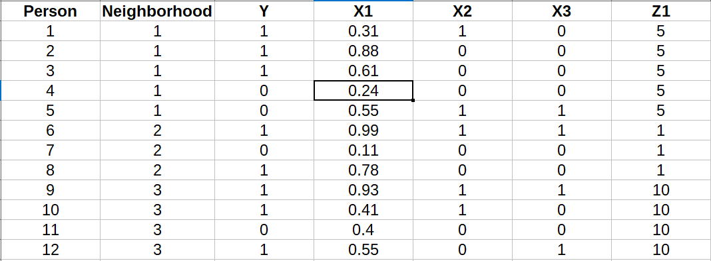
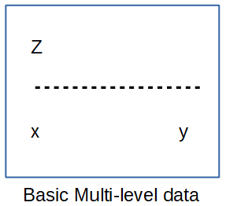
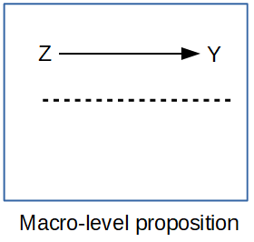
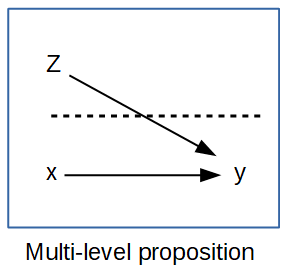
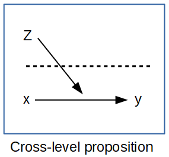

## A Fundamental problem of names 

Before we begin our discussion of multi-level data, we must first clarify some semantics. The models we are going to be describing and using in this and the following lesson go by a variety of different names, depending on the disciplinary tradition you may come from. To clarify, these models all follow common forms, but names may be vary. 

Three names that are commonly used for these models are:

- Mixed effects models
- Hierarchical models
- Random effects models

We will see later why these names are important in specific contexts, but for now, it is sufficient to say that these are all the same model, and they all refer to the same suite of models, but different disciplines/authors/applications have managed to confuse us all.


## Some perspectives in Multi-level Modeling 

Following from previous lessons, within spatial demography, there are many different types of perspectives that are used when asking questions. Regardless of the specific disciplinary tradition that you may come from, all of these perspectives attempt to situate humans within some contextual level that is assumed to either influence or be influenced by their actions and behaviors.

Following the lessons within this course, we have discussed how various measures of context matter for human health and economic activities, and these are all very valid when considering the use of multi-level models. 

In general, a multi-level framework for any analysis will be interested in asking questions about outcomes that are clustered by either space or time or some other linking characteristic, such as cohort of birth or period of life. 

The processes that affect an outcome within a multi-level framework are thought to be operating at both the individual level (person level) and at some other structural level of existence. These structural levels can be defined in a variety of ways, but again, following what we have covered previously, the structural levels commonly addressed in spatial demography are those of the household, neighborhood, social network, residential location, or other locational definition. The processes operating at these levels are also believed to be causal to some degree, meaning that they are thought to cause the outcome, or at least we can construct an argument about how these processes **_could_** cause the outcome. 

Finally, any multilevel perspective has at its core an interest in describing the variation within the population that is attributable to the differences between these contextual, or structural levels. Moreover, the interest in the variation between these contexts presents something that is worth knowing about and addressing beyond simply focusing on the individual.


## Multi-level data structure 

Most statistical models assume that the data we put into them are independent of one another, meaning the individual responses in sample that is represented by the data are not related to one another in some fashion. Things that can violate this assumption, as we have seen already in this course, are spatial closeness, or, as it often is in multi-level data, neighborhood or place-base co-residence. By co-residence, we simply mean that people live in the same area, however that is defined. 

As we have already discussed in this course, according to Tobler's law, things that are close together are more alike than things that are far apart. So, if two or more people are sampled from a given neighborhood, or place, they may be at least correlated with one another because they share a similar residential location. 

In most population-based surveys, people are sampled in a non-random fashion, despite what we learn in our introductory statistics books. This is because it can be much more cost effective to capture a population sample within a small area. These areas may be called **_clusters_** or **_primary sampling units_**, and you may have seen these terms before in other analyses you have done. Many surveys identify these clusters within their data code books, so that you can use this information in statistical analyses you may do. Often these clusters are nested within other areas known as **_strata_** which represent a larger subdivision of space or some sort of administrative area. For example, a school district may serve as a sample stratum, and the schools within it may serve as primary sampling units, or clusters. This would represent a **_two-stage_** sample design, with the districts representing the first stage of sampling and the schools being the second stage. We could have a third stage where classrooms are sampled within schools, for instance. A popular longitudinal survey, the [Early Childhood Longitudinal Survey - Kindergarten cohort, 1998 and 2011](https://nces.ed.gov/ecls/) follow this type of sampling strategy. 

When doing any analysis of data that are sampled in this kind of nested fashion, we must be careful, because the observations at any of these levels could be correlated. This leads to dependence among the observations within the given levels, and typically, the lower the level of sampling, the more similar the observations. You can think that children within the same classroom may be more similar to one another than children in the same school district, for example. 

Here's a picture of the process of stratified sampling, with a simple 1 stage design. In this example, there are several possible neighborhoods that could be sampled, but some are not sampled (dotted lines) and some are sampled (solid lines). These could represent strata or clusters, because in a 1 stage design, the two are synonymous. 

Within each neighborhood there are people, and some of them are sampled (circles) and some are not sampled (X's). 


If we were to look at the data represented by this type of sampling method, it would look like the example below. We have 12 people nested within three neighborhoods. Each is measured for the outcome variable (Y) and three presumed predictor variables (X1, X2 and X3). We see that these values are unique to each individual, they each have their own individual level data. 

Also present is a neighborhood-level variable, Z1, which is the same within neighborhood, but differs across neighborhoods. A real example of this may be the poverty rate, which is measured for areas, and people within the same area will all have the same value for that variable



This is actually a really good example of what we have been talking about: people within areas sharing characteristics. In this case everyone in a given neighborhood all have the same level of neighborhood poverty, so they are similar in that regard, but are different in their own characteristics (the X's for example). 

In multi-level analyses, we are typically interested in how both the individual person-level variables and the neighborhood level variables combine to explain the outcome. In the next part of the lesson, we will review various types of research propositions we may be interested in, which use combinations of these available variables. 


## Multi-level propositions 

When we have a research statement that involves individuals within some context, this is called a multi-level proposition. In this sense, we are interested in questions that relate variables at different levels, the person and the place, the micro and the macro. 

### Types of multi-level propositions

In a multilevel proposition, variables are present at two different levels, and we are potentially interested in the relationship between both the micro and macro level association with our outcome, y.

Again, referring to our data structure from the previous part of this lesson, we could create a graphical representation of these data, with the outcome, *Y* and the predictor *X* measured at the individual level, and the contextual variable *Z* measured at the neighborhood level. 

   

In the graphs the follow, we will describe types of questions that could be asked using various combinations of this information. 

### Individual level proposition
If we are concerned with how individual-level factors affect each person's outcome, then we are stating an individual level, or micro, proposition. In this type of analysis, we have *Y* and *X*, both measured on our individual level units. An example of this would be that we think a persons health is affected by their level of education. 


## Macro level proposition
We can also have purely macro-level propositions, where we have an outcome *Y* measured at an aggregate level unit, such as a neighborhood or MSA, such as we have seen before in previous lessons. We also have predictors measured at the aggregate unit, *Z* and we are interested in how *Z* affects *Y*. This is referred to as an **_ecological study_** because we observe no within area variation, only between areas. While this type of study is common in spatial demography, the trend is moving away from such analyses as better multi-level data become available. An example of this would be where we are interested to see if higher poverty rates at the MSA level are associated with higher rates of mortality at the MSA level. 



### Multi-level propositions
In most circumstances when we do a multi-level analysis, we use information in the form of predictors measured at both the micro and macro levels of analysis, in order to understand an outcome at the individual level. These types of analysis represent true **_multi-level_** analyses. An example of a multi-level research question would be "For individuals with the a given level of education, does living in an high poverty area lead to poor health". When we have these types of statements, we are generally looking for a *net* effect of *Z* after considering the effect of *X*. 



These are highly informative modelling strategies because we are considering the effects of both individual and neighborhood level variables on an individual level outcome. 

### Cross-level interactions 
The final proposition we will discuss is the **_cross-level interaction_**. This is where we ask a question that demands we interact the neighborhood and individual-level predictors. In a sense, this puts the individual level directly within context by considering the interaction. When we use language to describe this type of association, we must stress the conditioning of the individual level effect on the contextual level effect. A cross-level interaction question could be stated as: "Individuals with low levels of education, *and* who live in areas with high poverty, have higher risk of death." The important part of the statement is the *and*, where we stress in our research statement that the individual level characteristic is directly interacted with the neighborhood level variable.  



In the section that follows, we will describe the structure of multi-level regression models, emphasizing the various forms that we have covered in this section.


## Multi-level statistical models 

The multi-level model can be used for any form of outcome variable; continuous, dichotomous, count, right skewed, categorical. Many times the model is presented as an extension to the regular linear regression model, however this is not as useful for much of social science. It is more common in demography and sociology to be analyzing survey data that consist mostly of counts or yes/no question response. Taking this into consideration, we will discuss the multi-level model from the perspective of the generalized linear model, such as we used for logistic or Poisson regression, as to avoid strict reliance on an assumed continuous outcome. We do this because once we are comfortable with the idea that you can link the mean of any outcome to a linear model through the general linear model framework, this can be extended to any distribution. 

Using this framework, we will refer to the class of models that we are describing as **_Generalized Linear Mixed Models_**, or GLMMs. 

In this section we will begin our discussion of the multi-level regression model with the first model most people learn in statistics, the Analysis of Variance (ANOVA). Why the ANOVA? Because the basic multilevel model is a direct analog of the ANOVA model. 

If you remember, the ANOVA was the model that was used to compare the means of several groups, or for just two groups. The general form of this is:

$$E(y_j) = \mu + u_{j}$$

or, the mean of the $j^{th}$ group is a combination of the overall mean of the sample, $\mu$ and a term $u_j$ that measures how the mean of the $j^{th}$ group differs from the overall sample mean, or perhaps from the mean of a pre-arranged reference group. When the number of groups is small, say 3 to 5, the ANOVA model is very efficient, meaning that you are estimating a few parameters in order to estimate the means of each group. These are said to be **_fixed effects_** in the model, as they are estimated relative to the mean of a predefined group. 


However, in many multi-level modeling analyses, we may have dozens or hundreds of groups. An example would be if we had people nested within counties, even if we only have people in 10% of counties, we would still have over 300 groups in the data. In this setting you would estimate 300 parameters, which sounds like a lot, and it is. Moreover, when the number of groups is small, we generally choose of the groups to be the reference group and compare the means of the other groups to it. When we have a large number of groups, doing this with reference to any one particular group may not be so logical: Why pick the one you choose? Why not another?

It is in this situation where the multi-level model has a distinct advantage. Instead of estimating a single parameter for every group, the multi-level model estimates the overall mean $\mu$, and then models the group-specific deviations as a set of Normally distributed random variables, with a mean of 0, since the overall mean is estimated by $\mu$, and a variance of $\sigma^2_u$. This is considered to be a **_random effect term_** in the model. Contrast this to the ANOVA model where al the group means are "fixed". When using this type of model, we can still measure the means of all the groups, and we are doing so with fewer parameters, technically only two, the overall mean, $\mu$ and the variance in $u_j$, $\sigma^2_u$, although that is a matter of debate in the literature on the subject.  

Of course, in social research, the ANOVA model is generally only a first step, and we are often much more interested in controlling for various other factors, so assuming that the ANOVA or the multi-level analog is the kind of model that will be used in a research setting is not very realistic. 

So, we can add lots of other terms in the model, and if we use the ANOVA as a basis, we have a model like:

$$E(y_j) = \mu + u_j +\sum_k \beta_k x_k$$

Where the $\beta$'s are regression coefficients for other individual level variables in the model, and the *x*'s are the other predictors, besides the group variable. 

Again, if we have a small number of groups, the $u_j$ will only be a few parameters, and if we have lots of groups then the $u_j$ will be lots of parameters. In this type of situation, if we adopt a random effect model, then this would be considered a **_mixed effects model_** where we have some effects in the model that are considered fixed, the $\beta_k$'s and a random effect term for the group means, $u_j$. 

In many presentations of the multi-level model, you may see the equation above written where the $u_j$ term is absorbed into the intercept term. This would be written as two stages, and in terms of the intercept parameter, $\beta_0$:

$$y_{ij} = \beta_{0j} +\sum_k \beta_k x_{kij}$$
$$\beta_{0j} = \beta_0 + u_j$$

When interpreting this model, the $u_j$ terms are referred to as a the **_random intercepts_** in the model. In model output, these are rarely shown directly, since there can be many of them. What *is* shown is the variance in these random terms, $\sigma^2_u$, and it reported by all software that fits these models. 


## Components of variation in the multi-level model 
When using the multi-level model, we are often concerned with how much variation is accounted for within and between our groups, or neighborhoods. Different types of outcome variables, and different outcome distribution allow imply different sources of variation within the model. For example, if we were to assume our outcome was Normally distrusted, then the model above would be written as:

$$y_{ij} = \beta_{0j} +\sum_k \beta_k x_{kij} + e_i$$

Where we have the $e_i$ term, as in the ordinary least squares model, which measures the individual level variation not accounted for by the model parameters, or the residual. In this model specification, this $e_i$ term has it's own variance, $\sigma^2_e$, or the residual variance. There is a second variance term, as shown in the previous section, that measures the variation between our higher-level units, $\sigma^2_u$, or the between group variance. 

This implies that the total variation, $\sigma^2_y$ in the outcome, for a model assuming a Normal distribution for the outcome comes from two sources, the between group variance and the person-level variance:

$$\sigma^2_y = \sigma^2_e +\sigma^2_u$$

In multi-level models, a quantity called the **_Intraclass correlation coefficient_**, or ICC is commonly calculated using these variance components. The ICC is considered a measure of correlation within higher level units. In other words, it measures the degree of similarity between two randomly selected respondents within a given, randomly selected neighborhood. An example of this would be, if we wanted to know how similar you were to one of your neighbors in your neighborhood, on average. As a general rule, the larger the between-group variance, the greater the ICC. 

$$\text{ICC} = \frac{\sigma^2_u}{\sigma^2_e +\sigma^2_u}$$

The ICC is bound between 0 and 1, with higher values implying greater similarity within our higher level units. For example and ICC of .5 (which is large for an ICC) would imply that you and a randomly selected one of your neighbors in your neighborhood would be pretty strongly correlated, while an ICC of .01, would imply a very low degree of similarity between you and your neighbors. 

If you are doing a multi-level logistic regression model the variance terms are different. Since the binomial distribution, assumed by the logistic regression model, only has one parameter, and the variance and mean of the distribution are strongly related, the multi-level logistic model has a different individual-level variance term, that is actually a constant. In the binomial model, the ICC is:

$$\text{ICC} = \frac{\sigma^2_u}{\frac{\pi^2}{3} +\sigma^2_u}$$

The term $\frac{\pi^2}{3}$ is the variance in the logistic distribution, implied by the model, and is a constant (Austin and Merlo, 2017). 

If a Poisson multi-level model is used, then the individual level variance is actually 1, and the ICC is:

$$\text{ICC} = \frac{\sigma^2_u}{1 +\sigma^2_u}$$
The individual level variance is 1 in the Poisson model, owing to the assumption of that model that the mean and variance of the distribution are the same. 


## Practical rules of thumb for choosing models 

There are differences between these classic ANOVA model and the linear mixed model.  As a rule, you use the fixed-effects models when:

- You know that each group is regarded as unique, and you want to draw conclusions on each of these specific groups, and you also know all the groups a priori e.g. sex or race

- If the groups can be considered as a sample from some (real or hypothetical) population of groups, such as our MSA example, and you want to draw conclusions about this population of groups, then the random effects model is appropriate.
    
*WHY?*  because if you have a *LARGE* number of groups, say $n_j$ > 10, then the odds that you are really interested in all possible difference in the means is probably pretty low, and the model has lots of parameters that you do not really care about. 
 
## Multi-level data sources 
Before we move forward into actually seeing how to use R to estimate multi-level models, we must state a caveat. Not all questions that you may come up with involve multi-level propositions, nor do all types of data necessarily have the required elements to do a traditional multi-level analysis, from a spatial demographic perspective, or the data necessary to do a place-focused type of model may only be available in restricted-use versions of publicly available data. 

Some examples of public-use data with place-based higher level units identified are:

- ECLS-K 1998 and 2011 (School identifier)
- BRFSS many years (pre 2014 MSA identifier, post 2014, MSA identifier)
- ACS microdata (PUMA, MSA, State)
- Demographic and Health Survey, many countries, many years (Region, GPS coordinate for sampling units)

While many other data sources also allow for the types of models we are describing here, these are widely used.

Other data sources that do not allow for place-based multi-level models in their public use data, but do allow for it in the restricted use data are:

- National Health and Nutrition Examination Survey (NHANES)
- National Health Interview Survey (NHIS)
- National Longitudinal Study of Adolescent to Adult Health (AddHealth)
- Panel Study of Income Dynamics (PSID)
- National Longitudinal Study of Youth (NLSY)


## Using R to estimate multi-level models 

In R there  are several libraries that can be used to estimate multi-level models. The `lme4` library provides a current and continuously developed framework for estimating the types of models we are considering, with options for several different distributions for handling continuous, discrete and count outcomes. 

The primary function, depending on how your outcome is measured, will either be `lmer()` for Normally distributed outcomes, or `glmer()` for count and binary outcomes. Syntax for the general models are very similar to other R functions for regression we have seen in this course. 

For example, if our outcome is binary (0/1), and is called `y` and we have one individual level predictor, `x_1`, and our grouping variable is called `place`, and our dataset is called `mydata`, then our model would look like this:

`glmer(y ~ x_1 + (1|place), data=mydata, family=binomial)`

The syntax `(1|place)` tells R that we want to consider a random intercept term for each place in the data. The `1` indicates that we are specifying a constant for each place, just like in a regular regression model, the intercept is estimated by the computer generating a vector of 1's as the first element in the design matrix. 

In the next section, we will use R to analyze an outcome from the 2016 [Behavioral Risk Factor Surveillance System SMART MMSA](https://www.cdc.gov/brfss/smart/smart_2016.html)(BRFSS) data. 

The BRFSS data are a nationally representative phone survey designed to measure national and local trends in many health outcomes and morbidities, and the use of health resources. The BRFSS has been collected annually since 1984. The SMART data file, is a subset of the larger BRFSS data file, which identifies the metropolitan statistical area where each survey respondent lives.  


```{r load data&recode, message=FALSE, warning=FALSE}
#load brfss
library(car)
library(stargazer)
library(survey)
library(sjPlot)
library(ggplot2)
library(pander)
library(knitr)
library(tidycensus)
library(dplyr)
```


```{r}
load(url("https://github.com/coreysparks/data/blob/master/brfss_2017.Rdata?raw=true"))

set.seed(12345)
#samps<-sample(1:nrow(brfss_17), size = 40000, replace=F)
#brfss_17<-brfss_17[samps,]
#The names in the data are very ugly, so I make them less ugly
nams<-names(brfss_17)
#we see some names are lower case, some are upper and some have a little _ in the first position. This is a nightmare.

newnames<-gsub(pattern = "_",
               replacement =  "",
               x =  nams)

names(brfss_17)<-tolower(newnames)

```

### Recode variables
```{r}
#sex
brfss_17$male<-ifelse(brfss_17$sex==1, 1, 0)

#BMI
brfss_17$bmi<-ifelse(is.na(brfss_17$bmi5)==T, NA, brfss_17$bmi5/100)

#Healthy days
brfss_17$healthdays<-Recode(brfss_17$physhlth, recodes = "88=0; 77=NA; 99=NA")

#Healthy mental health days
brfss_17$healthmdays<-Recode(brfss_17$menthlth, recodes = "88=0; 77=NA; 99=NA")

brfss_17$badhealth<-Recode(brfss_17$genhlth, recodes="4:5=1; 1:3=0; else=NA")
#race/ethnicity
brfss_17$black<-Recode(brfss_17$racegr3, recodes="2=1; 9=NA; else=0")
brfss_17$white<-Recode(brfss_17$racegr3, recodes="1=1; 9=NA; else=0")
brfss_17$other<-Recode(brfss_17$racegr3, recodes="3:4=1; 9=NA; else=0")
brfss_17$hispanic<-Recode(brfss_17$racegr3, recodes="5=1; 9=NA; else=0")

brfss_17$race_eth<-Recode(brfss_17$racegr3, 
recodes="1='nhwhite'; 2='nh black'; 3='nh other';4='nh multirace'; 5='hispanic'; else=NA",
as.factor = T)
brfss_17$race_eth<-relevel(brfss_17$race_eth, ref = "nhwhite")

#insurance
brfss_17$ins<-Recode(brfss_17$hlthpln1, recodes ="7:9=NA; 1=1;2=0")

#income grouping
brfss_17$inc<-Recode(brfss_17$incomg, recodes = "9= NA;1='1_lt15k'; 2='2_15-25k';3='3_25-35k';4='4_35-50k';5='5_50kplus'", as.factor = T)
brfss_17$inc<-as.ordered(brfss_17$inc)
#education level
brfss_17$educ<-Recode(brfss_17$educa,
recodes="1:2='0Prim'; 3='1somehs'; 4='2hsgrad'; 5='3somecol'; 6='4colgrad';9=NA",
as.factor=T)
brfss_17$educ<-relevel(brfss_17$educ, ref='2hsgrad')

#employment
brfss_17$employ<-Recode(brfss_17$employ1,
recodes="1:2='employloyed'; 2:6='nilf'; 7='retired'; 8='unable'; else=NA",
as.factor=T)
brfss_17$employ<-relevel(brfss_17$employ, ref='employloyed')

#marital status
brfss_17$marst<-Recode(brfss_17$marital,
recodes="1='married'; 2='divorced'; 3='widowed'; 4='separated'; 5='nm';6='cohab'; else=NA",
as.factor=T)
brfss_17$marst<-relevel(brfss_17$marst,
                        ref='married')

#Age cut into intervals
brfss_17$agec<-cut(brfss_17$age80,
                   breaks=c(0,24,39,59,79,99))

#BMI, in the brfss_17a the bmi variable has 2 implied decimal places,
#so we must divide by 100 to get real bmi's

brfss_17$bmi<-brfss_17$bmi5/100

#smoking currently
brfss_17$smoke<-Recode(brfss_17$smoker3, 
recodes="1:2=1; 3:4=0; else=NA")
#brfss_17$smoke<-relevel(brfss_17$smoke, ref = "NeverSmoked")

brfss_17$obese<-ifelse(is.na(brfss_17$bmi)==T, NA, 
                       ifelse(brfss_17$bmi>30,1,0))

```

I want to see how many people we have in each MSA in the data:

```{r}

#Now we will begin fitting the multilevel regression model with the msa
#that the person lives in being the higher level
head(data.frame(name=table(brfss_17$mmsaname), 
                id=unique(brfss_17$mmsa)))
#people within each msa

#How many total MSAs are in the data?
length(table(brfss_17$mmsa))
#MSAs
```


### Higher level predictors
We will often be interested in factors at both the individual *AND* contextual levels. To illustrate this, I will use data from the American Community Survey measured at the MSA level. Specifically, I use the DP3 table, which provides economic characteristics of places, from the 2010 5 year ACS [Link](http://www.census.gov/acs/www/data_documentation/special_data_release/).

To measure macro level variables, I will include some Census variables from the ACS 2011 5 Year estimates load in ACS data from **_tidycensus_**.
The first set of variables includes information on the economic conditions of the MSA, specifically poverty and unemployment.
```{r}
usacs<-get_acs(geography = "metropolitan statistical area/micropolitan statistical area", year = 2011,
                variables=c( "DP05_0001E",
                             "DP03_0062E",
                             "DP04_0003PE") ,
                summary_var = "B01001_001",
                geometry = F,
               output = "wide")

usacs<-usacs%>%
  mutate(totpop= DP05_0001E,
         medhhinc=DP03_0062E,
         pvacant=DP04_0003PE/100)%>%
  dplyr::select(GEOID,NAME, totpop, medhhinc, pvacant)


head(usacs)
```

I also have segregation measures at the MSA level that I made [here](http://rpubs.com/corey_sparks/116032), I will merge these in too.


### Clean and standardize contextual data
```{r}
myscale<-function(x){as.numeric(scale(x))}
usacs<-usacs %>%
  mutate_at(c( "medhhinc", "pvacant"),myscale)

merged<-usacs%>%
  filter(complete.cases(.))
head(merged)
```

Now, I merge the data back to the individual level data:
```{r}
merged<-merge(x=brfss_17,
              y=merged,
              by.x="mmsa",
              by.y="GEOID",
              all.x=F)

```

Let's see the geographic variation in these economic indicators:
```{r, results='hide'}
library(tigris)
msa<-core_based_statistical_areas(cb=T)
msa_ec<-geo_join(msa,
                 usacs, "CBSAFP", "GEOID", how="inner")

```

```{r}
library(RColorBrewer)
library(tmap)
tm_shape(msa_ec)+
  tm_polygons("pvacant",
              style="quantile",
              n=5,
              legend.hist = TRUE) +
   tm_layout(legend.outside = TRUE,
             title = "% Vacant Housing") 


tm_shape(msa_ec)+
  tm_polygons("medhhinc",
              style="quantile",
              n=5,
              legend.hist = TRUE) +
   tm_layout(legend.outside = TRUE,
             title = "Median Household Income") 


```

Merge the MSA data to the BRFSS data

```{r merged}

merged$bmiz<-as.numeric(scale(merged$bmi,
                              center=T,
                              scale=T))
#merged<-merged[complete.cases(merged[, c("bmiz", "race_eth", "agec", "educ", "gini")]),]
#and merge the data back to the kids data

merged<-merged%>%
  dplyr::select(bmiz, obese, mmsa, agec, educ, race_eth,smoke, healthmdays, badhealth,bmi,medhhinc,pvacant, male, mmsawt, mmsaname )%>%
  filter(complete.cases(.))


head(merged[, c("bmiz", "male", "agec", "educ","medhhinc", "pvacant", "mmsa")])

meanbmi<-mean(merged$bmi, na.rm=T)

sdbmi<-sd(merged$bmi, na.rm=T)


```

As a general rule, I will do a basic fixed-effects ANOVA as a precursor to doing full multi-level models, just to see if there is any variation amongst my higher level units (groups). If I do not see any variation in my higher level units, I generally will not proceed with the process of multi-level modeling.

```{r anova,message=FALSE, warning=FALSE}
fit.an<-lm(bmiz~as.factor(mmsa),
           merged)
anova(fit.an)
```


### use glm() for non-normal outcomes
```{r}
fit.ob<-glm(obese~as.factor(mmsa),
            family=binomial,
            merged)

anova(fit.ob, test="Chisq")
```
So we see significant variation in our outcomes across the higher level units.

Now we fit the hierarchical model
```{r, message=FALSE}
library(lme4)
library(lmerTest)
library(arm)
```

Basic hierarchical model for means of each MSA:

```{r}

fit<-lmer(bmiz~(1|mmsaname),
           data=merged)
arm::display(fit,
             detail=T)

```

```{r}
merged$predbmi<-sdbmi*(fitted(fit))+meanbmi

head(ranef(fit)$mmsa)

dim(ranef(fit)$mmsa)

rate<- sdbmi*(fixef(fit)+ranef(fit)$mmsa)+meanbmi
est<-data.frame(rate =rate, id=rownames(ranef(fit)$mmsa))
head(est)

```


```{r}
msa_ec<-merge(msa_ec, est,
              by.x="CBSAFP", by.y="id")

tm_shape(msa_ec)+
  tm_polygons("X.Intercept.",
              style="quantile",
              n=5,
              legend.hist = TRUE) +
   tm_layout(legend.outside = TRUE,
             title = "Estimated BMI") 

```

```{r}

citymeans<-aggregate(cbind(bmi, predbmi)~mmsaname,merged, mean)
head(citymeans, n=10)

plot(predbmi~bmi, citymeans)
```

Model with individual level predictors:

```{r}
fit2<-lmer(bmiz~male+agec+educ+(1|mmsa),
           data=merged,
           na.action=na.omit)
arm::display(fit2, detail=T)

```

We do a likelihood ratio test to see if our individual level variables are explaining anything about out outcome:

```{r}
anova(fit, fit2)

```

They do.


We also typically would test to see if the random effect term is significant, SAS pumps out a test of this, so we do the same kind of thing in R
```{r}

rand(fit2)

```

Which shows significant variation in average BMI across MSAs.


Some may be interested in getting the intra-class correlation coefficient. While I don't usually pay attention to this, here it is:
```{r ICC, fig.width=8, fig.height=14}
library(sjstats); library(sjPlot)
icc(fit2)
plot_model(fit,
           type = "re",
           sort.est="sort.all",
           grid=F)
```

So less than 1% of the variance in BMI is due to difference between MSAs. That's not much, but according to our random effect testing, it's not, statistically speaking, 0.

### Pooling of estimates
It may be informative to plot the estimated BMI's for each MSA from the OLS and multilevel models. This section illustrates the effects of "pooling" as Gelman & Hill ch 12. 

```{r}
#these models are good for estimating group means better than traditional methods
#this follows the examples in chapter 12 of Gelman and Hill, I stole the code directly from them.

#complete pooling, this model fits the grand mean ONLY
fit.cp<-lm(bmi~1, merged)
display(fit.cp)


#No pooling i.e. fixed effects regression, this model fits separate means for each MSA using OLS
lm.unpooled<-lm(bmi~factor(mmsa)-1, merged)


#partial pooling, this model fits the population mean and MSA deviations using multilevel models
fit0<-lmer(bmi~1+(1|mmsa), merged)

#partial pooling with covariate
fit0.1<-lmer(bmi~medhhinc+pvacant+(1|mmsa), merged)

```

### Plot the means of the counties
```{r}
mmsas<-unique(merged$mmsa)
J<-length(unique(merged$mmsa))
ns<-as.numeric(table(brfss_17$mmsa[brfss_17$mmsa%in%mmsas]))
sample.size <- as.numeric(table(brfss_17$mmsa[brfss_17$mmsa%in%mmsas]))
sample.size.jittered <- sample.size*exp (runif (J, -.1, .1))

par (mar=c(5,5,4,2)+.1)
plot (sample.size.jittered, 
      coef(lm.unpooled), cex.lab=1.2, cex.axis=1.2,
      xlab="sample size in MSA j", ylab=expression (paste ("est. intercept, ", alpha[J], "   (no pooling)")),
      pch=20, log="x", ylim=c(25, 30), yaxt="n", xaxt="n")
axis (1, quantile(ns), cex.axis=1.1)
axis (2, seq(25, 30), cex.axis=1.1)
for (j in 1:J){
  lines (rep(sample.size.jittered[j],2),
         coef(lm.unpooled)[j] + c(-1,1)*se.coef(lm.unpooled)[j], lwd=.5)
}
abline (coef(fit.cp)[1], 0, lwd=.5)
title(main="Estimates of MSA Means from the Fixed Effect Model")

```


### Plot MLM estimates of MSA means + se's

```{r}

par (mar=c(5,5,4,2)+.1)
a.hat.M1 <- coef(fit0)$mmsa[,1]
a.se.M1 <- se.coef(fit0)$mmsa

plot (as.numeric(ns), t(a.hat.M1), cex.lab=1.2, cex.axis=1.1,
      xlab="sample size in MSA j",
      ylab=expression (paste("est. intercept, ", alpha[j], "(multilevel model)")),
      pch=20, log="x", ylim=c(25, 30), yaxt="n", xaxt="n")
axis (1, quantile(ns), cex.axis=1.1)
axis (2, seq(25,30), cex.axis=1.1)
for (j in 1:length(unique(merged$mmsa))){
  lines (rep(as.numeric(ns)[j],2),
         as.vector(a.hat.M1[j]) + c(-1,1)*a.se.M1[j], lwd=.5, col="gray10")
}
abline (coef(fit.cp)[1], 0, lwd=.5)
title(main="Estimates of MSA Means from the MLM")

```

### Plot MLM estimates of MSA means + se's, model with MSA covariates
```{r}

par (mar=c(5,5,4,2)+.1)
a.hat.M2 <- coef(fit0.1)$mmsa[,1]
a.se.M2 <- se.coef(fit0.1)$mmsa

plot (as.numeric(ns), t(a.hat.M2), cex.lab=1.2, cex.axis=1.1,
      xlab="sample size in MSA j",
      ylab=expression (paste("est. intercept, ", alpha[j], "(multilevel model with covariates)")),
      pch=20, log="x", ylim=c(25, 30), yaxt="n", xaxt="n")
axis (1, quantile(ns), cex.axis=1.1)
axis (2, seq(25,30), cex.axis=1.1)
for (j in 1:length(unique(merged$mmsa))){
  lines (rep(as.numeric(ns)[j],2),
         as.vector(a.hat.M2[j]) + c(-1,1)*a.se.M2[j], lwd=.5, col="gray10")
}
abline (coef(fit.cp)[1], 0, lwd=.5)
title(main="Estimates of MSA Means from the MLM with MSA predictors")

#This plot shows that as the n_j goes down, the standard error of the estimate increases
qplot(y=se.coef(lm.unpooled), x=coef(lm.unpooled), size=sqrt(ns))

#again, we see the relationship between variance and n_j
qplot(y=as.numeric(a.se.M1),x=se.coef(lm.unpooled),color=sqrt(ns))


```
