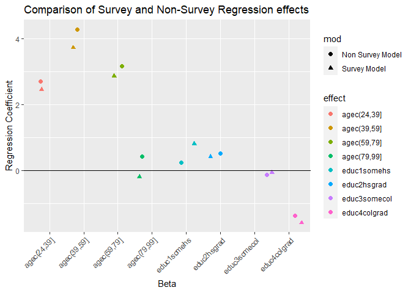

## What is a survey?

A systematic method for gathering information from a sample of entities
for the purposes of constructing quantitative descriptors of the
attributes of the larger population of which the entities are members

## Questions when identifying a survey data source:

1.  What is the target population?
2.  What is the sampling frame

-   how do we know who ***could*** be included?

1.  What is the sample design?
2.  What is the mode of data collection?
3.  Is the survey ongoing or a one-time collection?

# Core Concepts

***Sampling units*** - where information will be collected from

***Sampling frame*** - the set of sampling units containing distinct
sets of population members

# Weights and weighting

Surveys with complex sample designs will often have:

-   Unequal probabilities of selection
-   Variation in response rates across groups
-   Differences in distributions of characteristics compared to the
    population

### Weights are used to compensate for these features

## What is a weight?

-   A weight is used to indicate the relative strength of an
    observation.

-   In the simplest case, each observation is counted equally.

-   For example, if we have five observations, and wish to calculate the
    mean, we just add up the values and divide by 5.

### Dataset with 5 cases

``` r
library(htmlTable)
y<-c(4,2,1,5,2)
wt<-c(1,2,4,1,2)
dat<-data.frame(y=y, weight=wt)
knitr::kable(dat)
```

|   y | weight |
|----:|-------:|
|   4 |      1 |
|   2 |      2 |
|   1 |      4 |
|   5 |      1 |
|   2 |      2 |

Unweighted sample mean

``` r
mean(dat$y)
```

    ## [1] 2.8

Weighted sample mean

``` r
library(questionr)
wtd.mean(x=dat$y, weights=dat$weight)
```

    ## [1] 2.1

## Difference between unweighted and weighted data

-   With unweighted data, each case is counted equally.

-   Unweighted data represent only those in the sample who provide data.

-   With weighted data, each case is counted relative to its
    representation in the population.

-   Weights allow analyses that represent the target population.

Weights compensate for collecting data from a sample rather than the
entire population and for using a complex sample design.

Weights adjust for differential selection probabilities and reduce bias
associated with non-response by adjusting for differential nonresponse.
Weights are used when estimating characteristics of the population.

## Sample variance estimation in complex designs

***Standard errors*** are produced for estimates from sample surveys.
They are a measure of the variance in the estimates associated with the
selected sample being one of many possible samples.

Standard errors are used to test hypotheses and to study group
differences.

Using inaccurate standard errors can lead to identification of
statistically significant results where none are present and vice versa

## Complex survey designs and standard errors

-   The usual standard error formula assumes a simple random sample.

-   Software packages designed for simple random samples tend to
    underestimate the standard errors for complex sample designs.

-   Standard errors for estimates from a complex sample must account for
    the within cluster/ across cluster variation.

-   Special software can make the adjustment, or this adjustment can be
    approximated using the design effect.

## Methods for sample variance estimation

There are basically 3 ways in which software estimates variances: 1)
Naive method 2) Taylor series approximation 3) Balanced or Jackknife
replication

## Data Example

This example will cover the use of R functions for analyzing complex
survey data. Most social and health surveys are not simple random
samples of the population, but instead consist of respondents from a
complex survey design.

These designs often stratify the population based on one or more
characteristics, including geography, race, age, etc. In addition the
designs can be multi-stage, meaning that initial strata are created,
then respondents are sampled from smaller units within those strata.

An example would be if a school district was chosen as a sample strata,
and then schools were then chosen as the primary sampling units (PSUs)
within the district. From this 2 stage design, we could further sample
classrooms within the school (3 stage design) or simply sample students
(or whatever our unit of interest is).

## Multi-stage sampling

-   Non-random sampling

-   Population consists of known sub-groups called *clusters*

-   A 2 -stage sample might be households within neighborhoods, or
    children within schools

    -   We may choose a random sample of schools/neighborhoods at the
        first stage, and a random sample of people within each
        school/neighborhood as the second stage
    -   We need to be *careful* because the observations in the second
        stage are not *independent* of one another
    -   Increased probability of selection for children in a selected
        school

-   This type of sampling leads to *dependent* observations

Here’s a picture of this:


A second feature of survey data we often want to account for is
differential respondent weighting. This means that each respondent is
given a weight to represent how common that particular respondent is
within the population. This reflects the differenital probability of
sampling based on respondent characteristics.

As demographers, we are also often interested in making inference for
the population, not just the sample, so our results must be
generalizable to the population at large. Sample weights are used in the
process as well.

When such data are analyzed, we must take into account this nesting
structure (sample design) as well as the respondent sample weight in
order to make valid estimates of **ANY** statistical parameter. If we do
not account for design, the parameter standard errors will be incorrect,
and if we do not account for weighting, the parameters themselves will
be incorrect and biased.

In general there are typically three things we need to find in our
survey data codebooks: The sample strata identifier, the sample primary
sampling unit identifier (often called a cluster identifier) and the
respondent survey weight. These will typically have one of these names
and should be easily identifiable in the codebook.

Statistical software will have special routines for analyzing these
types of data and you must be aware that the diversity of statistical
routines that generally exists will be lower for analyzing complex
survey data, and some forms of analysis *may not be available!*

See [Thomas Lumley’s
Book](https://onlinelibrary.wiley.com/doi/book/10.1002/9780470580066) on
this!

Below I illustrate the use of survey characteristics when conducting
descriptive analysis of a survey data set and a linear regression model
estimated from that data. For this example I am using 2016 CDC
Behavioral Risk Factor Surveillance System (BRFSS) SMART metro area
survey data. [Link](https://www.cdc.gov/brfss/smart/smart_2016.html)

``` r
#load brfss
library(car)
```

    ## Loading required package: carData

``` r
library(stargazer)
```

    ## 
    ## Please cite as:

    ##  Hlavac, Marek (2022). stargazer: Well-Formatted Regression and Summary Statistics Tables.

    ##  R package version 5.2.3. https://CRAN.R-project.org/package=stargazer

``` r
library(survey)
```

    ## Loading required package: grid

    ## Loading required package: Matrix

    ## Loading required package: survival

    ## 
    ## Attaching package: 'survey'

    ## The following object is masked from 'package:graphics':
    ## 
    ##     dotchart

``` r
library(questionr)
library(dplyr)
```

    ## 
    ## Attaching package: 'dplyr'

    ## The following object is masked from 'package:car':
    ## 
    ##     recode

    ## The following objects are masked from 'package:stats':
    ## 
    ##     filter, lag

    ## The following objects are masked from 'package:base':
    ## 
    ##     intersect, setdiff, setequal, union

``` r
library(forcats)
```

``` r
brfss20<- readRDS(url("https://github.com/coreysparks/DEM7283/blob/master/data/brfss20sm.rds?raw=true"))
### Fix variable names
names(brfss20) <- tolower(gsub(pattern = "_",replacement =  "",x =  names(brfss20)))
```

### Recoding of variables

Be sure to always check your codebooks!

``` r
#Poor or fair self rated health
brfss20$badhealth<-Recode(brfss20$genhlth, recodes="4:5=1; 1:3=0; else=NA")

#sex
brfss20$male<-as.factor(ifelse(brfss20$sex==1, "Male", "Female"))

#race/ethnicity
brfss20$black<-Recode(brfss20$racegr3, recodes="2=1; 9=NA; else=0")
brfss20$white<-Recode(brfss20$racegr3, recodes="1=1; 9=NA; else=0")
brfss20$other<-Recode(brfss20$racegr3, recodes="3:4=1; 9=NA; else=0")
brfss20$hispanic<-Recode(brfss20$racegr3, recodes="5=1; 9=NA; else=0")
brfss20$race_eth<-Recode(brfss20$racegr3, 
recodes="1='nhwhite'; 2='nh black'; 3='nh other';4='nh multirace'; 5='hispanic'; else=NA",
as.factor = T)
brfss20$race_eth<-relevel(brfss20$race_eth, ref = "nhwhite")

#insurance
brfss20$ins<-Recode(brfss20$hlthpln1, recodes ="7:9=NA; 1=1;2=0")

#income grouping
brfss20$inc<-ifelse(brfss20$incomg==9, NA, brfss20$incomg)

#education level
brfss20$educ<-Recode(brfss20$educa, recodes="1:2='0Prim'; 3='1somehs'; 4='2hsgrad'; 5='3somecol'; 6='4colgrad';9=NA", as.factor=T)
brfss20$educ<-fct_relevel(brfss20$educ,'0Prim','1somehs','2hsgrad','3somecol','4colgrad' ) 

#employment
brfss20$employ<-Recode(brfss20$employ1, recodes="1:2='Employed'; 2:6='nilf'; 7='retired'; 8='unable'; else=NA", as.factor=T)
brfss20$employ<-relevel(brfss20$employ, ref='Employed')

#marital status
brfss20$marst<-Recode(brfss20$marital, recodes="1='married'; 2='divorced'; 3='widowed'; 4='separated'; 5='nm';6='cohab'; else=NA", as.factor=T)
brfss20$marst<-relevel(brfss20$marst, ref='married')

#Age cut into intervals
brfss20$agec<-cut(brfss20$age80, breaks=c(0,24,39,59,79,99))

#BMI, in the brfss20a the bmi variable has 2 implied decimal places, so we must divide by 100 to get real bmi's

brfss20$bmi<-brfss20$bmi5/100
brfss20$obese<-ifelse(brfss20$bmi>=30, 1, 0)
```

### Filter cases

``` r
brfss20<-brfss20%>%
  filter(sex!=9, is.na(educ)==F, is.na(badhealth)==F)
```

### Analysis

First, we will do some descriptive analysis, such as means and cross
tabulations.

``` r
library(gtsummary)

brfss20%>%
  select(badhealth, educ)%>%
  tbl_summary(by = educ, 
              label = list(badhealth = "Fair/Poor Health"),
              statistic = all_categorical())%>%
  add_p()%>%
  add_n()
```

``` r
#First we will do some tables
#Raw frequencies
table(brfss20$badhealth, brfss20$educ)
```

    ##    
    ##     0Prim 1somehs 2hsgrad 3somecol 4colgrad
    ##   0  2398    4983   37371    43861    78788
    ##   1  1438    2295    8700     7672     6394

``` r
#column percentages
100*prop.table(table(brfss20$badhealth, brfss20$educ), margin=2)
```

    ##    
    ##         0Prim   1somehs   2hsgrad  3somecol  4colgrad
    ##   0 62.513034 68.466612 81.116103 85.112452 92.493719
    ##   1 37.486966 31.533388 18.883897 14.887548  7.506281

``` r
#basic chi square test of independence
chisq.test(table(brfss20$badhealth, brfss20$educ))
```

    ## 
    ##  Pearson's Chi-squared test
    ## 
    ## data:  table(brfss20$badhealth, brfss20$educ)
    ## X-squared = 7681.7, df = 4, p-value < 2.2e-16

So basically all of these numbers are incorrect, since they all assume
random sampling. Now, we must tell R what the survey design is and what
the weight variable is, then we can re-do these so they are correct.

### Create a survey design object

Now we identify the survey design. *ids* = PSU identifers,
*strata*=strata identifiers, *weights*=sampling weights, *data*= the
data frame where these variables are located. Lastly, I only include
respondents with NON-MISSING case weights.

I first try to get only cities in the state of Texas by looking for “TX”
in the MSA’s name field in the data.

``` r
brfss20$tx<-NA
brfss20$tx[grep(pattern = "TX", brfss20$mmsaname)]<-1
```

Now I make the survey design object. You may be required to specify two
options here:

1.  `survey.lonely.psu` This means that some of the strata only have 1
    PSU within them. This does not allow for within strata variance to
    be calculated. So we often have to tell the computer to do something
    here. Two valid options are “adjust”, to center the stratum at the
    population mean rather than the stratum mean, and “average” to
    replace the variance contribution of the stratum by the average
    variance contribution across strata. (from ?surveyoptions)

2.  Nesting of PSU within strata. By default, PSUs have numeric
    identifiers that can overlap between strata. By specifying `nest=T`,
    we tell R to re-lable the PSUs so they are unique across strata. If
    your survey requires this, it will throw a warning message.

``` r
library(srvyr)
```

    ## 
    ## Attaching package: 'srvyr'

    ## The following object is masked from 'package:stats':
    ## 
    ##     filter

``` r
library(gtsummary)
options(survey.lonely.psu = "adjust")

test<-  brfss20%>%
  as_survey_design( strata =ststr, weights = mmsawt)%>%
  select(badhealth, educ)%>%
  tbl_svysummary(by = educ, 
              label = list(badhealth = "Fair/Poor Health"))%>%
  add_p()%>%
  add_n()

test
```

<div id="lmkswhcrjo" style="overflow-x:auto;overflow-y:auto;width:auto;height:auto;">
<style>html {
  font-family: -apple-system, BlinkMacSystemFont, 'Segoe UI', Roboto, Oxygen, Ubuntu, Cantarell, 'Helvetica Neue', 'Fira Sans', 'Droid Sans', Arial, sans-serif;
}

#lmkswhcrjo .gt_table {
  display: table;
  border-collapse: collapse;
  margin-left: auto;
  margin-right: auto;
  color: #333333;
  font-size: 16px;
  font-weight: normal;
  font-style: normal;
  background-color: #FFFFFF;
  width: auto;
  border-top-style: solid;
  border-top-width: 2px;
  border-top-color: #A8A8A8;
  border-right-style: none;
  border-right-width: 2px;
  border-right-color: #D3D3D3;
  border-bottom-style: solid;
  border-bottom-width: 2px;
  border-bottom-color: #A8A8A8;
  border-left-style: none;
  border-left-width: 2px;
  border-left-color: #D3D3D3;
}

#lmkswhcrjo .gt_heading {
  background-color: #FFFFFF;
  text-align: center;
  border-bottom-color: #FFFFFF;
  border-left-style: none;
  border-left-width: 1px;
  border-left-color: #D3D3D3;
  border-right-style: none;
  border-right-width: 1px;
  border-right-color: #D3D3D3;
}

#lmkswhcrjo .gt_title {
  color: #333333;
  font-size: 125%;
  font-weight: initial;
  padding-top: 4px;
  padding-bottom: 4px;
  padding-left: 5px;
  padding-right: 5px;
  border-bottom-color: #FFFFFF;
  border-bottom-width: 0;
}

#lmkswhcrjo .gt_subtitle {
  color: #333333;
  font-size: 85%;
  font-weight: initial;
  padding-top: 0;
  padding-bottom: 6px;
  padding-left: 5px;
  padding-right: 5px;
  border-top-color: #FFFFFF;
  border-top-width: 0;
}

#lmkswhcrjo .gt_bottom_border {
  border-bottom-style: solid;
  border-bottom-width: 2px;
  border-bottom-color: #D3D3D3;
}

#lmkswhcrjo .gt_col_headings {
  border-top-style: solid;
  border-top-width: 2px;
  border-top-color: #D3D3D3;
  border-bottom-style: solid;
  border-bottom-width: 2px;
  border-bottom-color: #D3D3D3;
  border-left-style: none;
  border-left-width: 1px;
  border-left-color: #D3D3D3;
  border-right-style: none;
  border-right-width: 1px;
  border-right-color: #D3D3D3;
}

#lmkswhcrjo .gt_col_heading {
  color: #333333;
  background-color: #FFFFFF;
  font-size: 100%;
  font-weight: normal;
  text-transform: inherit;
  border-left-style: none;
  border-left-width: 1px;
  border-left-color: #D3D3D3;
  border-right-style: none;
  border-right-width: 1px;
  border-right-color: #D3D3D3;
  vertical-align: bottom;
  padding-top: 5px;
  padding-bottom: 6px;
  padding-left: 5px;
  padding-right: 5px;
  overflow-x: hidden;
}

#lmkswhcrjo .gt_column_spanner_outer {
  color: #333333;
  background-color: #FFFFFF;
  font-size: 100%;
  font-weight: normal;
  text-transform: inherit;
  padding-top: 0;
  padding-bottom: 0;
  padding-left: 4px;
  padding-right: 4px;
}

#lmkswhcrjo .gt_column_spanner_outer:first-child {
  padding-left: 0;
}

#lmkswhcrjo .gt_column_spanner_outer:last-child {
  padding-right: 0;
}

#lmkswhcrjo .gt_column_spanner {
  border-bottom-style: solid;
  border-bottom-width: 2px;
  border-bottom-color: #D3D3D3;
  vertical-align: bottom;
  padding-top: 5px;
  padding-bottom: 5px;
  overflow-x: hidden;
  display: inline-block;
  width: 100%;
}

#lmkswhcrjo .gt_group_heading {
  padding-top: 8px;
  padding-bottom: 8px;
  padding-left: 5px;
  padding-right: 5px;
  color: #333333;
  background-color: #FFFFFF;
  font-size: 100%;
  font-weight: initial;
  text-transform: inherit;
  border-top-style: solid;
  border-top-width: 2px;
  border-top-color: #D3D3D3;
  border-bottom-style: solid;
  border-bottom-width: 2px;
  border-bottom-color: #D3D3D3;
  border-left-style: none;
  border-left-width: 1px;
  border-left-color: #D3D3D3;
  border-right-style: none;
  border-right-width: 1px;
  border-right-color: #D3D3D3;
  vertical-align: middle;
}

#lmkswhcrjo .gt_empty_group_heading {
  padding: 0.5px;
  color: #333333;
  background-color: #FFFFFF;
  font-size: 100%;
  font-weight: initial;
  border-top-style: solid;
  border-top-width: 2px;
  border-top-color: #D3D3D3;
  border-bottom-style: solid;
  border-bottom-width: 2px;
  border-bottom-color: #D3D3D3;
  vertical-align: middle;
}

#lmkswhcrjo .gt_from_md > :first-child {
  margin-top: 0;
}

#lmkswhcrjo .gt_from_md > :last-child {
  margin-bottom: 0;
}

#lmkswhcrjo .gt_row {
  padding-top: 8px;
  padding-bottom: 8px;
  padding-left: 5px;
  padding-right: 5px;
  margin: 10px;
  border-top-style: solid;
  border-top-width: 1px;
  border-top-color: #D3D3D3;
  border-left-style: none;
  border-left-width: 1px;
  border-left-color: #D3D3D3;
  border-right-style: none;
  border-right-width: 1px;
  border-right-color: #D3D3D3;
  vertical-align: middle;
  overflow-x: hidden;
}

#lmkswhcrjo .gt_stub {
  color: #333333;
  background-color: #FFFFFF;
  font-size: 100%;
  font-weight: initial;
  text-transform: inherit;
  border-right-style: solid;
  border-right-width: 2px;
  border-right-color: #D3D3D3;
  padding-left: 5px;
  padding-right: 5px;
}

#lmkswhcrjo .gt_stub_row_group {
  color: #333333;
  background-color: #FFFFFF;
  font-size: 100%;
  font-weight: initial;
  text-transform: inherit;
  border-right-style: solid;
  border-right-width: 2px;
  border-right-color: #D3D3D3;
  padding-left: 5px;
  padding-right: 5px;
  vertical-align: top;
}

#lmkswhcrjo .gt_row_group_first td {
  border-top-width: 2px;
}

#lmkswhcrjo .gt_summary_row {
  color: #333333;
  background-color: #FFFFFF;
  text-transform: inherit;
  padding-top: 8px;
  padding-bottom: 8px;
  padding-left: 5px;
  padding-right: 5px;
}

#lmkswhcrjo .gt_first_summary_row {
  border-top-style: solid;
  border-top-color: #D3D3D3;
}

#lmkswhcrjo .gt_first_summary_row.thick {
  border-top-width: 2px;
}

#lmkswhcrjo .gt_last_summary_row {
  padding-top: 8px;
  padding-bottom: 8px;
  padding-left: 5px;
  padding-right: 5px;
  border-bottom-style: solid;
  border-bottom-width: 2px;
  border-bottom-color: #D3D3D3;
}

#lmkswhcrjo .gt_grand_summary_row {
  color: #333333;
  background-color: #FFFFFF;
  text-transform: inherit;
  padding-top: 8px;
  padding-bottom: 8px;
  padding-left: 5px;
  padding-right: 5px;
}

#lmkswhcrjo .gt_first_grand_summary_row {
  padding-top: 8px;
  padding-bottom: 8px;
  padding-left: 5px;
  padding-right: 5px;
  border-top-style: double;
  border-top-width: 6px;
  border-top-color: #D3D3D3;
}

#lmkswhcrjo .gt_striped {
  background-color: rgba(128, 128, 128, 0.05);
}

#lmkswhcrjo .gt_table_body {
  border-top-style: solid;
  border-top-width: 2px;
  border-top-color: #D3D3D3;
  border-bottom-style: solid;
  border-bottom-width: 2px;
  border-bottom-color: #D3D3D3;
}

#lmkswhcrjo .gt_footnotes {
  color: #333333;
  background-color: #FFFFFF;
  border-bottom-style: none;
  border-bottom-width: 2px;
  border-bottom-color: #D3D3D3;
  border-left-style: none;
  border-left-width: 2px;
  border-left-color: #D3D3D3;
  border-right-style: none;
  border-right-width: 2px;
  border-right-color: #D3D3D3;
}

#lmkswhcrjo .gt_footnote {
  margin: 0px;
  font-size: 90%;
  padding-left: 4px;
  padding-right: 4px;
  padding-left: 5px;
  padding-right: 5px;
}

#lmkswhcrjo .gt_sourcenotes {
  color: #333333;
  background-color: #FFFFFF;
  border-bottom-style: none;
  border-bottom-width: 2px;
  border-bottom-color: #D3D3D3;
  border-left-style: none;
  border-left-width: 2px;
  border-left-color: #D3D3D3;
  border-right-style: none;
  border-right-width: 2px;
  border-right-color: #D3D3D3;
}

#lmkswhcrjo .gt_sourcenote {
  font-size: 90%;
  padding-top: 4px;
  padding-bottom: 4px;
  padding-left: 5px;
  padding-right: 5px;
}

#lmkswhcrjo .gt_left {
  text-align: left;
}

#lmkswhcrjo .gt_center {
  text-align: center;
}

#lmkswhcrjo .gt_right {
  text-align: right;
  font-variant-numeric: tabular-nums;
}

#lmkswhcrjo .gt_font_normal {
  font-weight: normal;
}

#lmkswhcrjo .gt_font_bold {
  font-weight: bold;
}

#lmkswhcrjo .gt_font_italic {
  font-style: italic;
}

#lmkswhcrjo .gt_super {
  font-size: 65%;
}

#lmkswhcrjo .gt_two_val_uncert {
  display: inline-block;
  line-height: 1em;
  text-align: right;
  font-size: 60%;
  vertical-align: -0.25em;
  margin-left: 0.1em;
}

#lmkswhcrjo .gt_footnote_marks {
  font-style: italic;
  font-weight: normal;
  font-size: 75%;
  vertical-align: 0.4em;
}

#lmkswhcrjo .gt_asterisk {
  font-size: 100%;
  vertical-align: 0;
}

#lmkswhcrjo .gt_slash_mark {
  font-size: 0.7em;
  line-height: 0.7em;
  vertical-align: 0.15em;
}

#lmkswhcrjo .gt_fraction_numerator {
  font-size: 0.6em;
  line-height: 0.6em;
  vertical-align: 0.45em;
}

#lmkswhcrjo .gt_fraction_denominator {
  font-size: 0.6em;
  line-height: 0.6em;
  vertical-align: -0.05em;
}
</style>
<table class="gt_table">
  
  <thead class="gt_col_headings">
    <tr>
      <th class="gt_col_heading gt_columns_bottom_border gt_left" rowspan="1" colspan="1"><strong>Characteristic</strong></th>
      <th class="gt_col_heading gt_columns_bottom_border gt_center" rowspan="1" colspan="1"><strong>N</strong></th>
      <th class="gt_col_heading gt_columns_bottom_border gt_center" rowspan="1" colspan="1"><strong>0Prim</strong>, N = 6,688,473<sup class="gt_footnote_marks">1</sup></th>
      <th class="gt_col_heading gt_columns_bottom_border gt_center" rowspan="1" colspan="1"><strong>1somehs</strong>, N = 10,662,249<sup class="gt_footnote_marks">1</sup></th>
      <th class="gt_col_heading gt_columns_bottom_border gt_center" rowspan="1" colspan="1"><strong>2hsgrad</strong>, N = 38,002,207<sup class="gt_footnote_marks">1</sup></th>
      <th class="gt_col_heading gt_columns_bottom_border gt_center" rowspan="1" colspan="1"><strong>3somecol</strong>, N = 44,184,385<sup class="gt_footnote_marks">1</sup></th>
      <th class="gt_col_heading gt_columns_bottom_border gt_center" rowspan="1" colspan="1"><strong>4colgrad</strong>, N = 49,844,845<sup class="gt_footnote_marks">1</sup></th>
      <th class="gt_col_heading gt_columns_bottom_border gt_center" rowspan="1" colspan="1"><strong>p-value</strong><sup class="gt_footnote_marks">2</sup></th>
    </tr>
  </thead>
  <tbody class="gt_table_body">
    <tr><td class="gt_row gt_left">Fair/Poor Health</td>
<td class="gt_row gt_center">149,382,158</td>
<td class="gt_row gt_center">2,325,936 (35%)</td>
<td class="gt_row gt_center">2,932,766 (28%)</td>
<td class="gt_row gt_center">6,008,385 (16%)</td>
<td class="gt_row gt_center">5,588,175 (13%)</td>
<td class="gt_row gt_center">3,077,908 (6.2%)</td>
<td class="gt_row gt_center"><0.001</td></tr>
  </tbody>
  
  <tfoot class="gt_footnotes">
    <tr>
      <td class="gt_footnote" colspan="8"><sup class="gt_footnote_marks">1</sup> n (%)</td>
    </tr>
    <tr>
      <td class="gt_footnote" colspan="8"><sup class="gt_footnote_marks">2</sup> chi-squared test with Rao &amp; Scott's second-order correction</td>
    </tr>
  </tfoot>
</table>
</div>

``` r
brfss20<-brfss20%>%
  filter(tx==1, is.na(mmsawt)==F, is.na(badhealth)==F)

#

des<-svydesign(ids=~1, strata=~ststr, weights=~mmsawt, data = brfss20 )
```

###Simple weighted analysis Now , we re-do the analysis from above using
only weights:

``` r
#counts
cat<-wtd.table(brfss20$badhealth, brfss20$educ, weights = brfss20$mmsawt)

#proportions
prop.table(wtd.table(brfss20$badhealth, brfss20$educ, weights = brfss20$mmsawt), margin=2)
```

    ##        0Prim    1somehs    2hsgrad   3somecol   4colgrad
    ## 0 0.70518074 0.71096484 0.84906073 0.87783343 0.93652941
    ## 1 0.29481926 0.28903516 0.15093927 0.12216657 0.06347059

``` r
#compare that with the original, unweighted proportions
prop.table(table(brfss20$badhealth, brfss20$educ), margin=2)
```

    ##    
    ##          0Prim    1somehs    2hsgrad   3somecol   4colgrad
    ##   0 0.56967213 0.68945869 0.79491018 0.83485046 0.91494737
    ##   1 0.43032787 0.31054131 0.20508982 0.16514954 0.08505263

There **are** differences, notably that the prevalence of poor SRH is
*higher in the sample than the population*. This is important!

Let’s say we also want the standard errors of these percentages. This
can be found for a proportion by: $s.e. (p)={\sqrt {p(1-p)} \over {n}}$

So we need to get n and p, that’s easy:

``` r
n<-table(is.na(brfss20$badhealth)==F)
n
```

TRUE 5844

``` r
p<-prop.table(wtd.table(brfss20$badhealth, brfss20$educ, weights = brfss20$mmsawt), margin=2)
t(p)
```

                  0          1

0Prim 0.70518074 0.29481926 1somehs 0.71096484 0.28903516 2hsgrad
0.84906073 0.15093927 3somecol 0.87783343 0.12216657 4colgrad 0.93652941
0.06347059

``` r
p<-prop.table(wtd.table(brfss20$badhealth, brfss20$male, weights = brfss20$mmsawt), margin=2)
t(p)
```

               0         1

Female 0.8611383 0.1388617 Male 0.8667699 0.1332301

``` r
se<-(p*(1-p))/n[2]

p<-

knitr::kable(data.frame(proportion=p, se=sqrt(se))[, c(1,2,3,6)], format = "html", caption = "Frequencies assuming random sampling")
```

Which shows us the errors in the estimates based on the weighted
proportions. That’s nice, but since we basically inflated the n to be
the population of the US, these standard errors are too small. This is
another example of using survey statistical methods, to get the right
standard error for a statistic.

### Proper survey design analysis

``` r
#Now consider the full sample design + weights
cat<-svyby(formula = ~badhealth, by=~male+agec+ins, design = des, FUN=svymean)

svychisq(~badhealth+male, design = des)
```

    Pearson's X^2: Rao & Scott adjustment

data: svychisq(\~badhealth + male, design = des) F = 0.13104, ndf = 1,
ddf = 5798, p-value = 0.7174

``` r
knitr::kable(cat,
      caption = "Survey Estimates of Poor SRH by Sex",
      align = 'c',  
      format = "html")
```

<table>
<caption>
Survey Estimates of Poor SRH by Sex
</caption>
<thead>
<tr>
<th style="text-align:left;">
</th>
<th style="text-align:center;">
male
</th>
<th style="text-align:center;">
agec
</th>
<th style="text-align:center;">
ins
</th>
<th style="text-align:center;">
badhealth
</th>
<th style="text-align:center;">
se
</th>
</tr>
</thead>
<tbody>
<tr>
<td style="text-align:left;">
Female.(0,24\].0
</td>
<td style="text-align:center;">
Female
</td>
<td style="text-align:center;">
(0,24\]
</td>
<td style="text-align:center;">
0
</td>
<td style="text-align:center;">
0.0523842
</td>
<td style="text-align:center;">
0.0469658
</td>
</tr>
<tr>
<td style="text-align:left;">
Male.(0,24\].0
</td>
<td style="text-align:center;">
Male
</td>
<td style="text-align:center;">
(0,24\]
</td>
<td style="text-align:center;">
0
</td>
<td style="text-align:center;">
0.0721369
</td>
<td style="text-align:center;">
0.0308101
</td>
</tr>
<tr>
<td style="text-align:left;">
Female.(24,39\].0
</td>
<td style="text-align:center;">
Female
</td>
<td style="text-align:center;">
(24,39\]
</td>
<td style="text-align:center;">
0
</td>
<td style="text-align:center;">
0.1401317
</td>
<td style="text-align:center;">
0.0324747
</td>
</tr>
<tr>
<td style="text-align:left;">
Male.(24,39\].0
</td>
<td style="text-align:center;">
Male
</td>
<td style="text-align:center;">
(24,39\]
</td>
<td style="text-align:center;">
0
</td>
<td style="text-align:center;">
0.1605173
</td>
<td style="text-align:center;">
0.0478842
</td>
</tr>
<tr>
<td style="text-align:left;">
Female.(39,59\].0
</td>
<td style="text-align:center;">
Female
</td>
<td style="text-align:center;">
(39,59\]
</td>
<td style="text-align:center;">
0
</td>
<td style="text-align:center;">
0.1952876
</td>
<td style="text-align:center;">
0.0435536
</td>
</tr>
<tr>
<td style="text-align:left;">
Male.(39,59\].0
</td>
<td style="text-align:center;">
Male
</td>
<td style="text-align:center;">
(39,59\]
</td>
<td style="text-align:center;">
0
</td>
<td style="text-align:center;">
0.1922345
</td>
<td style="text-align:center;">
0.0473397
</td>
</tr>
<tr>
<td style="text-align:left;">
Female.(59,79\].0
</td>
<td style="text-align:center;">
Female
</td>
<td style="text-align:center;">
(59,79\]
</td>
<td style="text-align:center;">
0
</td>
<td style="text-align:center;">
0.2455053
</td>
<td style="text-align:center;">
0.0862563
</td>
</tr>
<tr>
<td style="text-align:left;">
Male.(59,79\].0
</td>
<td style="text-align:center;">
Male
</td>
<td style="text-align:center;">
(59,79\]
</td>
<td style="text-align:center;">
0
</td>
<td style="text-align:center;">
0.5874102
</td>
<td style="text-align:center;">
0.1251749
</td>
</tr>
<tr>
<td style="text-align:left;">
Female.(79,99\].0
</td>
<td style="text-align:center;">
Female
</td>
<td style="text-align:center;">
(79,99\]
</td>
<td style="text-align:center;">
0
</td>
<td style="text-align:center;">
0.0000000
</td>
<td style="text-align:center;">
0.0000000
</td>
</tr>
<tr>
<td style="text-align:left;">
Male.(79,99\].0
</td>
<td style="text-align:center;">
Male
</td>
<td style="text-align:center;">
(79,99\]
</td>
<td style="text-align:center;">
0
</td>
<td style="text-align:center;">
0.9292085
</td>
<td style="text-align:center;">
0.0814634
</td>
</tr>
<tr>
<td style="text-align:left;">
Female.(0,24\].1
</td>
<td style="text-align:center;">
Female
</td>
<td style="text-align:center;">
(0,24\]
</td>
<td style="text-align:center;">
1
</td>
<td style="text-align:center;">
0.0541243
</td>
<td style="text-align:center;">
0.0327938
</td>
</tr>
<tr>
<td style="text-align:left;">
Male.(0,24\].1
</td>
<td style="text-align:center;">
Male
</td>
<td style="text-align:center;">
(0,24\]
</td>
<td style="text-align:center;">
1
</td>
<td style="text-align:center;">
0.0260993
</td>
<td style="text-align:center;">
0.0124075
</td>
</tr>
<tr>
<td style="text-align:left;">
Female.(24,39\].1
</td>
<td style="text-align:center;">
Female
</td>
<td style="text-align:center;">
(24,39\]
</td>
<td style="text-align:center;">
1
</td>
<td style="text-align:center;">
0.0726300
</td>
<td style="text-align:center;">
0.0171185
</td>
</tr>
<tr>
<td style="text-align:left;">
Male.(24,39\].1
</td>
<td style="text-align:center;">
Male
</td>
<td style="text-align:center;">
(24,39\]
</td>
<td style="text-align:center;">
1
</td>
<td style="text-align:center;">
0.0613862
</td>
<td style="text-align:center;">
0.0197174
</td>
</tr>
<tr>
<td style="text-align:left;">
Female.(39,59\].1
</td>
<td style="text-align:center;">
Female
</td>
<td style="text-align:center;">
(39,59\]
</td>
<td style="text-align:center;">
1
</td>
<td style="text-align:center;">
0.1452698
</td>
<td style="text-align:center;">
0.0199134
</td>
</tr>
<tr>
<td style="text-align:left;">
Male.(39,59\].1
</td>
<td style="text-align:center;">
Male
</td>
<td style="text-align:center;">
(39,59\]
</td>
<td style="text-align:center;">
1
</td>
<td style="text-align:center;">
0.1051384
</td>
<td style="text-align:center;">
0.0182374
</td>
</tr>
<tr>
<td style="text-align:left;">
Female.(59,79\].1
</td>
<td style="text-align:center;">
Female
</td>
<td style="text-align:center;">
(59,79\]
</td>
<td style="text-align:center;">
1
</td>
<td style="text-align:center;">
0.1897202
</td>
<td style="text-align:center;">
0.0263628
</td>
</tr>
<tr>
<td style="text-align:left;">
Male.(59,79\].1
</td>
<td style="text-align:center;">
Male
</td>
<td style="text-align:center;">
(59,79\]
</td>
<td style="text-align:center;">
1
</td>
<td style="text-align:center;">
0.1813827
</td>
<td style="text-align:center;">
0.0263255
</td>
</tr>
<tr>
<td style="text-align:left;">
Female.(79,99\].1
</td>
<td style="text-align:center;">
Female
</td>
<td style="text-align:center;">
(79,99\]
</td>
<td style="text-align:center;">
1
</td>
<td style="text-align:center;">
0.1960283
</td>
<td style="text-align:center;">
0.0486104
</td>
</tr>
<tr>
<td style="text-align:left;">
Male.(79,99\].1
</td>
<td style="text-align:center;">
Male
</td>
<td style="text-align:center;">
(79,99\]
</td>
<td style="text-align:center;">
1
</td>
<td style="text-align:center;">
0.3546465
</td>
<td style="text-align:center;">
0.0747518
</td>
</tr>
</tbody>
</table>

Which gives the same %’s as the weighted table above, but we also want
the correct standard errors for our bad health prevalence.

The `svyby()` function will calculate statistics by groups, in this case
we want the % in bad health by each level of education. The %’s can be
gotten using the `svymean()` function, which finds means of variables
using survey design:

``` r
sv.table<-svyby(formula = ~badhealth, by = ~educ, design = des, FUN = svymean, na.rm=T)


knitr::kable(sv.table,
      caption = "Survey Estimates of Poor SRH by Education",
      align = 'c',  
      format = "html")
```

<table>
<caption>
Survey Estimates of Poor SRH by Education
</caption>
<thead>
<tr>
<th style="text-align:left;">
</th>
<th style="text-align:center;">
educ
</th>
<th style="text-align:center;">
badhealth
</th>
<th style="text-align:center;">
se
</th>
</tr>
</thead>
<tbody>
<tr>
<td style="text-align:left;">
0Prim
</td>
<td style="text-align:center;">
0Prim
</td>
<td style="text-align:center;">
0.2948193
</td>
<td style="text-align:center;">
0.0512681
</td>
</tr>
<tr>
<td style="text-align:left;">
1somehs
</td>
<td style="text-align:center;">
1somehs
</td>
<td style="text-align:center;">
0.2890352
</td>
<td style="text-align:center;">
0.0418629
</td>
</tr>
<tr>
<td style="text-align:left;">
2hsgrad
</td>
<td style="text-align:center;">
2hsgrad
</td>
<td style="text-align:center;">
0.1509393
</td>
<td style="text-align:center;">
0.0163382
</td>
</tr>
<tr>
<td style="text-align:left;">
3somecol
</td>
<td style="text-align:center;">
3somecol
</td>
<td style="text-align:center;">
0.1221666
</td>
<td style="text-align:center;">
0.0124570
</td>
</tr>
<tr>
<td style="text-align:left;">
4colgrad
</td>
<td style="text-align:center;">
4colgrad
</td>
<td style="text-align:center;">
0.0634706
</td>
<td style="text-align:center;">
0.0078110
</td>
</tr>
</tbody>
</table>

``` r
#Make a survey design that is random sampling - no survey information
nodes<-svydesign(ids = ~1,  weights = ~1, data = brfss20)

sv.table<-svyby(formula = ~factor(badhealth), by = ~educ, design = nodes, FUN = svymean, na.rm=T)


prop.table(table(brfss20$sex, brfss20$badhealth))
```

             0          1

1 0.40879535 0.07084189 2 0.42967146 0.09069131

``` r
knitr::kable(sv.table,
      caption = "Estimates of Poor SRH by Education - No survey design",
      align = 'c',  
      format = "html")
```

<table>
<caption>
Estimates of Poor SRH by Education - No survey design
</caption>
<thead>
<tr>
<th style="text-align:left;">
</th>
<th style="text-align:center;">
educ
</th>
<th style="text-align:center;">
factor(badhealth)0
</th>
<th style="text-align:center;">
factor(badhealth)1
</th>
<th style="text-align:center;">
se.factor(badhealth)0
</th>
<th style="text-align:center;">
se.factor(badhealth)1
</th>
</tr>
</thead>
<tbody>
<tr>
<td style="text-align:left;">
0Prim
</td>
<td style="text-align:center;">
0Prim
</td>
<td style="text-align:center;">
0.5696721
</td>
<td style="text-align:center;">
0.4303279
</td>
<td style="text-align:center;">
0.0316997
</td>
<td style="text-align:center;">
0.0316997
</td>
</tr>
<tr>
<td style="text-align:left;">
1somehs
</td>
<td style="text-align:center;">
1somehs
</td>
<td style="text-align:center;">
0.6894587
</td>
<td style="text-align:center;">
0.3105413
</td>
<td style="text-align:center;">
0.0247000
</td>
<td style="text-align:center;">
0.0247000
</td>
</tr>
<tr>
<td style="text-align:left;">
2hsgrad
</td>
<td style="text-align:center;">
2hsgrad
</td>
<td style="text-align:center;">
0.7949102
</td>
<td style="text-align:center;">
0.2050898
</td>
<td style="text-align:center;">
0.0110475
</td>
<td style="text-align:center;">
0.0110475
</td>
</tr>
<tr>
<td style="text-align:left;">
3somecol
</td>
<td style="text-align:center;">
3somecol
</td>
<td style="text-align:center;">
0.8348505
</td>
<td style="text-align:center;">
0.1651495
</td>
<td style="text-align:center;">
0.0094690
</td>
<td style="text-align:center;">
0.0094690
</td>
</tr>
<tr>
<td style="text-align:left;">
4colgrad
</td>
<td style="text-align:center;">
4colgrad
</td>
<td style="text-align:center;">
0.9149474
</td>
<td style="text-align:center;">
0.0850526
</td>
<td style="text-align:center;">
0.0057246
</td>
<td style="text-align:center;">
0.0057246
</td>
</tr>
</tbody>
</table>

And we see the same point estimates of our prevalences as in the simple
weighted table, but the standard errors have now been adjusted for
survey design as well, so they are also correct. You also see they are
much larger than the ones we computed above, which assumed random
sampling.

### Another way

There’s this great R package, `tableone` that does this stuff very
nicely and incorporates survey design too. Here’s an example of using it
to generate your bi-variate tests like above:

``` r
library(tableone)
#not using survey design
t1<-CreateTableOne(vars = c("educ", "marst", "male", "badhealth"),strata="race_eth", data = brfss20)


#t1<-print(t1, format="p")
print(t1,format="p" )
```

    ##                        Stratified by race_eth
    ##                         nhwhite     hispanic    nh black    nh multirace
    ##   n                     2947        1809         499         114        
    ##   educ (%)                                                              
    ##      0Prim               0.6        11.9         0.6         0.0        
    ##      1somehs             2.6        12.2         5.8         9.6        
    ##      2hsgrad            19.6        28.7        23.8        16.7        
    ##      3somecol           27.9        23.2        28.9        34.2        
    ##      4colgrad           49.3        24.0        40.9        39.5        
    ##   marst (%)                                                             
    ##      married            53.8        45.7        38.6        35.1        
    ##      cohab               3.9         7.1         2.6         5.4        
    ##      divorced           13.6        12.8        17.3        18.0        
    ##      nm                 16.0        22.7        30.2        29.7        
    ##      separated           1.2         4.8         4.4         3.6        
    ##      widowed            11.5         6.9         6.8         8.1        
    ##   male = Male (%)       48.7        45.9        41.3        46.5        
    ##   badhealth (mean (SD)) 0.13 (0.34) 0.22 (0.41) 0.16 (0.37) 0.16 (0.37) 
    ##                        Stratified by race_eth
    ##                         nh other    p      test
    ##   n                      312                   
    ##   educ (%)                          <0.001     
    ##      0Prim               1.0                   
    ##      1somehs             1.9                   
    ##      2hsgrad            17.9                   
    ##      3somecol           18.6                   
    ##      4colgrad           60.6                   
    ##   marst (%)                         <0.001     
    ##      married            59.7                   
    ##      cohab               2.6                   
    ##      divorced            6.9                   
    ##      nm                 24.1                   
    ##      separated           1.7                   
    ##      widowed             5.0                   
    ##   male = Male (%)       59.0        <0.001     
    ##   badhealth (mean (SD)) 0.08 (0.27) <0.001

``` r
#, strata = "badhealth", test = T,
#using survey design
st1<-svyCreateTableOne(vars = c("educ", "marst", "male", "badhealth"), strata = "race_eth", test = T, data = des)
#st1<-print(st1, format="p")
print(st1, format="p")
```

    ##                        Stratified by race_eth
    ##                         nhwhite           hispanic          nh black         
    ##   n                      6291819.4         5668355.4         2035869.1       
    ##   educ (%)                                                                   
    ##      0Prim                     0.6              16.8               0.8       
    ##      1somehs                   4.1              15.2               5.2       
    ##      2hsgrad                  22.1              28.0              25.2       
    ##      3somecol                 33.7              24.7              35.0       
    ##      4colgrad                 39.5              15.3              33.8       
    ##   marst (%)                                                                  
    ##      married                  59.0              46.1              40.6       
    ##      cohab                     3.8               8.6               3.5       
    ##      divorced                 10.2               9.3              13.9       
    ##      nm                       17.1              28.1              32.3       
    ##      separated                 1.0               4.2               4.1       
    ##      widowed                   8.9               3.7               5.5       
    ##   male = Male (%)             48.2              49.9              46.5       
    ##   badhealth (mean (SD))       0.11 (0.31)       0.17 (0.38)       0.14 (0.34)
    ##                        Stratified by race_eth
    ##                         nh multirace     nh other          p      test
    ##   n                      150314.3         1213499.7                   
    ##   educ (%)                                                 <0.001     
    ##      0Prim                    0.0               0.5                   
    ##      1somehs                 30.0               3.2                   
    ##      2hsgrad                 18.6              20.5                   
    ##      3somecol                27.7              17.3                   
    ##      4colgrad                23.7              58.5                   
    ##   marst (%)                                                <0.001     
    ##      married                 28.9              57.0                   
    ##      cohab                    6.4               3.9                   
    ##      divorced                17.1               6.8                   
    ##      nm                      43.0              28.8                   
    ##      separated                0.2               0.8                   
    ##      widowed                  4.4               2.7                   
    ##   male = Male (%)            28.5              48.8         0.395     
    ##   badhealth (mean (SD))      0.12 (0.32)       0.07 (0.25)  0.001

## Regression example

Next we apply this logic to a regression case. First we fit the OLS
model for our BMI outcome using education and age as predictors:

``` r
fit1<-lm(bmi~educ+agec, data=brfss20)
```

Next we incorporate case weights

``` r
fit2<-lm(bmi~educ+agec, data=brfss20, weights = mmsawt)
```

Now we will incorporate design effects as well:

``` r
fit3<-svyglm(bmi~educ+agec,des, family=gaussian)
```

Now I make a table to show the results of the three models:

``` r
stargazer(fit1, fit2, fit3, style="demography", type="html",
          column.labels = c("OLS", "Weights Only", "Survey Design"),
          title = "Regression models for BMI using survey data - BRFSS 2016", 
          covariate.labels=c("PrimarySchool", "SomeHS", "SomeColl", "CollGrad", "Age 24-39","Age 39-59" ,"Age 59-79", "Age 80+"), 
          keep.stat="n", model.names=F, align=T, ci=T)
```

<table style="text-align:center">
<caption>
<strong>Regression models for BMI using survey data - BRFSS
2016</strong>
</caption>
<tr>
<td colspan="4" style="border-bottom: 1px solid black">
</td>
</tr>
<tr>
<td style="text-align:left">
</td>
<td colspan="3">
bmi
</td>
</tr>
<tr>
<td style="text-align:left">
</td>
<td>
OLS
</td>
<td>
Weights Only
</td>
<td>
Survey Design
</td>
</tr>
<tr>
<td style="text-align:left">
</td>
<td>
Model 1
</td>
<td>
Model 2
</td>
<td>
Model 3
</td>
</tr>
<tr>
<td colspan="4" style="border-bottom: 1px solid black">
</td>
</tr>
<tr>
<td style="text-align:left">
PrimarySchool
</td>
<td>
0.239
</td>
<td>
0.813
</td>
<td>
0.813
</td>
</tr>
<tr>
<td style="text-align:left">
</td>
<td>
(-0.948, 1.425)
</td>
<td>
(-0.080, 1.706)
</td>
<td>
(-1.423, 3.050)
</td>
</tr>
<tr>
<td style="text-align:left">
SomeHS
</td>
<td>
0.526
</td>
<td>
0.421
</td>
<td>
0.421
</td>
</tr>
<tr>
<td style="text-align:left">
</td>
<td>
(-0.477, 1.528)
</td>
<td>
(-0.338, 1.180)
</td>
<td>
(-1.475, 2.317)
</td>
</tr>
<tr>
<td style="text-align:left">
SomeColl
</td>
<td>
-0.125
</td>
<td>
-0.058
</td>
<td>
-0.058
</td>
</tr>
<tr>
<td style="text-align:left">
</td>
<td>
(-1.116, 0.865)
</td>
<td>
(-0.800, 0.684)
</td>
<td>
(-1.900, 1.784)
</td>
</tr>
<tr>
<td style="text-align:left">
CollGrad
</td>
<td>
-1.356<sup>\*\*</sup>
</td>
<td>
-1.577<sup>\*\*\*</sup>
</td>
<td>
-1.577
</td>
</tr>
<tr>
<td style="text-align:left">
</td>
<td>
(-2.325, -0.386)
</td>
<td>
(-2.316, -0.839)
</td>
<td>
(-3.383, 0.228)
</td>
</tr>
<tr>
<td style="text-align:left">
Age 24-39
</td>
<td>
2.697<sup>\*\*\*</sup>
</td>
<td>
2.454<sup>\*\*\*</sup>
</td>
<td>
2.454<sup>\*\*\*</sup>
</td>
</tr>
<tr>
<td style="text-align:left">
</td>
<td>
(1.968, 3.425)
</td>
<td>
(1.892, 3.017)
</td>
<td>
(1.416, 3.493)
</td>
</tr>
<tr>
<td style="text-align:left">
Age 39-59
</td>
<td>
4.277<sup>\*\*\*</sup>
</td>
<td>
3.726<sup>\*\*\*</sup>
</td>
<td>
3.726<sup>\*\*\*</sup>
</td>
</tr>
<tr>
<td style="text-align:left">
</td>
<td>
(3.574, 4.980)
</td>
<td>
(3.182, 4.270)
</td>
<td>
(2.728, 4.725)
</td>
</tr>
<tr>
<td style="text-align:left">
Age 59-79
</td>
<td>
3.161<sup>\*\*\*</sup>
</td>
<td>
2.868<sup>\*\*\*</sup>
</td>
<td>
2.868<sup>\*\*\*</sup>
</td>
</tr>
<tr>
<td style="text-align:left">
</td>
<td>
(2.441, 3.880)
</td>
<td>
(2.281, 3.455)
</td>
<td>
(1.844, 3.892)
</td>
</tr>
<tr>
<td style="text-align:left">
Age 80+
</td>
<td>
0.426
</td>
<td>
-0.182
</td>
<td>
-0.182
</td>
</tr>
<tr>
<td style="text-align:left">
</td>
<td>
(-0.543, 1.394)
</td>
<td>
(-1.161, 0.796)
</td>
<td>
(-1.897, 1.533)
</td>
</tr>
<tr>
<td style="text-align:left">
Constant
</td>
<td>
26.081<sup>\*\*\*</sup>
</td>
<td>
26.173<sup>\*\*\*</sup>
</td>
<td>
26.173<sup>\*\*\*</sup>
</td>
</tr>
<tr>
<td style="text-align:left">
</td>
<td>
(24.944, 27.219)
</td>
<td>
(25.346, 27.000)
</td>
<td>
(24.162, 28.185)
</td>
</tr>
<tr>
<td style="text-align:left">
<em>N</em>
</td>
<td>
5,136
</td>
<td>
5,136
</td>
<td>
5,136
</td>
</tr>
<tr>
<td colspan="4" style="border-bottom: 1px solid black">
</td>
</tr>
<tr>
<td colspan="4" style="text-align:left">
<sup>*</sup>p \< .05; <sup>**</sup>p \< .01; <sup>***</sup>p \< .001
</td>
</tr>
</table>

Notice, the results for the education levels are much *less* significant
than the were with either of the other two analysis. This is because
those models had standard errors for the parameters that were too small.
You see all the standard errors are larger and the T statistics are
smaller.

Which shows the same *β*’s between the survey design model and the
weighted model but the standard errors are larger in the survey model,
so the test statistics are more conservative (smaller t statistics).

While in this simple model, our overall interpretation of the effects do
not change (positive effects of education, negative effects of age), it
is entirely possible that they could once we include our survey design
effects.

It may be informative to plot the results of the models to see how
different the coefficients are from one another:

``` r
library(ggplot2)
library(dplyr)
coefs<-data.frame(coefs=c(coef(fit1)[-1], coef(fit3)[-1]),
                  mod=c(rep("Non Survey Model", 8),rep("Survey Model", 8)),
                  effect=rep(names(coef(fit1)[-1]), 2))

coefs%>%
  ggplot()+
  geom_point(aes( x=effect, y=coefs, group=effect,color=effect, shape=mod),
             position=position_jitterdodge(jitter.width = 1),
             size=2)+
  ylab("Regression Coefficient")+
  xlab("Beta")+
  geom_abline(intercept = 0, slope=0)+
  theme(axis.text.x = element_text(angle = 45, hjust = 1))+
  ggtitle(label = "Comparison of Survey and Non-Survey Regression effects")
```



Which shows us that the betas are similar but have some differences
between the two models.

## Creating Survey estimates for places

One of the coolest ways to use the BRFSS is to calculate estimates for
places, and by demographic characteristics withing places. Again, we use
`svyby()` to do this, but now we calculate obesity rates by sex within
cities.

``` r
citytab<-svyby(~obese, ~mmsaname, design=des,FUN = svymean, na.rm=T )
knitr::kable(citytab, type="html", digits=3,caption = "Obesity Estimats for TX MSAs")
```

|                                                                     | mmsaname                                                            | obese |    se |
|:-------------------------------|:-------------------------------|---:|---:|
| Austin-Round Rock-Georgetown, TX, Metropolitan Statistical Area     | Austin-Round Rock-Georgetown, TX, Metropolitan Statistical Area     | 0.273 | 0.015 |
| Corpus Christi, TX, Metropolitan Statistical Area                   | Corpus Christi, TX, Metropolitan Statistical Area                   | 0.294 | 0.075 |
| Dallas-Plano-Irving, TX, Metropolitan Division                      | Dallas-Plano-Irving, TX, Metropolitan Division                      | 0.327 | 0.024 |
| El Paso, TX, Metropolitan Statistical Area                          | El Paso, TX, Metropolitan Statistical Area                          | 0.356 | 0.029 |
| Fort Worth-Arlington-Grapevine, TX, Metropolitan Division           | Fort Worth-Arlington-Grapevine, TX, Metropolitan Division           | 0.346 | 0.024 |
| Houston-The Woodlands-Sugar Land, TX, Metropolitan Statistical Area | Houston-The Woodlands-Sugar Land, TX, Metropolitan Statistical Area | 0.364 | 0.027 |
| San Antonio-New Braunfels, TX, Metropolitan Statistical Area        | San Antonio-New Braunfels, TX, Metropolitan Statistical Area        | 0.377 | 0.027 |

Obesity Estimats for TX MSAs

### Using srvyr

There’s a new package called `srvyr` that incorporates the survey
analysis stuff into the `dplyr` universe:

``` r
library(srvyr)
brfsurv<-brfss20%>%
  as_survey_design(1,strata=ststr,weights=mmsawt )


brfsurv%>%
  group_by(mmsaname)%>%
    summarise(obprev = survey_mean(obese, na.rm=T))
```

## Replicate Weights

If your dataset comes with *replicate weights*, you have to specify the
survey design slightly differently. Here is an example using the IPUMS
CPS data. For this data, you can get information
[here](https://cps.ipums.org/cps/repwt.shtml), but you must consult your
specific data source for the appropriate information for your data.

``` r
load(url("https://github.com/coreysparks/data/blob/master/cpsmar10tx.Rdata?raw=true"))
names(cpsmar10tx)
```

    ##   [1] "year"     "serial"   "hwtsupp"  "repwt"    "statefip" "metarea" 
    ##   [7] "foodstmp" "REPWT1"   "REPWT2"   "REPWT3"   "REPWT4"   "REPWT5"  
    ##  [13] "REPWT6"   "REPWT7"   "REPWT8"   "REPWT9"   "REPWT10"  "REPWT11" 
    ##  [19] "REPWT12"  "REPWT13"  "REPWT14"  "REPWT15"  "REPWT16"  "REPWT17" 
    ##  [25] "REPWT18"  "REPWT19"  "REPWT20"  "REPWT21"  "REPWT22"  "REPWT23" 
    ##  [31] "REPWT24"  "REPWT25"  "REPWT26"  "REPWT27"  "REPWT28"  "REPWT29" 
    ##  [37] "REPWT30"  "REPWT31"  "REPWT32"  "REPWT33"  "REPWT34"  "REPWT35" 
    ##  [43] "REPWT36"  "REPWT37"  "REPWT38"  "REPWT39"  "REPWT40"  "REPWT41" 
    ##  [49] "REPWT42"  "REPWT43"  "REPWT44"  "REPWT45"  "REPWT46"  "REPWT47" 
    ##  [55] "REPWT48"  "REPWT49"  "REPWT50"  "REPWT51"  "REPWT52"  "REPWT53" 
    ##  [61] "REPWT54"  "REPWT55"  "REPWT56"  "REPWT57"  "REPWT58"  "REPWT59" 
    ##  [67] "REPWT60"  "REPWT61"  "REPWT62"  "REPWT63"  "REPWT64"  "REPWT65" 
    ##  [73] "REPWT66"  "REPWT67"  "REPWT68"  "REPWT69"  "REPWT70"  "REPWT71" 
    ##  [79] "REPWT72"  "REPWT73"  "REPWT74"  "REPWT75"  "REPWT76"  "REPWT77" 
    ##  [85] "REPWT78"  "REPWT79"  "REPWT80"  "REPWT81"  "REPWT82"  "REPWT83" 
    ##  [91] "REPWT84"  "REPWT85"  "REPWT86"  "REPWT87"  "REPWT88"  "REPWT89" 
    ##  [97] "REPWT90"  "REPWT91"  "REPWT92"  "REPWT93"  "REPWT94"  "REPWT95" 
    ## [103] "REPWT96"  "REPWT97"  "REPWT98"  "REPWT99"  "REPWT100" "REPWT101"
    ## [109] "REPWT102" "REPWT103" "REPWT104" "REPWT105" "REPWT106" "REPWT107"
    ## [115] "REPWT108" "REPWT109" "REPWT110" "REPWT111" "REPWT112" "REPWT113"
    ## [121] "REPWT114" "REPWT115" "REPWT116" "REPWT117" "REPWT118" "REPWT119"
    ## [127] "REPWT120" "REPWT121" "REPWT122" "REPWT123" "REPWT124" "REPWT125"
    ## [133] "REPWT126" "REPWT127" "REPWT128" "REPWT129" "REPWT130" "REPWT131"
    ## [139] "REPWT132" "REPWT133" "REPWT134" "REPWT135" "REPWT136" "REPWT137"
    ## [145] "REPWT138" "REPWT139" "REPWT140" "REPWT141" "REPWT142" "REPWT143"
    ## [151] "REPWT144" "REPWT145" "REPWT146" "REPWT147" "REPWT148" "REPWT149"
    ## [157] "REPWT150" "REPWT151" "REPWT152" "REPWT153" "REPWT154" "REPWT155"
    ## [163] "REPWT156" "REPWT157" "REPWT158" "REPWT159" "REPWT160" "month"   
    ## [169] "pernum"   "wtsupp"   "relate"   "age"      "sex"      "race"    
    ## [175] "marst"    "offpov"   "MIGRATE1"

So we see the replicate weights are in columns 8 through 167 in the data

``` r
#simple binary outcome
cpsmar10tx$poverty<-ifelse(cpsmar10tx$offpov==1,1,0)

# Replicate weight design - I got these details from the data source, you should too
des2<-svrepdesign( data = cpsmar10tx,repweights = cpsmar10tx[, c(8:167)]  ,
                   weights = ~wtsupp ,
                   type="JK1",
                   scale=.025)
des2
```

    ## Call: svrepdesign.default(data = cpsmar10tx, repweights = cpsmar10tx[, 
    ##     c(8:167)], weights = ~wtsupp, type = "JK1", scale = 0.025)
    ## Unstratified cluster jacknife (JK1) with 160 replicates.

``` r
#Without design
prop.table(table(cpsmar10tx$poverty))
```

    ## 
    ##         0         1 
    ## 0.8374617 0.1625383

``` r
#with design
prop.table(svytable(~poverty, design = des2))
```

    ## poverty
    ##         0         1 
    ## 0.8481106 0.1518894

``` r
#Again, using the mean
mean(cpsmar10tx$poverty)
```

    ## [1] 0.1625383

``` r
#Using the design. This would be an official estimate of poverty in TX in 2010:
svymean(~poverty, design=des2)
```

    ##            mean    SE
    ## poverty 0.15189 0.007
